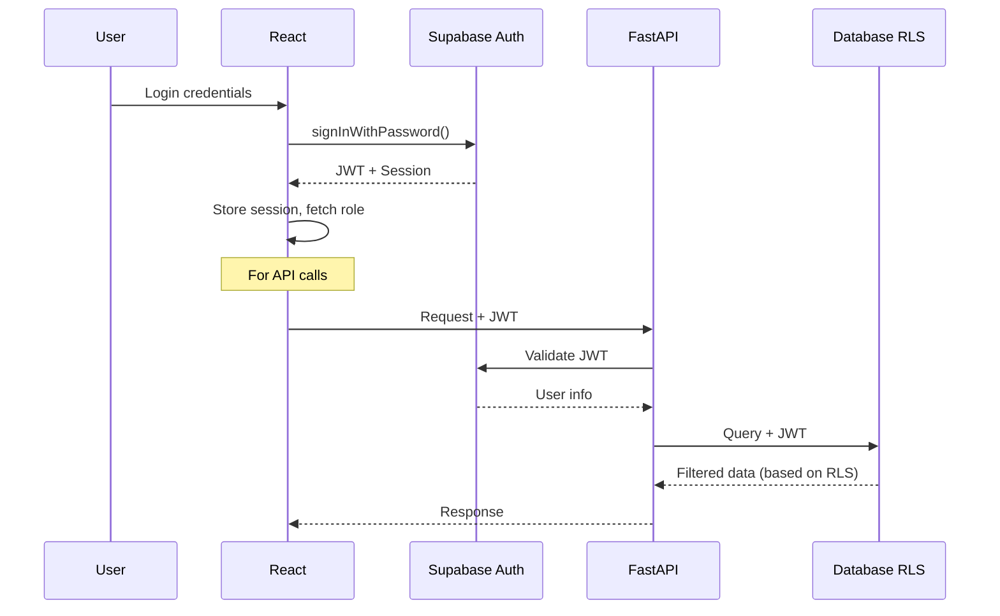

# Table of contents
*To be completed*
- RLS functions and repositories
  -> check docs/DATABASE_FUNCTIONS_AND_RLS.md

- RLS rules (Supabase Cloud)

# Authentication System Documentation

## Overview
The EMG C3D Analyzer implements a **simplified, secure authentication system** following the KISS (Keep It Simple, Stupid) principle. The system uses Supabase Auth for authentication and Row Level Security (RLS) for authorization, creating a clean separation of concerns.

**Important Note**: The authentication system does **NOT** use Zustand for storing logged users. Authentication state is managed entirely through React hooks (`useAuth`) and React Context API (`AuthContext`), not through Zustand stores.

**Latest Update (2025-01-07)**: Enhanced to fetch full user profile data from `user_profiles` table, fixing the "researcher • Unknown" display issue.

## Architecture Principles

### 1. Separation of Concerns
- **Authentication** (Who you are): Handled by frontend with Supabase Auth
- **Authorization** (What you can do): Handled by database RLS policies
- **No authorization logic in application code**: Single source of truth in database

### 2. Technology Stack
- **Frontend**: React 19 with TypeScript
- **Auth Provider**: Supabase Auth (JWT-based)
- **Backend**: FastAPI (thin JWT validation layer)
- **Database**: PostgreSQL with RLS policies

## Implementation Details

### Frontend Authentication (`useAuth` Hook)

**Location**: `frontend/src/hooks/useAuth.ts` (317 lines)

**Key Features**:
- Direct Supabase integration without unnecessary abstraction
- Automatic session management with token refresh
- Session expiration validation on mount
- **Full profile fetching**: Retrieves complete user profile data from `user_profiles` table
- Role fetching for UI rendering only (not security)
- Enhanced error handling with user-friendly messages
- **Fixed**: Loading state loops and race conditions with `useRef` for initialization tracking
- **No Zustand**: Authentication state managed via React hooks and Context API only

**Core Functions**:
```typescript
interface UserProfileData {
  id: string
  role: string
  first_name?: string
  last_name?: string
  full_name?: string
  institution?: string
  department?: string
  access_level: string
  user_code?: string
  created_at: string
  updated_at?: string
  last_login?: string
}

interface AuthState {
  user: User | null
  session: Session | null
  loading: boolean
  userRole: 'ADMIN' | 'THERAPIST' | 'RESEARCHER' | null
  userProfile: UserProfileData | null  // Full profile data
}

interface AuthActions {
  login: (email: string, password: string) => Promise<{ data: Session | null; error: Error | null }>
  logout: () => Promise<{ error: Error | null }>
}
```

**Session Management**:
- Validates session expiration on app mount
- Handles TOKEN_REFRESHED events without re-fetching roles
- Logs token refresh timestamps for debugging
- Automatic cleanup of expired sessions

### Backend JWT Validation

**Location**: `backend/api/dependencies/auth.py` (84 lines)

**Key Features**:
- Thin authentication layer - JWT validation only
- No role checking or authorization logic
- Token pass-through for RLS enforcement
- Clean dependency injection with FastAPI

**Core Function**:
```python
async def get_current_user(credentials: HTTPAuthorizationCredentials) -> Dict[str, str]:
    # Validates JWT token with Supabase
    # Returns: {'id': user_id, 'email': email, 'token': token}
    # Token is critical for RLS enforcement
```

### Database Authorization (RLS)

**Key Principle**: Database is the single source of truth for permissions

**Policy Examples**:
```sql
-- Therapists can only view their own patients
CREATE POLICY "therapist_own_patients" ON patients
FOR SELECT USING (therapist_id = auth.uid());

-- Admins have full access
CREATE POLICY "admin_full_access" ON patients
FOR ALL USING (
  EXISTS (
    SELECT 1 FROM user_profiles
    WHERE id = auth.uid() AND role = 'ADMIN'
  )
);
```

## User Roles

### Three Role Types
1. **ADMIN**: Full system access, user management, configuration
2. **THERAPIST**: Access to own patients and sessions only
3. **RESEARCHER**: Read-only access to anonymized data

### Role Usage
- **Frontend**: Roles used for UI conditional rendering only
- **Backend**: No role checking - delegates to RLS
- **Database**: RLS policies enforce actual permissions

## Authentication Flow



## Best Practices Applied

### Security
✅ JWT tokens with automatic refresh
✅ Session expiration validation
✅ RLS as primary authorization layer
✅ No client-side security logic
✅ Secure token pass-through to database

### Performance
✅ Minimal re-renders with proper React hooks
✅ Token refresh without role re-fetching
✅ Direct Supabase client for simple operations
✅ Efficient session state management

### Developer Experience
✅ Single `useAuth` hook for all auth needs
✅ Clear error messages for common failures
✅ TypeScript for type safety
✅ Clean separation of concerns

## Common Operations

### Login
```typescript
const { login } = useAuth()
const { data, error } = await login(email, password)
// Enhanced error messages for invalid credentials, unverified email, etc.
```

### Logout
```typescript
const { logout } = useAuth()
await logout() // Cleans up session and local state
```

### Check Authentication
```typescript
const { user, loading, userRole, userProfile } = useAuth()
if (user) {
  // User is authenticated
  // userRole can be used for UI rendering
  // userProfile contains full profile data (name, institution, etc.)
  console.log(`Welcome ${userProfile?.full_name || user.email}`)
}
```

### Protected Routes
```tsx
<AuthGuard>
  <ProtectedComponent />
</AuthGuard>
// AuthGuard handles loading states and redirects
```

## Migration from Previous Implementation

### Removed Files (Obsolete)
- ❌ `AuthGuardFixed.tsx` - Duplicate implementation
- ❌ `useAuthFixed.ts` - Redundant hook
- ❌ `authUtils.ts` - Unnecessary utilities
- ❌ Test files - Debug utilities

### Improvements
- **28% code reduction** in useAuth hook (439 → 317 lines) - now includes profile fetching
- **86% code reduction** in AuthContext (366 → 50 lines)
- **Removed** all redundant auth implementations
- **Enhanced** error handling and session management
- **Fixed** loading state loops and race conditions
- **Added** full user profile fetching from `user_profiles` table
- **Fixed** "researcher • Unknown" display issue in UserProfile component

## Troubleshooting

### Common Issues

1. **"Invalid authentication token"**
   - Token expired or invalid
   - Solution: Force logout and re-login

2. **"Please verify your email"**
   - Email confirmation required
   - Solution: Check email for verification link

3. **Role not loading**
   - user_profiles table missing entry
   - Solution: Ensure user profile created on signup

4. **"researcher • Unknown" display**
   - Fixed: useAuth now fetches full profile data
   - Profile data includes name, institution, department
   - UserProfile component displays actual user data

5. **Session expired on mount**
   - Normal behavior for expired sessions
   - Automatic logout and cleanup performed

## Future Considerations

### Optional Enhancements
1. **Session heartbeat** for long-running sessions
2. **Persistent session** in localStorage
3. **Multi-factor authentication** support
4. **OAuth providers** (Google, GitHub, etc.)

### Not Needed (Avoided Complexity)
- ❌ Complex caching mechanisms
- ❌ Custom token management
- ❌ Client-side authorization logic
- ❌ Role-based route guards (use RLS instead)

## Authentication Architecture Decision

**Decision**: Use Supabase client directly for most operations, FastAPI for complex logic only.

**Rationale**:
- Reduces complexity and latency by avoiding unnecessary API layers
- Leverages Supabase RLS as single source of truth for authorization
- FastAPI only needed for EMG processing and complex business logic
- Follows KISS principle - simplest solution that works

**Implementation**:
- **Frontend**: Direct Supabase client for auth, CRUD operations, and storage
- **Backend**: Thin JWT validation layer, complex processing only (EMG analysis)
- **Database**: RLS policies handle all authorization decisions

**When to Use Direct Supabase**:
- Simple CRUD operations (e.g., clinical_notes)
- Real-time subscriptions
- File storage operations  
- Auth state management

**When to Use FastAPI**:
- Complex business logic (EMG signal processing)
- Multi-step transactions requiring atomicity
- External API integrations
- Heavy computational tasks
- Custom validation beyond database constraints

----


  Policy 1: SELECT (Download/View)

  Policy Name: Therapists can only view their patients files
Operation: SELECT
  Target Roles: authenticated

  Policy Definition:
  ```sql
  public.user_owns_patient(split_part(name, '/', 1))
  ```

  Policy 2: INSERT (Upload)

  Policy Name: Therapists can only upload to their patients folders
  Operation: INSERT
  Target Roles: authenticated

  Policy Definition:
  ```sql
  public.user_owns_patient(split_part(name, '/', 1))
  ```
  Policy 3: UPDATE (Replace files)

  Policy Name: Therapists can only update their patients files
  Operation: UPDATE
  Target Roles: authenticated

  USING clause:

  ```sql
  public.user_owns_patient(split_part(name, '/', 1))
  WITH CHECK clause:
  public.user_owns_patient(split_part(name, '/', 1))
  ```

  Policy 4: DELETE (Remove files)

  Policy Name: Therapists can only delete their patients files
  Operation: DELETE
  Target Roles: authenticated

  Policy Definition:
  ```sql
  public.user_owns_patient(split_part(name, '/', 1))
  ```

----

## Architecture Decision: FastAPI vs Direct Supabase Client

### When to use Direct Supabase Client
- **Simple CRUD operations** without business logic
- **User profiles**, preferences, settings
- **Real-time subscriptions** for live updates
- **File uploads** to Supabase Storage
- **Authentication** flows (login, logout, session)

Example: Clinical notes could technically work with direct Supabase:
```javascript
// Direct from frontend
const { data } = await supabase
  .from('clinical_notes')
  .select('*, patients(patient_code)')
  .eq('author_id', user.id)
```

### When FastAPI is Required
- **Complex computations** (EMG signal processing, statistical analysis)
- **Binary file processing** (C3D files with ezc3d library)
- **Heavy algorithms** requiring NumPy, SciPy, specialized libraries
- **Webhook endpoints** for Supabase Storage events
- **Data transformations** beyond simple queries
- **Proprietary logic** that shouldn't be exposed in frontend

### Current Implementation
- **Clinical Notes**: Uses FastAPI for consistency, though direct Supabase would work
- **EMG Processing**: Absolutely requires FastAPI (signal processing, C3D parsing)
- **Therapy Sessions**: Requires FastAPI (complex calculations, scoring algorithms)

### Decision Principle
Follow KISS: Use the simplest tool that solves the problem. Don't add layers just for consistency.
