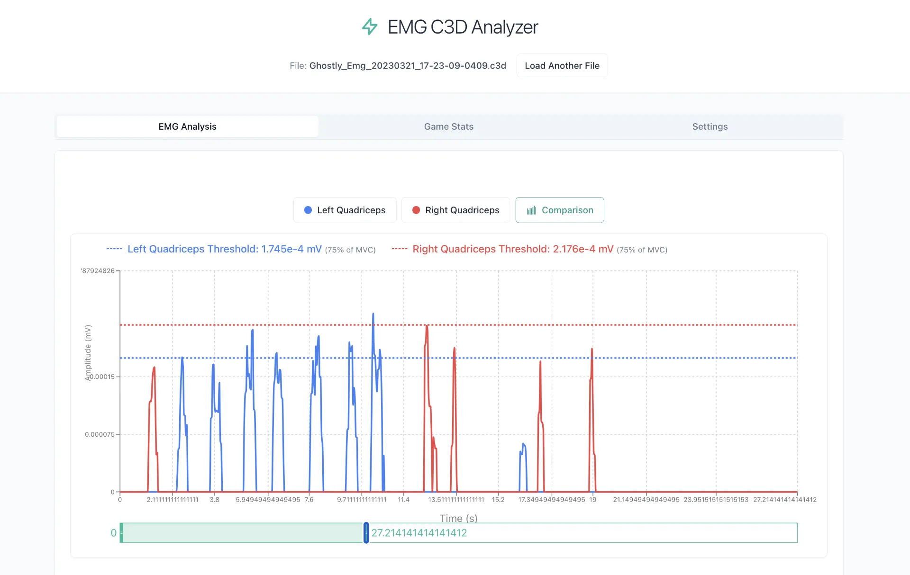
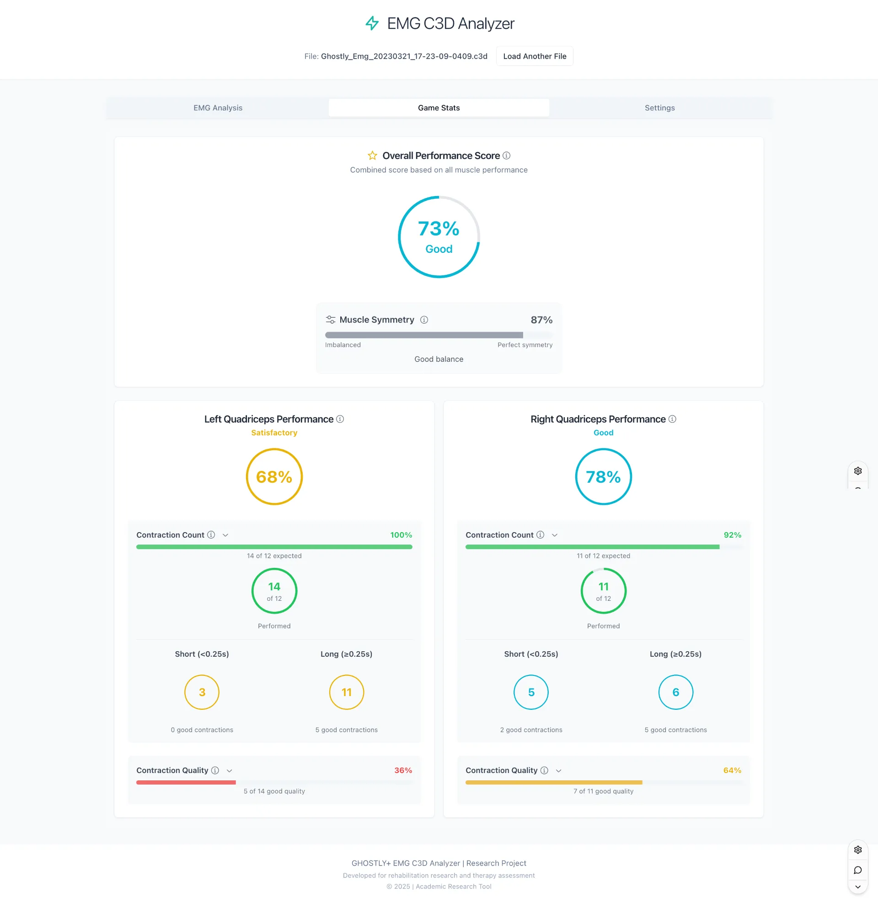

# EMG C3D Analyzer (GHOSTLY+)

A web-based tool for the analysis and visualization of Electromyography (EMG) data from C3D files, specifically designed and customized for C3D files generated by the GHOSTLY rehabilitation serious game platform.

> ⚠️ **Work in Progress**: This application is currently under active development. Some features are incomplete and EMG analysis algorithms have not yet been clinically validated. This tool is specifically customized for C3D files from the GHOSTLY serious game and may not work correctly with C3D files from other sources without modification.




## Core Features

*   **GHOSTLY-Specific C3D Processing:** Ingests C3D files from the GHOSTLY game and distinguishes between "Raw" and "Activated" EMG signals based on GHOSTLY's specific channel naming conventions.
*   **EMG Analytics (WIP):** Calculates basic metrics for muscle fatigue and activity, including RMS, MAV, MPF, MDF, and Dimitrov's Fatigue Index. *Note: Statistical analysis and clinical validation are currently in development.*
*   **Contractions Detection & Analysis:** Identifies muscle contractions using adaptive thresholding with configurable parameters for duration and amplitude, providing detailed metrics on contraction count, duration, and intensity.
*   **Performance Analysis of Rehabilitation Sessions:** Evaluates rehabilitation progress through analysis of contractions and exercise quality metrics compared to the rehabilitation protocol.
*   **Interactive Visualization:** Real-time EMG signal plotting with multi-channel comparison and basic performance metrics dashboard.
*   **Session Configuration:** Game session parameter management with MVC threshold settings and basic performance tracking.
*   **Stateless Architecture:** Optimized for cloud deployment with efficient data bundling and client-side processing.
*   **Modern Technology Stack:** Built with FastAPI backend and React/TypeScript frontend with Zustand state management.

## Technology Stack

*   **Backend:** Python 3.10+, FastAPI, Poetry, Uvicorn
*   **Frontend:** React 19, TypeScript, Tailwind CSS, shadcn/ui, Zustand
*   **Visualization:** Recharts for interactive EMG signal plotting
*   **Scientific Libraries:** `ezc3d`, `pandas`, `numpy`, `scipy` for EMG analysis
*   **Development:** Automated setup scripts, comprehensive testing, ESLint/TypeScript

---

## Important Disclaimers

### 🚧 Development Status
This application is actively under development with several features in various stages of completion:
- **EMG Analysis Algorithms**: Basic implementation complete, but statistical analysis and clinical validation are ongoing
- **Channel Detection**: Currently optimized for GHOSTLY C3D file format and channel naming conventions
- **Performance Metrics**: Calculations implemented but may require clinical validation for research use

### 📊 Clinical Validation
The EMG analysis results have **not been clinically validated** and should not be used for medical diagnosis or clinical decision-making. This tool is intended for research and educational purposes within the GHOSTLY rehabilitation game context.

### 🎮 GHOSTLY-Specific Design
This analyzer is specifically designed for C3D files generated by the GHOSTLY serious game platform. It may not work correctly with C3D files from other motion capture systems or EMG devices without significant modification.

---

## Getting Started

### Prerequisites

*   Git
*   Python 3.10+
*   Poetry
*   Node.js (LTS) & npm

### 1. Clone & Setup

First, clone the repository:
```bash
git clone https://github.com/ggustin93/emg-c3d-analyzer.git
cd emg-c3d-analyzer
```
### 2. Configure Virtual Environment (Recommended)

To ensure the `start_dev.sh` script works seamlessly, configure Poetry to create the virtual environment inside the project folder:
```bash
poetry config virtualenvs.in-project true
```

### 3. Run the Development Environment

The `start_dev.sh` script is the recommended way to launch the entire application. It handles all dependencies and starts both the backend and frontend servers concurrently.

**First, make the script executable:**
```bash
chmod +x start_dev.sh
```

**To run the development server:**
```bash
./start_dev.sh
```
*   **Backend API:** `http://localhost:8080`
*   **Frontend App:** `http://localhost:3000`

**For a clean dependency reinstall (if you encounter module errors):**
```bash
./start_dev.sh --clean
```
This will delete `node_modules` and `package-lock.json` before installing, which can resolve caching issues.

---

## Configuration

### Frontend API Endpoint

The frontend defaults to connecting to the backend at `http://localhost:8080`. To override this (for example, in a production deployment), you can either:

1.  Create a `frontend/.env` file with `REACT_APP_API_URL=your_backend_url`.
2.  Set the `REACT_APP_API_URL` as an environment variable in your deployment platform (e.g., Vercel, Netlify).

---

## Project Structure

```
emg-c3d-analyzer/
├── backend/            # FastAPI application source
│   ├── api.py          # REST API endpoints
│   ├── processor.py    # C3D file processing logic
│   ├── emg_analysis.py # EMG metrics calculation
│   ├── models.py       # Data models (Pydantic)
│   └── tests/          # Backend tests
├── frontend/           # React TypeScript application
│   ├── public/         # Static assets and index.html
│   └── src/            # Application source code
│       ├── components/ # Reusable UI components
│       ├── hooks/      # Custom React hooks
│       ├── store/      # Zustand state management
│       ├── types/      # TypeScript type definitions
│       └── utils/      # Utility functions
├── memory-bank/        # Agent-maintained project documentation
├── assets/             # Project assets (images, etc.)
├── start_dev.sh        # Development environment setup script
└── README.md
```

## Development Roadmap

### 🎯 Current Focus
- **Enhanced EMG Statistical Analysis**: Implementation of clinically sound average and standard deviation calculations for all metrics
- **Algorithm Validation**: Clinical validation of EMG analysis algorithms with reference datasets
- **Documentation**: Comprehensive API documentation and EMG analysis methodology

### 🔜 Planned Features
- **Multi-session Analysis**: Compare EMG data across multiple GHOSTLY game sessions
- **Export Capabilities**: Data export in standard research formats (CSV, MATLAB, etc.)
- **Advanced Filtering**: Configurable EMG signal preprocessing options
- **Performance Optimization**: Enhanced processing speed for large C3D files

## License

This project is licensed under the MIT License. See the `LICENSE.md` file for details.
