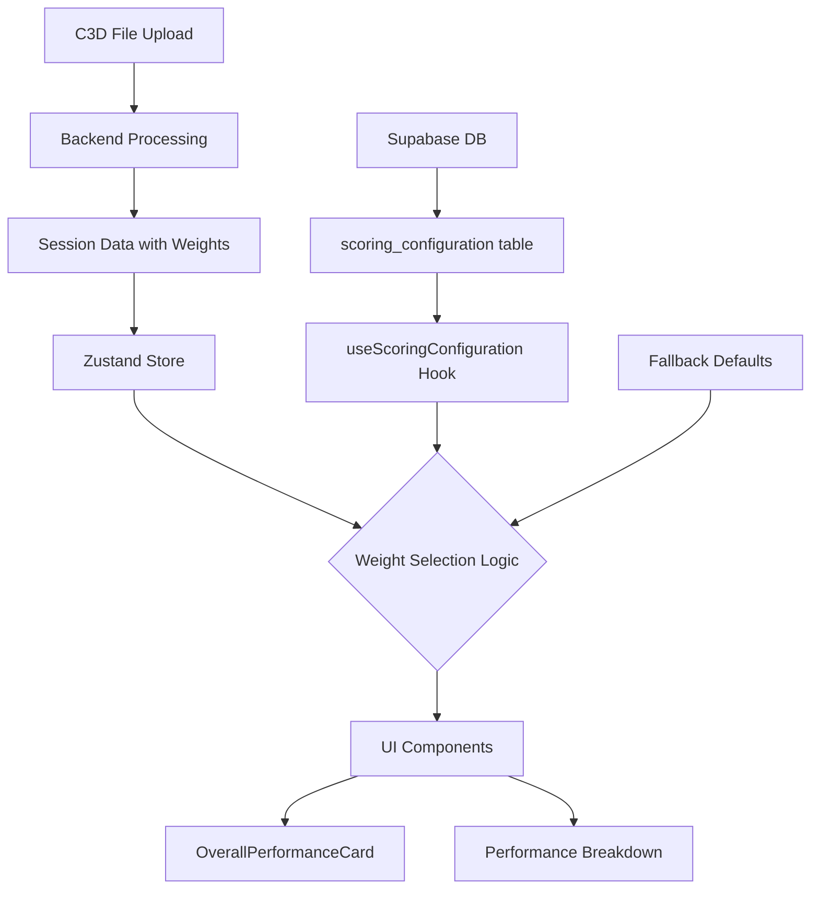

# Scoring Weights Integration - How It Works

## Overview
The EMG C3D Analyzer uses a flexible scoring system where weights can be configured at multiple levels. This document explains how scoring weights flow from Supabase to the UI.

## Weight Configuration Hierarchy

The system uses a **cascading priority system** for scoring weights:

### 1. Session-Level Weights (Highest Priority)
- **Source**: `sessionParams.enhanced_scoring?.weights` 
- **Origin**: Backend calculates and sends these with each processed session
- **When Used**: Always used first if present in the current session data
- **Location**: Stored in Zustand session store after C3D processing

### 2. Database Weights (Supabase)
- **Source**: `useScoringConfiguration()` hook
- **Tables**: 
  - `scoring_configuration` - Global active configuration
  - Custom configurations (therapist/patient specific) - Future enhancement
- **API Endpoints**:
  - `/api/scoring/configurations/active` - Get active global configuration
  - `/api/scoring/configurations/custom` - Get therapist/patient specific (future)
- **When Used**: When no session weights are available

### 3. Fallback Defaults (Lowest Priority)
- **Source**: Hardcoded in both frontend and backend
- **Values**:
  - Compliance: 50% (0.50)
  - Symmetry: 25% (0.25)
  - Effort: 25% (0.25)
  - Game Score: 0% (0.00)
- **When Used**: When no database configuration exists

## Data Flow



## Implementation Details

### Frontend (OverallPerformanceCard.tsx)
```typescript
// Weight priority logic
const weights = 
  sessionParams.enhanced_scoring?.weights ||  // 1. Session weights
  databaseWeights ||                           // 2. Database weights
  FALLBACK_WEIGHTS;                           // 3. Fallback defaults
```

### Backend (config.py)
```python
class ScoringDefaults:
    WEIGHT_COMPLIANCE = 0.50  # 50%
    WEIGHT_SYMMETRY = 0.25    # 25%
    WEIGHT_EFFORT = 0.25      # 25%
    WEIGHT_GAME = 0.00        # 0%
```

### Database Schema
```sql
CREATE TABLE scoring_configuration (
  id UUID PRIMARY KEY,
  configuration_name VARCHAR(255),
  weight_compliance DECIMAL(4,3),
  weight_symmetry DECIMAL(4,3),
  weight_effort DECIMAL(4,3),
  weight_game DECIMAL(4,3),
  active BOOLEAN,
  -- Sub-weights for compliance
  weight_completion DECIMAL(4,3),
  weight_intensity DECIMAL(4,3),
  weight_duration DECIMAL(4,3)
);
```

## Weight Validation

The system validates weights at multiple points:
1. **Database Level**: CHECK constraints ensure weights sum to 1.0
2. **API Level**: Backend validates before saving
3. **Frontend Level**: `useScoringConfiguration` validates fetched weights
4. **UI Level**: Components show visual feedback for invalid configurations

## User Configuration

### Current Implementation
- Therapists can modify weights via Settings tab
- Changes can be saved as:
  - **User Preferences**: Local to the browser
  - **System Defaults**: Global configuration in database

### Future Enhancements
- Patient-specific weight configurations
- Therapist-specific default configurations
- Session-specific temporary overrides

## Troubleshooting

### Weights Not Updating?
1. Check browser console for API errors
2. Verify Supabase connection
3. Check if session has override weights
4. Confirm database has active configuration

### Points Showing as 0?
- Weights are multiplied by scores (0-100)
- Very low weights (< 0.10) may round to 0 points
- Check actual contribution values in browser DevTools

## Testing Weight Configuration

```javascript
// In browser console
// Check current weights
console.log(sessionParams.enhanced_scoring?.weights);

// Check database weights
const response = await fetch('/api/scoring/configurations/active');
const config = await response.json();
console.log(config);
```

## API Endpoints

### GET /api/scoring/configurations/active
Returns the currently active scoring configuration from database.

### PUT /api/scoring/configurations/{id}
Updates a scoring configuration (requires authentication).

### POST /api/scoring/configurations
Creates a new scoring configuration (requires admin role).

## Related Files
- `/frontend/src/hooks/useScoringConfiguration.ts` - Main hook for fetching weights
- `/frontend/src/components/tabs/SettingsTab/components/ScoringWeightsSettings.tsx` - UI for configuration
- `/backend/config.py` - Backend default weights
- `/backend/api/routes/scoring_config.py` - API endpoints