# Automated C3D Processing Workflow with Supabase Storage Webhooks

## Overview

This document outlines the automated workflow for processing C3D files uploaded from the GHOSTLY mobile application using Supabase Storage webhooks to trigger real-time EMG analysis.

## Architecture Flow

```mermaid
flowchart LR
    subgraph "Client Layer"
        A["üè• GHOSTLY<br/>Mobile App"]
    end
    
    subgraph "Storage Layer"
        B["☁️ Supabase<br/>Storage"]
        C["üîî Webhook<br/>Event"]
    end
    
    subgraph "Processing Layer"
        D["⚙️ Backend<br/>Service"]
        E["🧮 EMG Analysis<br/>Pipeline"]
    end
    
    subgraph "Data Layer"
        F["üìä Analytics<br/>Database"]
        G["‚úÖ Clinical<br/>Results"]
    end
    
    A -->|"Upload C3D"| B
    B -->|"ObjectCreated"| C
    C -->|"HTTP POST"| D
    D -->|"Process Signal"| E
    E -->|"Store Results"| F
    F -->|"Real-time"| G
    
    style A fill:#2196F3,stroke:#1976D2,stroke-width:2px,color:#fff
    style B fill:#9C27B0,stroke:#7B1FA2,stroke-width:2px,color:#fff
    style C fill:#FF9800,stroke:#F57C00,stroke-width:2px,color:#fff
    style D fill:#4CAF50,stroke:#388E3C,stroke-width:2px,color:#fff
    style E fill:#4CAF50,stroke:#388E3C,stroke-width:2px,color:#fff
    style F fill:#607D8B,stroke:#455A64,stroke-width:2px,color:#fff
    style G fill:#00BCD4,stroke:#0097A7,stroke-width:2px,color:#fff
```



## Detailed Workflow Steps

### 1. File Upload from Mobile App
- **Trigger**: Patient completes GHOSTLY therapy session
- **Action**: Mobile app automatically uploads C3D file to designated storage bucket
- **Bucket**: `c3d-files/{user_id}/{session_id}/baseline.c3d`
- **Metadata**: User ID, session ID, timestamp, file type

### 2. Supabase Storage Event Detection
- **Event Type**: `ObjectCreated:Post`
- **Monitoring**: Supabase Storage automatically detects new file uploads
- **Filter**: Only C3D files in the `c3d-files` bucket trigger processing
- **Response Time**: < 1 second after upload completion

### 3. Webhook Notification
```json
{
  "eventType": "ObjectCreated:Post",
  "bucket": "c3d-files",
  "objectName": "user_123/session_456/baseline.c3d",
  "objectSize": 2458624,
  "contentType": "application/octet-stream",
  "timestamp": "2025-08-11T10:30:00Z",
  "metadata": {
    "userId": "user_123",
    "sessionId": "session_456",
    "sessionType": "baseline"
  }
}
```

### 4. Backend Processing Pipeline

#### File Retrieval
```javascript
// Download C3D file from Supabase Storage
const { data: fileData } = await supabase.storage
  .from('c3d-files')
  .download(objectName)
```

#### EMG Analysis Chain
1. **Signal Extraction**: Parse C3D file to extract raw EMG data
2. **Signal Processing**: Apply clinical pipeline (20Hz → Rectify → 10Hz → RMS)
3. **MVC Estimation**: Calculate patient-specific MVC using peak + RMS methods
4. **Quality Assessment**: Validate signal quality and processing confidence
5. **Clinical Metrics**: Generate therapeutic thresholds and compliance parameters

#### Data Persistence
```javascript
// Save processing results to database
await supabase.from('analytics').insert({
  user_id: metadata.userId,
  session_id: metadata.sessionId,
  mvc_threshold_actual_value: calculatedMVC,
  processing_metadata: {
    signal_quality: 'excellent',
    confidence_score: 0.94,
    processing_pipeline: 'v2.1.0'
  },
  created_at: new Date().toISOString()
})
```

## Implementation Configuration

### Supabase Storage Webhook Setup
1. **Dashboard Navigation**: Project Settings → Storage → Webhooks
2. **Event Selection**: `ObjectCreated:Post`
3. **Endpoint URL**: `https://your-backend.com/api/webhooks/c3d-uploaded`
4. **Authentication**: Bearer token or API key
5. **Bucket Filter**: `c3d-files`

### Database Trigger Alternative
```sql
CREATE OR REPLACE FUNCTION handle_c3d_upload()
RETURNS TRIGGER AS $$
BEGIN
  -- Only process C3D files in the designated bucket
  IF NEW.bucket_id = 'c3d-files' AND NEW.name LIKE '%.c3d' THEN
    PERFORM supabase_functions.http_request(
      'https://your-backend.com/api/process-c3d',
      'POST',
      '{"Content-Type":"application/json"}',
      json_build_object(
        'bucket', NEW.bucket_id,
        'file_path', NEW.name,
        'file_size', NEW.size,
        'uploaded_at', NEW.created_at
      )::text,
      5000
    );
  END IF;
  RETURN NEW;
END;
$$ LANGUAGE plpgsql;

CREATE TRIGGER c3d_upload_trigger
  AFTER INSERT ON storage.objects
  FOR EACH ROW
  EXECUTE FUNCTION handle_c3d_upload();
```

## Error Handling & Reliability

### Retry Mechanism
- **Webhook Failures**: Supabase automatically retries failed webhooks (exponential backoff)
- **Processing Errors**: Backend implements retry logic for transient failures
- **File Corruption**: Validation checks ensure C3D file integrity before processing

### Monitoring & Alerts
- **Processing Status**: Real-time status updates in dashboard
- **Performance Metrics**: Processing time, success rate, error patterns
- **Clinical Validation**: Automated quality checks for MVC calculations

### Fallback Strategies
```javascript
// Manual processing trigger for failed automated runs
app.post('/api/manual-process-c3d', async (req, res) => {
  const { filePath, userId, sessionId } = req.body;
  
  try {
    const result = await processC3DFile(filePath, userId, sessionId);
    res.json({ success: true, result });
  } catch (error) {
    // Log error and trigger alert
    logger.error('Manual C3D processing failed', { filePath, error });
    res.status(500).json({ success: false, error: error.message });
  }
});
```

## Security Considerations

### Authentication
- **Webhook Verification**: Validate webhook signatures using shared secret
- **API Security**: Rate limiting and request validation on backend endpoints
- **File Access**: Row-level security policies for storage bucket access

### Data Privacy
- **HIPAA Compliance**: Encrypted storage and transmission of patient data
- **Access Control**: User-specific folder isolation in storage buckets
- **Audit Trail**: Complete logging of file access and processing events

## Performance Characteristics

### Expected Metrics
- **Upload to Processing**: < 5 seconds end-to-end
- **C3D File Size**: Typically 1-5 MB per session
- **Processing Time**: 2-10 seconds per file depending on session length
- **Throughput**: Supports 100+ concurrent uploads with proper scaling

### Scalability Features
- **Horizontal Scaling**: Backend can scale based on webhook load
- **Queue Management**: Background job processing for resource-intensive operations
- **Storage Optimization**: Automatic file compression and archival policies

## Clinical Integration

### Real-Time Feedback
- **Immediate Results**: MVC calculations available within seconds of upload
- **Progress Tracking**: Session-by-session improvement metrics
- **Adaptive Thresholds**: Dynamic difficulty adjustment based on performance

### Quality Assurance
- **Signal Validation**: Automated quality checks prevent invalid data
- **Clinical Review**: Flagging system for sessions requiring manual review
- **Compliance Reporting**: Automated generation of clinical trial metrics

---

## Benefits Summary

✅ **Fully Automated**: Zero manual intervention required  
✅ **Real-Time Processing**: Immediate analysis after session completion  
✅ **Scalable Architecture**: Handles multiple concurrent users seamlessly  
✅ **Clinical Accuracy**: Validated EMG processing pipeline with confidence scoring  
✅ **Reliable**: Built-in retry mechanisms and error handling  
✅ **Secure**: HIPAA-compliant data handling and access controls  

This automated workflow ensures that GHOSTLY therapy sessions provide immediate, personalized feedback to patients while maintaining clinical research standards for data quality and processing consistency.

## Implementation TODO List

### Phase 1: Database Schema Setup ⏳
- [ ] **Create C3D metadata table**
  ```sql
  CREATE TABLE c3d_metadata (
    id UUID DEFAULT gen_random_uuid() PRIMARY KEY,
    file_path TEXT NOT NULL UNIQUE,
    file_hash TEXT NOT NULL,
    patient_id TEXT,
    session_id TEXT,
    session_date TIMESTAMP,
    channel_names JSONB,
    sampling_rate FLOAT,
    duration_seconds FLOAT,
    created_at TIMESTAMP DEFAULT NOW(),
    updated_at TIMESTAMP DEFAULT NOW()
  );
  ```

- [ ] **Create analysis results cache table**
  ```sql
  CREATE TABLE analysis_results (
    id UUID DEFAULT gen_random_uuid() PRIMARY KEY,
    c3d_metadata_id UUID REFERENCES c3d_metadata(id),
    file_hash TEXT NOT NULL,
    processing_version TEXT NOT NULL,
    analytics_data JSONB NOT NULL,
    emg_signals JSONB,
    processing_params JSONB,
    processing_time_ms INTEGER,
    created_at TIMESTAMP DEFAULT NOW(),
    INDEX idx_file_hash (file_hash),
    INDEX idx_metadata_id (c3d_metadata_id)
  );
  ```

- [ ] **Add performance indexes**
  - Index on file_hash for quick lookups
  - Index on patient_id for patient queries
  - Index on session_date for temporal queries

### Phase 2: Webhook Endpoint Implementation 🚀
- [ ] **Create webhook handler endpoint**
  - Path: `/api/webhooks/storage/c3d-upload`
  - Method: POST
  - Verify webhook signature
  - Parse Supabase storage event payload

- [ ] **Implement webhook verification**
  ```python
  def verify_webhook_signature(
      payload: bytes, 
      signature: str, 
      secret: str
  ) -> bool:
      expected = hmac.new(
          secret.encode(), 
          payload, 
          hashlib.sha256
      ).hexdigest()
      return hmac.compare_digest(expected, signature)
  ```

- [ ] **Add request validation**
  - Validate event type is "ObjectCreated:Post"
  - Ensure file is in c3d-files bucket
  - Check file extension is .c3d

### Phase 3: C3D Metadata Extraction Service 📊
- [ ] **Extract file metadata**
  ```python
  async def extract_c3d_metadata(file_path: str):
      # Download from Supabase Storage
      # Parse C3D headers
      # Extract:
      #   - Patient ID from path or metadata
      #   - Session date
      #   - Channel names
      #   - Sampling rate
      #   - Duration
      # Return metadata dict
  ```

- [ ] **Store metadata in database**
  - Check if metadata already exists (by file_hash)
  - Insert or update metadata record
  - Return metadata ID for linking

- [ ] **Link to storage path**
  - Store full Supabase storage path
  - Maintain reference to bucket and object name

### Phase 4: Analysis Caching System 💾
- [ ] **Implement cache check**
  ```python
  async def check_analysis_cache(
      file_hash: str, 
      processing_version: str
  ) -> Optional[dict]:
      # Query analysis_results table
      # Return cached results if found
      # Return None if cache miss
  ```

- [ ] **Store analysis results**
  ```python
  async def cache_analysis_results(
      metadata_id: UUID,
      file_hash: str,
      analysis_result: EMGAnalysisResult
  ):
      # Serialize analysis result
      # Store in analysis_results table
      # Include processing version
  ```

- [ ] **Cache invalidation strategy**
  - Version-based invalidation (new processing pipeline)
  - Time-based expiry (optional, e.g., 30 days)
  - Manual invalidation endpoint

### Phase 5: Performance Optimization ⚡
- [ ] **Database connection pooling**
  - Configure asyncpg pool
  - Set appropriate pool size
  - Monitor connection usage

- [ ] **Async processing queue**
  - Use Celery or similar for background tasks
  - Queue long-running analysis
  - Return immediate webhook response

- [ ] **Result caching layer**
  - Add Redis for hot data caching
  - Cache frequently accessed results
  - TTL configuration

### Phase 6: Testing Strategy 🧪
#### Unit Tests
- [ ] **Webhook validation tests**
  - Test signature verification
  - Test payload parsing
  - Test error handling

- [ ] **Metadata extraction tests**
  - Test C3D file parsing
  - Test metadata field extraction
  - Test edge cases (missing fields)

- [ ] **Database operation tests**
  - Test CRUD operations
  - Test transaction handling
  - Test constraint violations

#### Integration Tests
- [ ] **Full webhook flow test**
  - Simulate Supabase webhook
  - Verify end-to-end processing
  - Check database state

- [ ] **Cache hit/miss scenarios**
  - Test cache retrieval
  - Test cache population
  - Test cache invalidation

- [ ] **Error recovery tests**
  - Test retry mechanisms
  - Test failure logging
  - Test partial failure handling

### Phase 7: Documentation & Deployment 📚
- [ ] **Update API documentation**
  - Document webhook endpoint
  - Document cache endpoints
  - Document monitoring endpoints

- [ ] **Deployment instructions**
  - Environment variables setup
  - Database migration scripts
  - Webhook configuration guide

- [ ] **Monitoring setup**
  - Processing metrics dashboard
  - Error rate monitoring
  - Performance tracking

### Phase 8: Supabase Configuration 🔧
- [ ] **Configure Storage webhook**
  - Enable in Supabase dashboard
  - Set endpoint URL
  - Configure authentication

- [ ] **Set up RLS policies**
  - Secure metadata table
  - Secure analysis results
  - User-based access control

- [ ] **Configure Edge Functions** (optional)
  - Pre-processing validation
  - Quick metadata extraction
  - Event routing

## Development Tools & Resources

### MCP Servers to Use:
- **SERENA MCP**: For intelligent code navigation and implementation
- **SUPABASE MCP**: For database operations and storage management
- **CONTEXT7 MCP**: For documentation on Supabase webhooks and best practices

### Key Dependencies:
- `supabase-py`: Python client for Supabase
- `asyncpg`: Async PostgreSQL driver
- `ezc3d`: C3D file parsing
- `fastapi`: Web framework
- `celery`: Task queue (optional)
- `redis`: Caching layer (optional)

## Success Criteria ✅
- [ ] Webhook receives and processes events < 1 second
- [ ] C3D metadata extraction completes < 2 seconds
- [ ] Cache hit rate > 80% for repeated files
- [ ] Zero data loss with retry mechanisms
- [ ] 100% test coverage for critical paths
- [ ] Performance: Handle 100+ concurrent uploads
- [ ] Security: All endpoints authenticated and validated