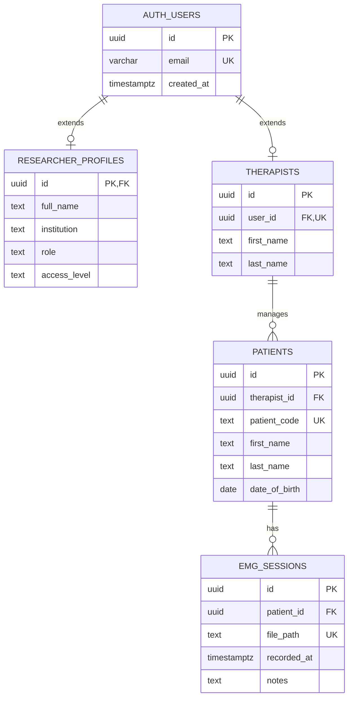

# GHOSTLY+ Database Schema

PostgreSQL 15.8.1.121 on Supabase with Row Level Security.

**Database**: `db.egihfsmxphqcsjotmhmm.supabase.co`
**Status**: Live verification completed 2025-07-29

## Tables

### Public Schema
- **researcher_profiles**: 1 profile, 64KB
- **therapists**: 2 therapists, 48KB  
- **patients**: 2 patients, 48KB
- **emg_sessions**: 28 sessions, 48KB

### Auth Schema (Supabase managed)
- **users**: 5 users, 152KB
- Plus standard Supabase auth tables

## Entity Relationships

## Key Features

- **RLS Enabled**: All public tables have Row Level Security
- **Auto-generated**: Patient codes (P001, P002, ...)
- **File Storage**: EMG sessions link to Supabase Storage paths
- **Foreign Keys**: All relationships enforced with CASCADE delete

## Current Data
- Active users: 5
- Therapists managing patients: 2
- Patients in system: 2
- EMG sessions recorded: 28

## Future Improvements

Future improvements may include analysis results caching, treatment protocols, progress tracking, and multi-institution support.