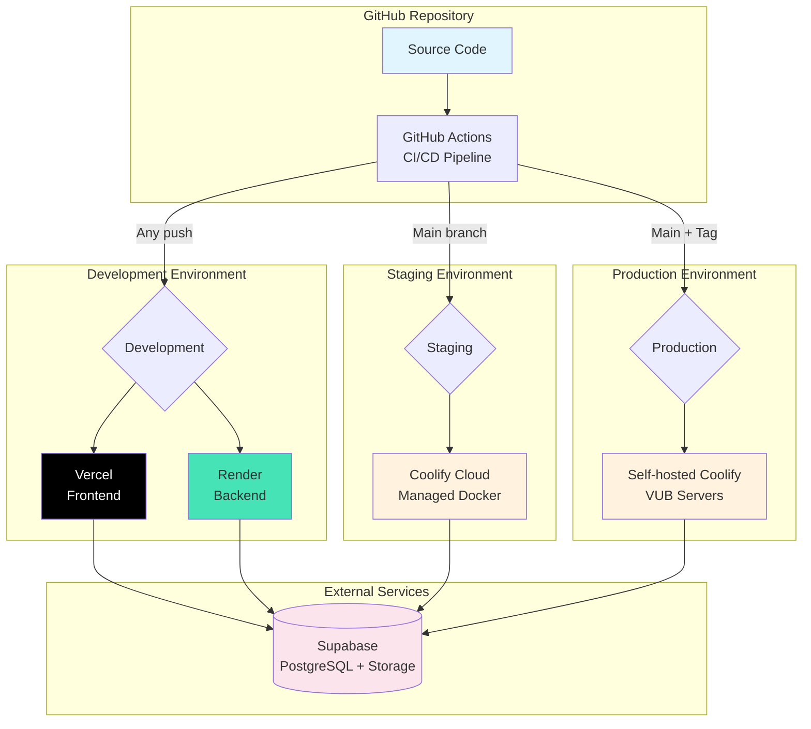

# EMG C3D Analyzer - Complete Deployment Guide

## Overview

This guide covers all deployment options for the EMG C3D Analyzer application across three environments. We use Vercel and Render for rapid development iterations, Coolify Cloud for staging tests, and self-hosted Coolify for production deployment. Each environment serves a specific purpose in our development lifecycle, from quick prototyping to GDPR-compliant production hosting of medical data.

## Deployment Environments

We maintain three separate environments, each optimized for different needs:

### Environment Comparison

| Environment | Frontend | Backend | Purpose | Auto-Deploy | Cost |
|------------|----------|---------|---------|-------------|------|
| **Development** | Vercel | Render | Rapid iteration, testing | ✅ On push | Free tier |
| **Staging** | Coolify Cloud | Coolify Cloud | Integration testing, demos | ✅ On main | ~$4/month |
| **Production** | Self-hosted Coolify | Self-hosted Coolify | Live system, medical data | ✅ On main | Server costs |

### When to Use Each Environment

**Development (Vercel + Render)**
- Quick feature development and testing
- Automatic preview deployments for PRs
- No Docker knowledge required
- Perfect for frontend-heavy changes

**Staging (Coolify Cloud)**
- Testing Docker configurations
- Client demos and user acceptance testing
- Performance testing with production-like setup
- Testing Supabase integrations

**Production (Self-hosted Coolify)**
- Live medical data processing
- GDPR compliance requirements
- Full control over infrastructure
- Maximum data security

## Development Environment (Vercel + Render)

The development environment provides the fastest way to deploy and test changes without dealing with Docker or infrastructure management.

### Vercel Frontend Setup

1. **Connect Repository**
   - Go to [vercel.com](https://vercel.com)
   - Import GitHub repository
   - Select `frontend` as root directory
   - Framework preset: Vite

2. **Configure Build Settings**
   ```
   Build Command: npm run build
   Output Directory: dist
   Install Command: npm ci
   ```

3. **Add Environment Variables**
   ```bash
   VITE_API_URL=https://your-app.onrender.com
   VITE_SUPABASE_URL=https://your-project.supabase.co
   VITE_SUPABASE_ANON_KEY=eyJhbGc...
   ```

4. **Deploy**
   - Vercel automatically deploys on every push
   - Preview URLs for pull requests
   - Production deployment on main branch

### Render Backend Setup

1. **Create Web Service**
   - Go to [render.com](https://render.com)
   - New > Web Service
   - Connect GitHub repository
   - Select `backend` as root directory

2. **Configure Service**
   ```
   Environment: Python 3
   Build Command: pip install -r requirements.txt
   Start Command: uvicorn main:app --host 0.0.0.0 --port $PORT
   ```

3. **Add Environment Variables**
   ```bash
   SUPABASE_URL=https://your-project.supabase.co
   SUPABASE_SERVICE_KEY=eyJhbGc...
   SUPABASE_ANON_KEY=eyJhbGc...
   ENVIRONMENT=development
   ```

4. **Deploy**
   - Automatic deploys on push
   - Zero-downtime deployments
   - Automatic HTTPS

### Benefits of Vercel + Render

- **Zero Configuration**: No Docker or server management
- **Instant Deployments**: Changes live in under 2 minutes
- **Preview Environments**: Test branches before merging
- **Free Tier**: Perfect for development and testing
- **Global CDN**: Fast frontend delivery worldwide

## Deployment Architecture



## What is Docker?

Docker is a platform that packages applications into containers - lightweight, portable units that include everything needed to run the software. Think of a container as a shipping container for code: it holds your application and all its dependencies in a standardized format that runs identically everywhere.

### Why Containers Over Traditional Deployment?

**Traditional Deployment**: Install dependencies directly on server → "Works on my machine" problems → Version conflicts between projects → Complex server management

**Container Deployment**: Package everything together → Runs the same everywhere → Isolated from other applications → Simple, reproducible deployments

### Key Benefits for Our Project
- **Consistency**: Same environment in development, staging, and production
- **Isolation**: Backend, frontend, and Redis run independently without conflicts
- **Efficiency**: Containers share the host OS kernel, using less resources than virtual machines
- **Portability**: Deploy anywhere that supports Docker - cloud, on-premise, or local

## What is Coolify?

Coolify is an open-source, self-hostable platform that simplifies Docker deployments. It's essentially your own private Heroku - providing a web interface to manage applications, databases, and services without the complexity of raw Docker commands or Kubernetes.

### Why We Use Coolify for Staging & Production

- **Cost Efficiency**: Save thousands compared to managed platforms like Heroku or Vercel
- **Data Control**: All data stays on your servers, ensuring GDPR compliance for medical data
- **No Vendor Lock-in**: If we stop using Coolify, our Docker containers keep running
- **Simple Management**: Deploy with git push, manage through web UI, automatic SSL certificates

### Coolify Staging (Cloud)

Coolify Cloud is the managed version - perfect for staging:
- **Zero Setup**: No server management required
- **Automatic Updates**: Always on latest Coolify version
- **Quick Deployment**: Ready in minutes
- **Cost**: ~$4/month for our usage
- **Use Case**: Client demos, integration testing, Docker config validation

### Coolify Production (Self-hosted)

Self-hosted Coolify on VUB servers for production:
- **Full Control**: Complete infrastructure ownership
- **Data Sovereignty**: Medical data never leaves institutional servers
- **Custom Configuration**: Tailored to our security requirements
- **Cost**: Only server infrastructure costs
- **Use Case**: Live system with real patient data

## Prerequisites

Before deploying, ensure you have:

1. **GitHub Repository Access**: Push permissions to the main branch
2. **Supabase Project**: Created at [supabase.com](https://supabase.com) with:
   - Database for clinical data storage
   - Storage bucket named `c3d-files` for file uploads
   - Authentication configured for user management
3. **Coolify Access**: Either Coolify Cloud account or self-hosted instance
4. **Environment Variables**: Collected from Supabase dashboard (see below)

## Environment Variables

The application requires these environment variables, configured in Coolify's UI:

### Backend Variables
```bash
# Supabase Configuration (from Supabase dashboard > Settings > API)
SUPABASE_URL=https://your-project.supabase.co
SUPABASE_SERVICE_KEY=eyJhbGc...  # Service role key (keep secret!)
SUPABASE_ANON_KEY=eyJhbGc...     # Anon/public key

# Redis Cache (internal Docker network)
REDIS_URL=redis://redis:6379/0
REDIS_CACHE_TTL_SECONDS=7200
REDIS_MAX_CACHE_SIZE_MB=200

# Application Settings
ENVIRONMENT=production
LOG_LEVEL=INFO
SECRET_KEY=your-secret-key-here  # Generate with: openssl rand -hex 32
WEBHOOK_SECRET=your-webhook-secret
```

### Frontend Variables
```bash
# API Configuration (Coolify provides COOLIFY_PUBLIC_URL automatically)
VITE_API_URL=${COOLIFY_PUBLIC_URL}/api

# Supabase Public Configuration
VITE_SUPABASE_URL=https://your-project.supabase.co
VITE_SUPABASE_ANON_KEY=eyJhbGc...  # Same anon key as backend
```

## Deployment Process

### Step 1: Prepare Your Repository

Ensure your code is pushed to the main branch and passes all CI/CD checks:
```bash
git checkout main
git pull origin main
git push origin main
```

The GitHub Actions pipeline will run automatically, executing 232 tests and security scans.

### Step 2: Create Coolify Project

1. Log into your Coolify dashboard
2. Click "New Project" and select "Docker Compose"
3. Connect your GitHub repository
4. Select the branch to deploy (usually `main` for production)

### Step 3: Configure Build Settings

In Coolify's build configuration:
1. Set build path: `/`
2. Docker Compose file: `docker/compose/docker-compose.coolify.yml`
3. Enable "Auto Deploy" for automatic deployments on git push
4. Configure resource limits if needed (recommended: 2GB RAM, 2 CPU cores)

### Step 4: Add Environment Variables

In Coolify's environment variables section:
1. Add all backend variables (mark SERVICE_KEY as secret)
2. Add all frontend variables
3. Save configuration

### Step 5: Deploy

1. Click "Deploy" in Coolify
2. Monitor the build logs for any errors
3. Wait for health checks to pass (typically 2-3 minutes)
4. Access your application at the provided URL

## Verification Checklist

After deployment, verify everything works correctly:

### API Health Check
```bash
curl https://your-app.coolify.app/api/health
# Should return: {"status": "healthy", "timestamp": "..."}
```

### Frontend Access
1. Navigate to `https://your-app.coolify.app`
2. Verify login page loads
3. Test authentication with test credentials
4. Upload a sample C3D file to test processing

### Redis Cache
Check Redis connectivity in Coolify logs:
```
INFO: Redis connected successfully at redis:6379
```

### Supabase Integration
1. Verify user authentication works
2. Check that uploaded files appear in Supabase storage
3. Confirm clinical data saves to database

## Monitoring & Maintenance

### Viewing Logs

In Coolify dashboard:
- **Application Logs**: Click on service → View Logs
- **Build Logs**: Deployments → Select deployment → View Build Log
- **Real-time Logs**: Enable "Follow Logs" for live updates

### Performance Monitoring

Monitor key metrics:
- **Response Times**: Backend health endpoint should respond <200ms
- **Memory Usage**: Backend typically uses 500MB-1GB
- **CPU Usage**: Spikes during C3D processing are normal
- **Redis Memory**: Should stay under configured limit (200MB)

### Updating the Application

Coolify automatically deploys when you push to main:
```bash
git add .
git commit -m "feat: your changes"
git push origin main
# Coolify auto-deploys in ~5 minutes
```

For manual deployment:
1. Go to Coolify dashboard
2. Click "Redeploy"
3. Select "Force rebuild" if Docker cache issues occur

### Rollback Procedure

If deployment fails:
1. In Coolify: Deployments → Select previous successful deployment
2. Click "Rollback to this deployment"
3. Or via Git: `git revert HEAD && git push origin main`

## Troubleshooting

### Common Issues and Solutions

**Build Fails with "Module not found"**
- Clear Docker cache: Force rebuild in Coolify
- Check package.json dependencies are committed

**Frontend can't reach backend API**
- Verify VITE_API_URL uses Coolify's public URL
- Check backend health endpoint responds
- Ensure Coolify labels are configured correctly

**Supabase connection errors**
- Verify SUPABASE_URL has https:// prefix
- Check service key hasn't expired
- Ensure Supabase project isn't paused (free tier)

**High memory usage**
- Increase resource limits in Coolify
- Check Redis isn't storing too much data
- Review EMG processing for memory leaks

## Security Best Practices

- **Never commit secrets**: Use Coolify's environment variables
- **Rotate keys regularly**: Update Supabase keys quarterly
- **Monitor access logs**: Check for unusual patterns
- **Keep containers updated**: Rebuild monthly for security patches
- **Use HTTPS always**: Coolify provides automatic SSL certificates
- **Backup database**: Configure Supabase's point-in-time recovery

## CI/CD Pipeline

Our GitHub Actions pipeline ensures code quality before deployment:

```yaml
on:
  push:
    branches: [main]

jobs:
  backend-tests:    # 154 tests (unit, integration, API, E2E)
  frontend-tests:   # 78 tests with React Testing Library
  security-scan:    # Ruff, Bandit, Safety, Semgrep
  integration:      # Full stack validation
  deploy-notify:    # Alerts when ready for Coolify
```

The pipeline must pass before Coolify deploys, preventing broken code from reaching production.

## Essential Resources

### Docker & Containerization
- **Docker Docs**: [docs.docker.com](https://docs.docker.com)
- **Docker Best Practices**: [docs.docker.com/develop/dev-best-practices](https://docs.docker.com/develop/dev-best-practices)
- **Container Security**: [snyk.io/learn/container-security](https://snyk.io/learn/container-security)

### Coolify Platform
- **Coolify Docs**: [coolify.io/docs](https://coolify.io/docs)
- **Coolify GitHub**: [github.com/coollabsio/coolify](https://github.com/coollabsio/coolify)
- **Community Discord**: [discord.gg/coolify](https://discord.gg/coolify)

### Our Configuration Files
- **Backend Dockerfile**: `/docker/backend/Dockerfile`
- **Frontend Dockerfile**: `/docker/frontend/Dockerfile`
- **Coolify Compose**: `/docker/compose/docker-compose.coolify.yml`
- **CI/CD Pipeline**: `/.github/workflows/ci.yml`

## Quick Commands Reference

```bash
# Local Docker development
docker-compose up -d                    # Start all services
docker-compose logs -f backend          # View backend logs
docker-compose down                     # Stop all services

# Debugging production
curl https://your-app/api/health       # Check API health
docker ps                              # List running containers
docker logs container-name             # View container logs

# Environment management
openssl rand -hex 32                   # Generate secret keys
docker-compose config                  # Validate compose file
```

## Support

For deployment issues:
1. Check Coolify logs for specific error messages
2. Verify all environment variables are set correctly
3. Ensure GitHub Actions pipeline passes
4. Contact the team in `#deployment` Slack channel

For Coolify-specific issues, consult their [documentation](https://coolify.io/docs) or community Discord.