# EMG Signal Processing Documentation

## Introduction

The GHOSTLY+ EMG C3D Analyzer implements state-of-the-art signal processing algorithms for clinical-grade Electromyography (EMG) analysis. This system processes rehabilitation data from GHOSTLY game sessions, transforming raw muscle signals into actionable therapeutic insights through a sophisticated multi-stage pipeline.

## Signal Processing Architecture

```mermaid
flowchart TB
    subgraph Input["📥 Input Layer"]
        C3D[C3D File<br/>2.74MB Clinical Data]
        C3D --> RAW[Raw EMG Signal<br/>990Hz Sampling]
        C3D --> ACT[Activated Signal<br/>Pre-processed]
    end
    
    subgraph Processing["⚙️ Processing Pipeline"]
        RAW --> HPF[High-pass Filter<br/>20Hz, 4th order]
        HPF --> RECT[Full-wave<br/>Rectification]
        RECT --> LPF[Low-pass Filter<br/>10Hz, 4th order]
        LPF --> RMS[RMS Envelope<br/>50ms window]
        
        ACT --> CLEAN[Cleaner Signal<br/>2x SNR]
    end
    
    subgraph Detection["🎯 Dual Detection System"]
        CLEAN --> TIMING[Temporal Detection<br/>5% threshold]
        RMS --> AMP[Amplitude Assessment<br/>10% threshold]
        
        TIMING --> MERGE[Contraction Merger<br/>150ms window]
        AMP --> MERGE
        MERGE --> DETECT[Detected Contractions<br/>+13% improvement]
    end
    
    subgraph Analysis["📊 Clinical Analysis"]
        DETECT --> MVC[MVC Calibration<br/>75% threshold]
        DETECT --> SPEC[Spectral Analysis<br/>MPF, MDF, FI]
        DETECT --> TEMP[Temporal Stats<br/>1s windows]
        
        MVC --> QUALITY[Quality Assessment<br/>3-tier classification]
        SPEC --> FATIGUE[Fatigue Detection<br/>Frequency shifts]
        TEMP --> TRENDS[Trend Analysis<br/>Performance tracking]
    end
    
    subgraph Output["📤 Output Layer"]
        QUALITY --> REPORT[Clinical Report<br/>JSON Export]
        FATIGUE --> REPORT
        TRENDS --> REPORT
        REPORT --> VIS[Visualization<br/>React/Recharts]
    end
    
    style Input fill:#e3f2fd
    style Processing fill:#fff3e0
    style Detection fill:#f3e5f5
    style Analysis fill:#e8f5e9
    style Output fill:#fce4ec
```



## Core Documentation

### 📊 [Signal Types & Architecture](./signal-types-architecture.md)
**Foundation** - Understanding the three signal types and their clinical applications
- **Raw EMG**: Unprocessed electrical activity for research and frequency analysis
- **Activated**: Pre-processed game control signal with superior noise immunity
- **RMS Envelope**: Clinical standard for amplitude assessment and force correlation

### 🎯 [Contraction Detection Algorithm](./contraction-detection.md)
**Innovation** - Dual signal approach achieving +13% detection improvement
- **Hybrid Processing**: Activated for timing (5%) + RMS for amplitude (10%)
- **Baseline Noise**: Eliminated false positives during rest periods
- **Clinical Validation**: 26 contractions detected vs 23 with single signal

### 📈 [MVC Calibration System](./mvc-calibration.md)
**Clinical Assessment** - Personalized threshold management
- **95th Percentile Algorithm**: Research-validated MVC estimation
- **Confidence Scoring**: Multi-factor validation (variability, peak, duration)
- **Therapeutic Thresholds**: 75% MVC for strength training compliance

### 🔬 [Spectral Analysis Features](./spectral-analysis.md)
**Advanced Metrics** - Frequency domain analysis for fatigue detection
- **Mean Power Frequency (MPF)**: Weighted frequency average
- **Median Frequency (MDF)**: Robust fatigue indicator
- **Dimitrov's Index (FI)**: Advanced spectral moment analysis

## Implementation Overview

### Processing Pipeline Parameters

| Stage | Parameter | Value | Clinical Rationale |
|-------|-----------|-------|-------------------|
| **High-pass Filter** | Cutoff | 20 Hz | Remove DC offset and motion artifacts |
| **Filter Order** | Butterworth | 4th order | Optimal frequency response |
| **Rectification** | Type | Full-wave | Convert to positive amplitudes |
| **Low-pass Filter** | Cutoff | 10 Hz | Smooth envelope extraction |
| **RMS Window** | Duration | 50 ms | Standard for sEMG analysis |
| **Merge Threshold** | Gap | 150 ms | Motor unit firing patterns |
| **Refractory Period** | Duration | 50 ms | Prevent double-detection |

### Detection Thresholds

| Signal Type | Threshold | Use Case | Evidence |
|-------------|-----------|----------|----------|
| **Activated** | 5% | Temporal boundaries | 2x cleaner SNR |
| **RMS Envelope** | 10% | Amplitude assessment | [Clinical research](https://pmc.ncbi.nlm.nih.gov/articles/PMC12276857/) |
| **MVC Clinical** | 75% | Strength training | [Academic study](https://academic.oup.com/jsm/article/22/4/570/7916734) |
| **MVC Detection** | 10-15% | Contraction detection | Optimal sensitivity/specificity |

## Quality Metrics

### Three-Tier Classification System
```python
Quality Assessment:
├── Amplitude: meets_mvc (≥75% MVC threshold)
├── Duration: meets_duration (≥2000ms default)
└── Combined: is_good (both criteria met)
```

### Clinical Validation Results
- **Test File**: Ghostly_Emg_20230321_17-50-17-0881.c3d
- **Duration**: 175.1 seconds of EMG data
- **Sampling**: 990 Hz acquisition rate
- **Results**: 
  - CH1: 20 contractions detected (clinical compliance)
  - CH2: 9 contractions detected (therapeutic assessment)
  - Noise: Zero false positives in rest periods

## Testing & Validation

### Comprehensive Test Suite (43/43 Tests Passing) ✅
- **Backend**: 33 tests including E2E with real clinical data
- **Frontend**: 34 tests with hook and component validation
- **Coverage**: 62% EMG algorithm coverage
- **Clinical**: Real 2.74MB GHOSTLY rehabilitation files

## Legacy Reference

### [GHOSTLY C# Implementation](./legacy-activated-TrignoEmgInput.cs)
Original game processing pipeline for historical reference:
- Band-pass filter: 5-25 Hz (game-optimized)
- Moving average: 100ms window
- Baseline calibration: μ + 3σ threshold
- Real-time processing for game control

---

*For implementation details, see [`backend/emg/`](../../backend/emg/) source code.*