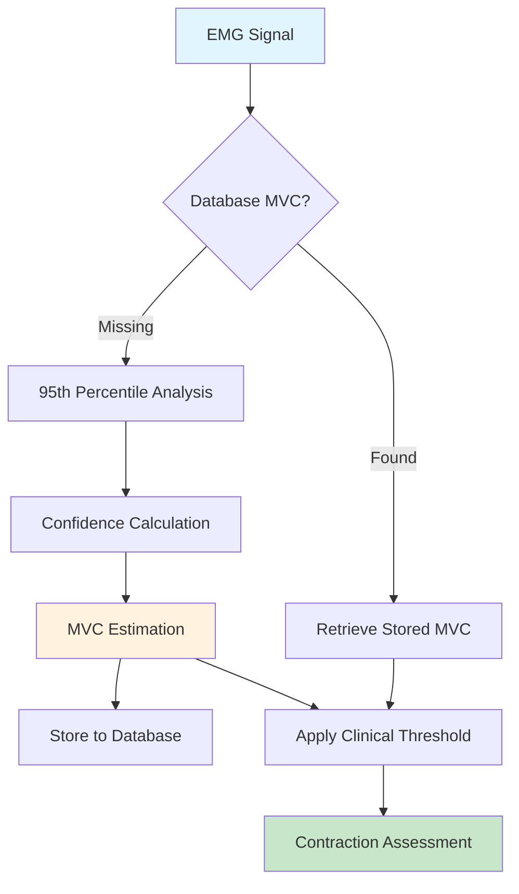

# MVC Calibration & Clinical Assessment System

## Overview

**Maximum Voluntary Contraction (MVC)** calibration provides clinical-grade threshold management for therapeutic assessment in the GHOSTLY+ platform.

**API Endpoint**: `/mvc/calibrate` (unified endpoint)  
**Service**: [`backend/services/mvc_service.py`](../../backend/services/mvc_service.py)

## API Architecture

### Unified Calibration Endpoint
**Route**: `POST /mvc/calibrate`

**Smart Input Detection**:
- **FormData** → Initial file-based calibration workflow
- **JSON** → Recalibration from existing analysis results

```python
@router.post("/calibrate", response_model=Dict[str, Dict])
async def calibrate_mvc_values(request: Request, file: Optional[UploadFile] = File(None), ...):
    if file is not None:
        # File upload - initial calibration
        return await _calibrate_from_file(file, user_id, session_id, threshold_percentage)
    elif "application/json" in content_type:
        # JSON payload - recalibration
        recalibrate_request = MVCRecalibrateRequest(**body)
        return await _calibrate_from_existing(recalibrate_request)
```

**Benefits**:
- Single Source of Truth for MVC operations
- Clinical terminology (`calibrate` vs technical `estimate`/`recalc`)
- Simplified API surface following DRY principles

## MVC Estimation Hierarchy

```python
class MVCService:
    async def get_or_estimate_mvc():
        # Priority 1: Database retrieval (user/session-specific)
        # Priority 2: Clinical estimation from signal analysis  
        # Priority 3: Safe fallback values
```

### 1. Database Retrieval (Priority 1)
```python
# User-specific MVC values stored from previous sessions
SELECT mvc_value, threshold_percentage, confidence_score 
FROM user_mvc_values 
WHERE user_id = ? AND channel = ? 
ORDER BY created_at DESC LIMIT 1
```

### 2. Clinical Signal Estimation (Priority 2)

#### **95th Percentile Algorithm**
```latex
\text{MVC}_{estimate} = \text{percentile}_{95}(|s_{raw}(t)|)
```

**Clinical Rationale**: 95th percentile represents strong voluntary contractions while filtering artifacts and noise peaks.

#### **Confidence Scoring**
```latex
\text{confidence} = 0.4 \cdot \text{variability}_{score} + 0.4 \cdot \text{peak}_{score} + 0.2 \cdot \text{length}_{score}
```

**Components:**
- **Variability Score**: `1 - (std/mean)` → Lower CV = higher confidence
- **Peak Score**: `min(1.0, (95th_percentile/mean)/5.0)` → Peak prominence
- **Length Score**: `min(1.0, signal_length/10000)` → Longer signals = better estimates

### 3. Safe Fallback (Priority 3)
```python
# When no estimation possible
MVCEstimation(
    mvc_value=0.001,           # Safe minimum value
    threshold_value=0.00075,   # 75% of fallback
    confidence_score=0.0,      # No confidence
    metadata={'fallback': True}
)
```

## MVC Integration Workflow



## Clinical Thresholds & Standards

### Research-Validated Thresholds

| Application | MVC Percentage | Clinical Evidence | Source |
|-------------|----------------|-------------------|--------|
| **Contraction Detection** | 10-15% | Optimal sensitivity/specificity (2024-2025) | [Clinical Research](https://pmc.ncbi.nlm.nih.gov/articles/PMC12276857/) |
| **Strength Training** | 75-80% | Standard therapeutic intensity | [Academic Study](https://academic.oup.com/jsm/article/22/4/570/7916734) |
| **Rehabilitation Therapy** | 50-75% | Progressive loading protocols | Clinical guidelines |
| **Fatigue Assessment** | Variable | Adapted to patient capacity | [Nature Research](https://www.nature.com/articles/s41598-025-05829-w) |

### Default Configuration
```python
# backend/config.py
DEFAULT_MVC_THRESHOLD_PERCENTAGE = 75.0  # 75% for therapeutic assessment
DEFAULT_THRESHOLD_FACTOR = 0.10          # 10% for initial detection (optimized 2024-2025)
```

## Data Structures

### MVCEstimation Class
```python
@dataclass
class MVCEstimation:
    channel: str                    # EMG channel identifier ('CH1', 'CH2')
    mvc_value: float               # Estimated MVC amplitude  
    threshold_value: float         # Calculated threshold (% of MVC)
    threshold_percentage: float    # Clinical threshold percentage (75.0)
    estimation_method: str         # 'database'|'clinical_estimation'|'user_provided'
    confidence_score: float        # Algorithm confidence (0.0-1.0)
    metadata: Dict                 # Clinical validation data
    timestamp: datetime            # Estimation timestamp
```

### Clinical Metadata
```python
metadata = {
    'signal_length_seconds': float,         # Signal duration
    'signal_std': float,                    # Signal variability
    'signal_mean': float,                   # Baseline level
    'percentile_95': float,                 # MVC estimate
    'percentile_90': float,                 # Secondary reference
    'percentile_99': float,                 # Peak detection
    'estimation_algorithm': '95th_percentile_clinical',
    'confidence_components': {
        'variability_score': float,
        'peak_score': float, 
        'length_score': float
    }
}
```

## Clinical Applications

### Therapeutic Assessment
```python
# Contraction quality evaluation
def assess_therapeutic_quality(contraction, mvc_estimation):
    intensity_ratio = contraction.max_amplitude / mvc_estimation.mvc_value
    
    if intensity_ratio >= 0.75:          # 75% MVC threshold
        return 'therapeutic_intensity'
    elif intensity_ratio >= 0.50:        # 50% MVC threshold  
        return 'moderate_intensity'
    elif intensity_ratio >= 0.20:        # 20% MVC threshold
        return 'low_intensity' 
    else:
        return 'subthreshold'
```

### Session Progression Tracking
```python
# Track MVC changes over therapy sessions
def track_mvc_progression(user_id, channel, timeframe_days=30):
    mvc_history = get_user_mvc_history(user_id, channel, timeframe_days)
    
    # Calculate progression metrics
    mvc_trend = calculate_trend(mvc_history)
    strength_gains = calculate_strength_gains(mvc_history)
    confidence_stability = assess_confidence_stability(mvc_history)
    
    return {
        'mvc_trend': mvc_trend,           # 'improving'|'stable'|'declining'
        'strength_gain_percent': float,   # Percentage improvement
        'confidence_trend': float,        # Estimation reliability
        'session_count': int              # Number of sessions analyzed
    }
```

## Integration with Detection System

### Quality Flag Assignment
```python
# MVC-based quality assessment in contraction detection
def evaluate_contraction_quality(contraction, mvc_estimation):
    mvc_threshold = mvc_estimation.threshold_value
    
    meets_mvc = contraction.max_amplitude >= mvc_threshold
    meets_duration = contraction.duration_ms >= MIN_DURATION_MS
    
    return {
        'meets_mvc': meets_mvc,
        'meets_duration': meets_duration, 
        'is_good': meets_mvc and meets_duration,
        'mvc_confidence': mvc_estimation.confidence_score,
        'therapeutic_intensity': contraction.max_amplitude / mvc_estimation.mvc_value
    }
```

## Implementation Status

- ✅ **Unified API Endpoint**: Single `/mvc/calibrate` endpoint with smart input detection
- ✅ **MVC Service**: Complete clinical-grade implementation
- ✅ **95th Percentile**: Research-validated estimation algorithm
- ✅ **Confidence Scoring**: Multi-factor validation system
- ✅ **Clinical Terminology**: User-friendly `calibrate`/`recalibrate` methods
- ⚠️ **Database Integration**: Service ready, Supabase connection pending
- ✅ **Quality Assessment**: Full integration with contraction detection
- ✅ **Backward Compatibility**: Deprecated methods maintained with warnings

## Related Documentation

- **[Contraction Detection](./contraction-detection.md)** - Quality assessment integration
- **[Signal Types](./signal-types-architecture.md)** - RMS envelope for MVC calculation
- **[Spectral Analysis](./spectral-analysis.md)** - Fatigue assessment with MVC context

---

**Implementation**: See [`backend/services/mvc_service.py`](../../backend/services/mvc_service.py) for complete service implementation.