# EMG Signal Types & Processing Architecture

## Overview

The GHOSTLY+ EMG C3D Analyzer processes **three distinct signal types** from C3D rehabilitation files, each serving specific analytical purposes for clinical assessment and research applications.

## Three Signal Types

### 1. Raw EMG Signal
**Source**: Direct from C3D file acquisition  
**Purpose**: Unprocessed electrical muscle activity  
**Usage**: Baseline reference, frequency analysis, research applications

The raw EMG signal represents the unfiltered electrical activity recorded directly from muscle electrodes during GHOSTLY rehabilitation sessions.

**Mathematical Representation:**
```latex
s_{raw}(t) = \text{EMG electrode voltage at time } t
```

**Characteristics:**
- **Frequency Range**: Full spectrum (0-1000Hz typical)
- **Amplitude**: Microvolts (μV) 
- **Noise Level**: High - includes electrical interference
- **Processing Cost**: Lowest computational overhead

### 2. Activated Signal (C3D Pre-processed)
**Source**: Pre-processed in C3D file (legacy GHOSTLY processing)  
**Purpose**: Real-time game control signal  
**Usage**: Historical analysis, game state correlation, temporal boundary detection

Based on the legacy C# implementation (`TrignoEmgInput.cs`), the "Activated" signal follows this processing pipeline:

#### **Processing Pipeline (Legacy C# Implementation):**

1. **Band-pass Filtering**: 5-25 Hz Butterworth filter (6th order)
```latex
s_{bpf}(t) = \text{BandPassFilter}_{5-25Hz}(s_{raw}(t))
```

2. **Full-Wave Rectification**:
```latex
s_{rect}(t) = |s_{bpf}(t)|
```

3. **Moving Window Average**: Window size = sampling_rate/10 samples (~100ms at 1000Hz)
```latex
s_{avg}[n] = \frac{1}{W} \sum_{k=n-W/2}^{n+W/2} s_{rect}[k]
```
where W = ⌊sampling_rate/10⌋

4. **Baseline Calibration & Thresholding**:
```latex
\text{threshold} = \mu_{baseline} + 3 \cdot \sigma_{baseline}
```
```latex
s_{activated}(t) = \begin{cases} 
s_{avg}(t) & \text{if } s_{avg}(t) > \text{threshold} \\
0 & \text{otherwise}
\end{cases}
```

**Characteristics:**
- **Frequency Range**: 5-25 Hz (game-optimized)
- **Temporal Resolution**: 100ms window averaging
- **Noise Immunity**: Pre-filtered and baseline calibrated
- **Clinical Validation**: Game-tested with rehabilitation patients

### 3. RMS Envelope (Current Processing)
**Source**: Calculated by current Python backend  
**Purpose**: Robust amplitude estimation for clinical analysis  
**Usage**: Contraction detection, therapeutic assessment, MVC evaluation

**Mathematical Representation:**
```latex
s_{RMS}[n] = \sqrt{\frac{1}{W} \sum_{k=n-W/2}^{n+W/2} s_{raw}^2[k]}
```

Where:
- W = window size in samples (50ms × sampling_rate)
- Continuous sliding window implementation
- No pre-filtering applied to preserve signal characteristics

**Implementation** (`backend/emg/emg_analysis.py:349`):
```python
def moving_rms(signal: np.ndarray, window_size: int) -> np.ndarray:
    """Moving RMS with same-length output using numpy convolution"""
    window_size = min(window_size, len(signal))
    squared_signal = np.power(signal, 2)
    window = np.ones(window_size) / float(window_size)
    return np.sqrt(np.convolve(squared_signal, window, 'same'))
```

**Characteristics:**
- **Window Size**: 50ms (configurable)
- **Amplitude Accuracy**: Superior correlation with muscle force
- **Noise Robustness**: Inherent noise reduction through RMS calculation
- **Clinical Standard**: Research-validated for rehabilitation therapy

## Signal Comparison Analysis

| Signal Type | Noise Robustness | Temporal Resolution | Clinical Relevance | Computational Cost | Best Use Case |
|-------------|------------------|--------------------|--------------------|-------------------|---------------|
| **Raw** | Low | Highest (2kHz) | Research | Lowest | Frequency analysis, research |
| **Activated** | Medium | Medium (100ms) | Game Control | Medium | Temporal boundary detection |
| **RMS Envelope** | **Highest** | Good (50ms) | **Clinical** | Medium | Amplitude evaluation, MVC |

## Research Foundation (2024-2025)

### Signal Processing Best Practices

**RMS Envelope Superiority:**
- [RMS envelope provides noise-robust amplitude estimation](https://pmc.ncbi.nlm.nih.gov/articles/PMC11548475/)
- [Better physiological correlation with muscle force than linear envelope](https://repository.lsu.edu/cgi/viewcontent.cgi?article=7300&context=gradschool_theses)
- [Standard practice in rehabilitation therapy applications](https://www.frontiersin.org/journals/human-neuroscience/articles/10.3389/fnhum.2024.1472075/full)

**Temporal vs Frequency Domain Analysis:**
- Time-domain features like RMS remain the **gold standard for contraction detection**
- Frequency features are valuable for **muscle fatigue assessment**
- [Integrated approaches with temporal analysis provide comprehensive assessment](https://www.nature.com/articles/s41598-025-03766-2)

### Clinical Validation

**MVC Threshold Standards:**
- [20-30% MVC optimal for contraction detection](https://pubmed.ncbi.nlm.nih.gov/40727050/)
- [75-80% MVC for strength training applications](https://academic.oup.com/jsm/article/22/4/570/7916734)
- [Individual calibration essential for therapeutic accuracy](https://www.nature.com/articles/s41598-025-05829-w)

## Recommended Hybrid Processing Strategy

Based on signal characteristics and clinical research, the optimal approach combines:

### **🎯 Activated Signal → Contraction Detection & Temporal Boundaries**
**Advantages:**
- Pre-filtered (5-25Hz) removes noise while preserving physiological patterns
- Baseline calibrated with statistical thresholding
- Superior temporal resolution for start/stop detection
- Game-validated with rehabilitation patients

### **📊 RMS Envelope → Intensity Evaluation & MVC Assessment**
**Advantages:**
- Noise-robust amplitude measurement
- Preserves full signal characteristics (no pre-filtering)
- Superior correlation with muscle force production
- Research-validated for clinical applications

### **Enhanced Processing Pipeline**

```mermaid
flowchart TD
    A[Raw EMG Signal] --> B[Activated Signal Processing]
    A --> C[RMS Envelope Calculation]
    
    B --> D[5-25Hz Band-pass Filter]
    D --> E[Full-Wave Rectification]
    E --> F[Moving Window Average 100ms]
    F --> G[Baseline Threshold μ+3σ]
    
    C --> H[50ms RMS Window]
    
    G --> I[Contraction Detection]
    I --> J[Temporal Boundary Detection]
    J --> K[Duration Calculation]
    
    H --> L[Amplitude Evaluation]
    L --> M[MVC Assessment]
    
    K --> N[Contraction Merging 200ms]
    M --> N
    N --> O[Clinical Quality Assessment]
    
    style A fill:#e1f5fe
    style I fill:#fff3e0
    style L fill:#f3e5f5
    style O fill:#c8e6c9
```



## Implementation Status

### Current Backend Implementation
**⚠️ IMPORTANT**: The current implementation uses **RMS envelope only** for both detection and evaluation.

**Implemented Functions:**
- **RMS Calculation**: `moving_rms()` in [`backend/emg/emg_analysis.py:349`](../../backend/emg/emg_analysis.py#L349)
- **Detection Algorithm**: `analyze_contractions()` in [`backend/emg/emg_analysis.py:50`](../../backend/emg/emg_analysis.py#L50)
- **Signal Processing**: Integration in [`backend/services/c3d_processor.py:174-177`](../../backend/services/c3d_processor.py#L174)

### Recommended Enhancement
The **hybrid approach** combining Activated signal (temporal) + RMS envelope (intensity) represents the optimal clinical strategy but requires implementation.

## Related Documentation

- **[Contraction Detection Algorithm](./contraction-detection-algorithm.md)** - Detection implementation details
- **[MVC Calibration System](./mvc-calibration-system.md)** - Clinical threshold management
- **[Spectral Analysis Features](./spectral-analysis-features.md)** - Frequency domain processing
- **[Backend Implementation](./backend-implementation.md)** - Code structure and functions

---

**Next**: See [Contraction Detection Algorithm](./contraction-detection-algorithm.md) for implementation details of the detection system.