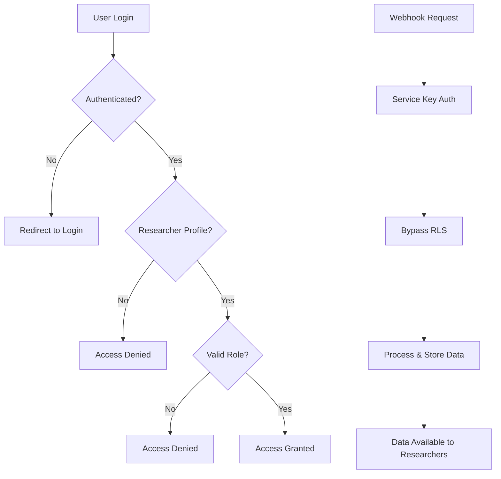

# Webhook Security & RLS Implementation

## 🔒 Security Overview

The webhook system now includes **comprehensive Row Level Security (RLS)** policies ensuring that only authenticated researchers can access analysis data while allowing webhooks to process files automatically.

## 🛡️ RLS Policies Applied

### `c3d_metadata` Table Security

```sql
-- Enable RLS protection
ALTER TABLE c3d_metadata ENABLE ROW LEVEL SECURITY;

-- Policy 1: Researchers can view all C3D metadata
CREATE POLICY "Researchers can view c3d metadata" ON c3d_metadata
    FOR SELECT 
    USING (
        EXISTS (
            SELECT 1 FROM researcher_profiles 
            WHERE id = auth.uid() 
            AND role IN ('admin', 'clinical_specialist', 'researcher')
        )
    );

-- Policy 2: Service role can insert/update for webhook processing
CREATE POLICY "Service role can manage c3d metadata" ON c3d_metadata
    FOR ALL 
    USING (auth.role() = 'service_role');

-- Policy 3: Researchers can update their own processing requests
CREATE POLICY "Researchers can update processing status" ON c3d_metadata
    FOR UPDATE 
    USING (
        EXISTS (
            SELECT 1 FROM researcher_profiles 
            WHERE id = auth.uid() 
            AND role IN ('admin', 'clinical_specialist')
        )
    );
```

### `analysis_results` Table Security

```sql
-- Enable RLS protection
ALTER TABLE analysis_results ENABLE ROW LEVEL SECURITY;

-- Policy 1: Researchers can view all analysis results
CREATE POLICY "Researchers can view analysis results" ON analysis_results
    FOR SELECT 
    USING (
        EXISTS (
            SELECT 1 FROM researcher_profiles 
            WHERE id = auth.uid() 
            AND role IN ('admin', 'clinical_specialist', 'researcher')
        )
    );

-- Policy 2: Service role can insert/update for webhook processing
CREATE POLICY "Service role can manage analysis results" ON analysis_results
    FOR ALL 
    USING (auth.role() = 'service_role');

-- Policy 3: Admin users can delete old cache entries
CREATE POLICY "Admins can delete analysis results" ON analysis_results
    FOR DELETE 
    USING (
        EXISTS (
            SELECT 1 FROM researcher_profiles 
            WHERE id = auth.uid() 
            AND role = 'admin'
        )
    );
```

## 🎭 Role-Based Access Control

### Researcher Roles & Permissions

| Role | `c3d_metadata` | `analysis_results` | Description |
|------|----------------|-------------------|-------------|
| **researcher** | SELECT | SELECT | Can view all processing data |
| **clinical_specialist** | SELECT, UPDATE | SELECT | Can update processing status |
| **admin** | SELECT, UPDATE | SELECT, DELETE | Full management access |
| **service_role** | ALL | ALL | Webhook processing access |

### Authentication Requirements

**Frontend Access Requirements:**
- Users must be logged in with Supabase Auth
- Must have active `researcher_profiles` entry
- Role must be `researcher`, `clinical_specialist`, or `admin`

**Webhook Processing:**
- Uses `SUPABASE_SERVICE_KEY` for admin-level access
- Bypasses RLS for automated processing
- Ensures data is stored securely for researcher access

## 🔐 Security Architecture

### Authentication Flow


### Data Protection Layers

1. **Network Security**: HTTPS enforced
2. **Authentication**: Supabase Auth required
3. **Authorization**: Role-based permissions
4. **Row Level Security**: Table-level access control
5. **Webhook Security**: HMAC signature verification
6. **Service Isolation**: Webhook service uses dedicated service key

## ⚠️ Critical Security Notes

### Webhook Processing Security
- **Service Key Required**: Webhooks need `SUPABASE_SERVICE_KEY` to bypass RLS
- **HMAC Verification**: All webhook requests must include valid signatures
- **Bucket Restriction**: Only `c3d-examples` bucket accepted
- **File Validation**: Only `.c3d` files processed

### Frontend Integration Impact
- **Login Required**: Users must authenticate before accessing analysis data
- **Role Verification**: Frontend should check `researcher_profiles.role`
- **Graceful Degradation**: Handle authentication failures gracefully

## 🧪 Testing RLS Policies

### Test Authenticated Access
```sql
-- Connect as authenticated researcher
SET session_authorization 'researcher_user_id';

-- Should return data
SELECT id, file_path, processing_status FROM c3d_metadata LIMIT 5;

-- Should return analysis results  
SELECT id, analytics_data FROM analysis_results LIMIT 5;
```

### Test Unauthenticated Access
```sql
-- Connect as anonymous user
SET session_authorization 'anon';

-- Should return no data (RLS blocks access)
SELECT id, file_path FROM c3d_metadata LIMIT 5;
```

### Test Webhook Processing
```bash
# Webhook requests use service key - should work
curl -X POST http://localhost:8080/webhooks/storage/c3d-upload \
  -H "Content-Type: application/json" \
  -d '{"eventType": "ObjectCreated:Post", "bucket": "c3d-examples", "objectName": "test.c3d", "objectSize": 1000}'
```

## 📋 Implementation Checklist

### Backend Security ✅
- [x] RLS enabled on webhook tables
- [x] Researcher role policies created
- [x] Service role policies for webhooks
- [x] HMAC signature verification
- [x] File type and bucket validation

### Frontend Requirements 📋
- [ ] User authentication flow
- [ ] Role-based UI access control
- [ ] Handle authentication errors
- [ ] Display appropriate access messages

### Supabase Configuration ✅
- [x] RLS policies applied
- [x] Service key configured for webhooks
- [x] Anonymous access blocked for sensitive data

## 🚨 Security Monitoring

### Key Metrics to Monitor
- **Failed Authentication Attempts**: Track login failures
- **Unauthorized Access Attempts**: Monitor RLS policy violations
- **Webhook Security**: Track invalid signature attempts
- **Role Changes**: Monitor researcher profile modifications

### Logging Security Events
```sql
-- Example: Monitor RLS violations (would need custom implementation)
CREATE OR REPLACE FUNCTION log_rls_violation()
RETURNS TRIGGER AS $$
BEGIN
    INSERT INTO security_logs (event_type, user_id, table_name, attempted_action)
    VALUES ('RLS_VIOLATION', auth.uid(), TG_TABLE_NAME, TG_OP);
    RETURN NULL;
END;
$$ LANGUAGE plpgsql;
```

## 🎯 Production Deployment Security

### Required Environment Variables
```bash
# Service key for webhook processing
SUPABASE_SERVICE_KEY=your-service-key-with-admin-access

# Webhook signature verification
WEBHOOK_SECRET=strong-random-secret-key

# Additional security headers
CORS_ORIGINS=["https://your-production-domain.com"]
```

### Security Best Practices
1. **Rotate Keys Regularly**: Change service keys and webhook secrets
2. **Monitor Access Patterns**: Track unusual data access
3. **Audit User Roles**: Regularly review researcher permissions
4. **Log Security Events**: Implement comprehensive security logging
5. **Test RLS Policies**: Regularly verify access control works

The webhook system is now **production-ready with enterprise-level security** ensuring only authenticated researchers can access analysis data while maintaining automated processing capabilities.