# GHOSTLY+ EMG C3D Analyzer - Architecture

## Overview

The GHOSTLY+ system transforms electromyography data from rehabilitation therapy sessions into clinical insights. This document provides an architectural overview of how React, FastAPI, and Supabase work together to process EMG signals and help therapists track patient progress.

**Quick Navigation:**
- **Backend Development** → [Backend Architecture](./backend.md)
- **Frontend Development** → [Frontend Overview](./frontend/overview.md)
- **DevOps & Deployment** → [DevOps Guide](./devops/devops.md)

## Technology Stack

The system combines modern frameworks selected for reliability and developer experience:

| Component | Technology | Purpose |
|-----------|------------|---------|
| **Frontend** | React 19 + TypeScript | Type-safe component development with modern hooks |
| **Backend** | FastAPI + Python 3.10 | High-performance API with automatic documentation |
| **Database** | PostgreSQL via Supabase | Structured data with Row Level Security |
| **Storage** | Supabase Storage | C3D file storage with webhook triggers |
| **Cache** | Redis 7.2 | Session caching and performance optimization |
| **Deployment** | Coolify + Docker | Self-hosted platform with SSL and monitoring |

> **Note**: When deploying with Coolify, the built-in Traefik proxy handles SSL/TLS termination, domain routing, and load balancing automatically - no separate NGINX required.

## System Architecture

The GHOSTLY+ system uses a sophisticated 6-layer architecture with three API integration approaches:


## Three API Integration Approaches

The system offers three complementary approaches for accessing data and functionality. Each approach works well for different scenarios:

```mermaid
graph TB
    A1["🎯 Approach 1: Frontend → Direct Supabase"]
    A1 --> F1[React App]
    F1 -->|User JWT| S1[Supabase REST API]
    S1 -->|Auto-generated endpoints| DB1[(PostgreSQL + RLS)]
    
    A2["🔧 Approach 2: Backend → Direct Supabase"]
    A2 --> B2[Python Service]
    B2 -->|Service Key/User Token| S2[Supabase Client]
    S2 --> DB2[(PostgreSQL)]
    
    A3["⚙️ Approach 3: Frontend → FastAPI → Supabase"]
    A3 --> F3[React App]
    F3 --> API3[Custom FastAPI Route]
    API3 -->|Business Logic| S3[Supabase Client]
    S3 --> DB3[(PostgreSQL)]
    
    style A1 fill:#e8f5e9
    style A2 fill:#fff3e0
    style A3 fill:#fce4ec
    style F1 fill:#e3f2fd
    style S1 fill:#c8e6c9
    style DB1 fill:#fff3e0
    style B2 fill:#fce4ec
    style S2 fill:#c8e6c9
    style DB2 fill:#fff3e0
    style F3 fill:#e3f2fd
    style API3 fill:#ffebee
    style S3 fill:#c8e6c9
    style DB3 fill:#fff3e0
```



### When to Use Each Approach

#### 🎯 **Approach 1: Frontend → Direct Supabase**
*Simple CRUD operations, authentication, real-time updates*

**Works well for:** Patient lists, clinical notes, profile updates, file uploads  
**Benefits:** Lower latency, reduced backend load, automatic RLS security

#### 🔧 **Approach 2: Backend → Direct Supabase**  
*Administrative operations, background tasks*

**Works well for:** User management, admin operations, system tasks  
**Benefits:** Service key access, administrative privileges, system operations

#### ⚙️ **Approach 3: Frontend → FastAPI → Supabase**
*Complex business logic, multi-step workflows*

**Works well for:** EMG processing, file analysis, complex workflows  
**Benefits:** Complex logic handling, data transformation, error recovery

### Decision Criteria

```
Need EMG/C3D processing? ──Yes──► FastAPI (Approach 3)
       │
       No
       ▼
Need business logic?     ──Yes──► FastAPI (Approach 3)
       │
       No
       ▼
Is it simple CRUD?       ──Yes──► Direct Supabase (Approach 1)
       │
       No
       ▼
Real-time updates?       ──Yes──► Direct Supabase (Approach 1)
       │
       No
       ▼
Backend admin task?      ──Yes──► Backend → Supabase (Approach 2)
       │
       No
       ▼
External webhook?        ──Yes──► FastAPI (Approach 3)
```

> **📖 Detailed Implementation**: For complete code examples, endpoint documentation, and implementation patterns, see the [Backend Architecture](./backend.md#api-design) documentation.

## Layer Descriptions

#### 1. Presentation Layer
- **React Components**: User interface and interactions
- **State Management**: Zustand store and TanStack Query
- **Visualization**: Charts and real-time data display

#### 2. API Gateway Layer  
- **FastAPI**: Complex processing endpoints, webhooks, C3D analysis
- **Supabase REST API**: Auto-generated CRUD endpoints via PostgREST
- **Authentication**: Supabase Auth with JWT tokens

#### 3. Application Layer
- **Session Orchestration**: Therapy session lifecycle management
- **Business Workflows**: Complex multi-step operations
- **Service Coordination**: Cross-domain orchestration

#### 4. Domain Layer
- **EMG Processing**: Signal filtering and analysis
- **Clinical Algorithms**: Contraction detection, fatigue analysis
- **Performance Scoring**: Clinical metrics calculation

#### 5. Infrastructure Layer
- **Repository Pattern**: Data access abstraction
- **Supabase Client**: Used by both frontend and backend
- **External Services**: Webhook handlers, cache services

#### 6. Persistence Layer
- **PostgreSQL Database**: Structured data with Row Level Security
- **Redis Cache**: Session data and performance optimization
- **File Storage**: C3D files in Supabase buckets

## Key System Files

The most important files to understand the system's architecture:

| File | Purpose |
|------|---------|
| `therapy_session_processor.py` | Core orchestration engine - coordinates entire workflow |
| `processor.py` | EMG signal processing - single source of truth for analysis |
| `performance_scoring_service.py` | Clinical scoring algorithms and metrics calculation |
| `emg_analysis.py` | Scientific EMG algorithms and clinical metrics |
| `signal_processing.py` | Low-level signal operations and filtering |
| `upload.py` | Stateless C3D processing endpoint for direct analysis |
| `webhooks.py` | Event-driven processing for Supabase storage events |
| `AppContent.tsx` | Main router with role-based access control |
| `TherapistOverview.tsx` | Primary clinical dashboard interface for patient monitoring |
| `AdminDashboard.tsx` | System administration and user management interface |
| `C3DFileBrowser.tsx` | File navigation and selection hub |
| `GameSessionTabs.tsx` | Multi-tab session analysis interface |
| `useAuth.ts` | Central authentication orchestrator |

## Processing Modes

The system supports two processing modes sharing the same core engine:

### Stateless Mode (Direct Upload)

Immediate, synchronous processing without persistence:


**Use Cases**: Quick assessments, testing, development

### Stateful Mode (Webhook)

Asynchronous, event-driven processing with full persistence:


**Use Cases**: Clinical workflow, patient tracking, performance history


## Key Architectural Patterns

### Domain-Driven Design

Services organized by business domain:
```
backend/services/
├── clinical/          # Therapy sessions, patient management
├── c3d/              # C3D file processing
├── analysis/         # EMG analysis coordination
├── user/             # User management
└── shared/           # Common utilities
```

### Repository Pattern

Clean separation between business logic and data access:
```python
class TherapySessionRepository:
    def create(self, session_data: dict) -> dict
    def get_by_id(self, session_id: str) -> dict
    def update(self, session_id: str, updates: dict) -> dict
```

### Dependency Injection

Services receive dependencies through constructors:
```python
class TherapySessionProcessor:
    def __init__(self, 
                 supabase_client: Client,
                 c3d_processor: GHOSTLYC3DProcessor,
                 scoring_service: PerformanceScoringService)
```

### Event-Driven Processing

Webhook endpoints enable background processing without blocking user interactions.

## Deep Dive Resources

For detailed information about specific areas:

### 🔧 Backend Development
→ [Backend Architecture](./backend.md)
- FastAPI patterns and best practices
- Domain service organization
- EMG processing pipeline details
- Database and repository patterns

### 🎨 Frontend Development  
→ [Frontend Overview](./frontend/overview.md)
- React component architecture
- State management with Zustand
- TanStack Query patterns
- UI/UX implementation details

### 🚀 DevOps & Deployment
→ [DevOps Guide](./devops/devops.md)
- Environment configurations
- Docker and Coolify setup
- CI/CD pipeline
- Production deployment

### 🧪 Testing
→ [Testing Architecture](./testing.md)
- 227+ comprehensive tests
- Testing strategies and patterns
- E2E validation approaches

## Quick Start

```bash
# Start both frontend and backend
./start_dev_simple.sh

# Or start individually:
cd backend && uvicorn main:app --reload --port 8080
cd frontend && npm start
```

For detailed setup instructions, see the specialized documentation linked above.

## Summary

The GHOSTLY+ system uses a sophisticated 6-layer architecture with three API integration approaches that separate concerns across presentation, API gateway, application orchestration, domain logic, infrastructure services, and persistence. The key architectural decision is choosing between direct Supabase access, backend Supabase operations, and FastAPI processing based on complexity and requirements.

For implementation details and best practices, refer to the specialized documentation for your area of interest.