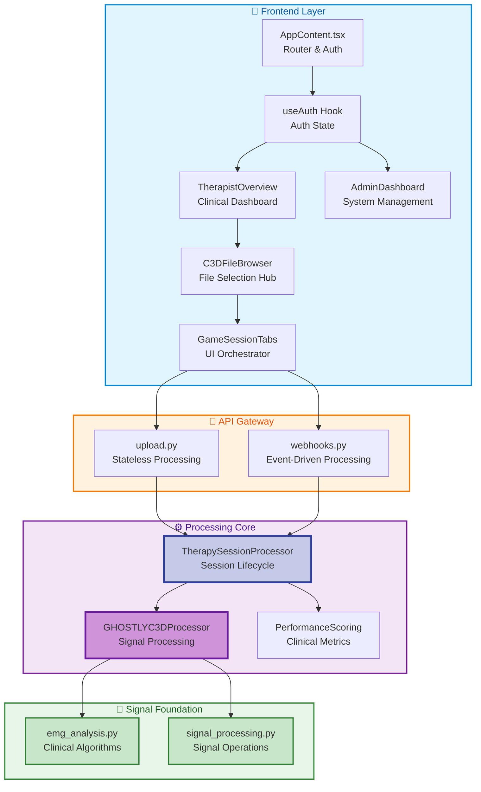

# Critical System Components

## Overview

The Ghostly+ Dashboard operates through 13 critical files that form the backbone of the system. These components were selected based on their architectural significance, representing the essential control points and processing centers that enable EMG analysis from the GHOSTLY rehabilitation game. Each file serves a distinct purpose while maintaining clean interfaces with other components, following Domain-Driven Design principles to ensure maintainability and testability.

## The Architecture at a Glance

## Signal Processing Foundation

### 1. EMG Analysis Module (707 lines)
**`backend/emg/emg_analysis.py`**

The EMG Analysis module provides the **scientific foundation** for all electromyographic metrics calculated within the system. It implements clinically-validated algorithms for **amplitude analysis** (RMS, MAV), frequency domain metrics (MPF, MDF), fatigue indices (Dimitrov's FI_nsm5), and contraction detection algorithms. Each function is thoroughly documented with **clinical validation requirements**, threshold parameters, and implementation hypotheses, ensuring reproducible and scientifically rigorous analysis across all patient sessions.

**Why it's critical:** Contains the core mathematical formulations and clinical algorithms that transform raw EMG signals into medically interpretable metrics, serving as the scientific foundation for therapeutic assessment.

### 2. Signal Processing Module (326 lines)
**`backend/emg/signal_processing.py`**

The Signal Processing module delivers **low-level signal operations** essential for EMG data preparation and enhancement. It implements Butterworth filtering for noise reduction, **envelope detection** for amplitude tracking, signal smoothing for artifact removal, and quality assessment metrics. This module maintains **standardized processing parameters** based on clinical literature, ensuring consistent and reproducible signal processing across all channels and sessions while maintaining complete transparency in the processing pipeline.

**Why it's critical:** Provides the fundamental signal processing operations that prepare raw EMG data for clinical analysis, ensuring data quality and consistency across the entire system.

## Backend Core: Processing Engine

### 3. TherapySessionProcessor (1,833 lines)
**`backend/services/clinical/therapy_session_processor.py`**

The TherapySessionProcessor serves as the **central orchestrator** for all clinical data processing, managing the complete lifecycle of therapy sessions from initial C3D file reception through final data persistence. It coordinates multiple services including EMG analysis, performance scoring, and database operations while maintaining **transactional integrity**. This processor implements the **Repository pattern** to abstract data access and ensures consistent error handling across the entire processing pipeline.

**Why it's critical:** Acts as the primary business logic coordinator, ensuring that all therapy session data flows through proper validation, processing, and storage stages while maintaining clinical data integrity.

### 4. GHOSTLYC3DProcessor (1,496 lines)
**`backend/services/c3d/processor.py`**

The GHOSTLYC3DProcessor represents the **Single Source of Truth** for all EMG signal processing operations within the system. It encapsulates sophisticated algorithms for C3D binary file parsing, Butterworth filtering, envelope detection, **contraction identification**, and fatigue analysis. This processor operates in a **stateless manner**, accepting raw C3D data and returning structured analysis results without any external dependencies, ensuring consistent and reproducible signal processing across all usage contexts.

**Why it's critical:** Contains the core scientific algorithms that transform raw EMG signals into clinically meaningful metrics, serving as the foundation for all therapeutic assessments.

### 5. PerformanceScoringService (1,065 lines)
**`backend/services/clinical/performance_scoring_service.py`**

The PerformanceScoringService transforms raw EMG analysis data into **standardized clinical scores** using proprietary GHOSTLY+ algorithms. It calculates multiple performance dimensions including **muscle activation quality**, exercise completion rates, fatigue indices, and session adherence scores. These metrics enable therapists to track patient progress objectively and adjust treatment plans based on **quantitative evidence** rather than subjective observation.

**Why it's critical:** Bridges the gap between technical signal analysis and clinical interpretation, providing therapists with actionable metrics for patient assessment.

## API Gateway

### 6. Upload Route (513 lines)
**`backend/api/routes/upload.py`**

The Upload Route provides a **stateless, synchronous processing** endpoint for direct C3D file uploads, delivering immediate analysis results without database persistence. This endpoint serves testing scenarios, quick assessments, and development workflows where **immediate feedback** is prioritized over session tracking. It implements comprehensive validation, error handling, and **response formatting** while maintaining complete independence from the stateful processing pipeline.

**Why it's critical:** Enables rapid prototyping and testing of EMG analysis algorithms without the overhead of full session management.

### 7. Webhooks Route (355 lines)
**`backend/api/routes/webhooks.py`**

The Webhooks Route implements **event-driven processing** triggered by Supabase Storage notifications, enabling asynchronous C3D file processing with full session persistence. It validates webhook signatures using **HMAC-SHA256**, extracts file metadata, and initiates background processing tasks that create comprehensive therapy sessions. This endpoint supports the **clinical workflow** where files are uploaded to storage buckets and processed automatically without blocking user interactions.

**Why it's critical:** Provides the production-ready pathway for clinical data processing, ensuring all therapy sessions are properly tracked and stored.

## Frontend Architecture

### 8. useAuth Hook (377 lines)
**`frontend/src/hooks/useAuth.ts`**

The useAuth hook serves as the **central authentication orchestrator** for the React application, managing user sessions, role-based access control, and security state synchronization with Supabase Auth. It provides a clean **abstraction layer** between components and the authentication system, handling session persistence, automatic token refresh, and role-based UI rendering decisions. This hook ensures consistent authentication behavior across all components while maintaining a **single source of truth** for user state.

**Why it's critical:** Centralizes all authentication logic, preventing security vulnerabilities from scattered auth implementations across components.

### 9. TherapistOverview Component (864 lines)
**`frontend/src/components/dashboards/therapist/TherapistOverview.tsx`**

The TherapistOverview component provides the **primary clinical interface** where therapists monitor patient progress, review session results, and make treatment decisions. It aggregates data from multiple sources including recent sessions, **performance trends**, and patient adherence metrics, presenting them through interactive charts and filterable tables. This dashboard implements **real-time updates** via Supabase subscriptions, ensuring therapists always see the latest patient data without manual refreshing.

**Why it's critical:** Serves as the main operational interface for clinical staff, directly impacting patient care quality and therapist efficiency.

### 10. GameSessionTabs Component (433 lines)
**`frontend/src/components/tabs/shared/GameSessionTabs.tsx`**

The GameSessionTabs component orchestrates the comprehensive **five-tab interface** for detailed session exploration, providing specialized views for exercises, performance scores, contraction patterns, clinical notes, and raw signal data. Each tab maintains its own state while sharing **common session context**, enabling therapists to navigate seamlessly between different data perspectives. This component implements **lazy loading and memoization** to ensure smooth performance even with large datasets.

**Why it's critical:** Provides the detailed analysis interface that therapists rely on for making informed clinical decisions based on comprehensive session data.

### 11. AdminDashboard Component (126 lines, needs expansion)
**`frontend/src/components/dashboards/admin/AdminDashboard.tsx`**

The AdminDashboard component serves as the **system administration interface** for managing the entire rehabilitation platform's operational aspects. It provides centralized control for **user management** (therapists, researchers, patients), role assignments, access permissions, and system-wide configuration settings. While currently in minimal implementation, this dashboard is designed to handle **patient-therapist assignments**, clinical protocol configurations, and platform-wide settings that affect all users. The component integrates with Supabase's role-based access control to ensure only authorized administrators can modify critical system parameters.

**Why it's critical:** Essential for platform governance, enabling administrators to manage the **user ecosystem**, configure clinical protocols, and maintain **system integrity** while ensuring proper access control and compliance.

### 12. AppContent Component (860 lines)
**`frontend/src/AppContent.tsx`**

The AppContent component functions as the **main application router** and navigation orchestrator, implementing sophisticated role-based access control throughout the platform. It manages the complete **routing hierarchy** for therapist dashboards, admin interfaces, patient views, and public pages while enforcing authentication requirements at each level. This component integrates deeply with the useAuth hook to dynamically render appropriate interfaces based on **user roles and permissions**, ensuring therapists only see their assigned patients, administrators access system controls, and unauthorized users are redirected appropriately. The router also handles session state persistence, navigation guards, and lazy loading of route components for optimal performance.

**Why it's critical:** Acts as the **security gatekeeper** and navigation controller, ensuring users can only access authorized features while providing **seamless navigation** throughout the application.

### 13. C3DFileBrowser Component (641 lines)
**`frontend/src/components/c3d/C3DFileBrowser.tsx`**

The C3DFileBrowser component provides the **central data navigation hub** where therapists browse, filter, and select C3D files for analysis from the GHOSTLY rehabilitation game. It manages complex **multi-dimensional relationships** between therapy sessions, patient records, therapist assignments, and temporal data through sophisticated filtering and search capabilities. This component implements **intelligent caching strategies** to handle potentially thousands of files while maintaining responsive performance, and provides advanced filtering by patient, date range, session type, and clinical parameters. The browser integrates with Supabase Storage for file retrieval and maintains session context to streamline the therapist's workflow when analyzing multiple files from the same patient.

**Why it's critical:** Serves as the **primary entry point** for all clinical analysis workflows, directly impacting therapist efficiency and the **quality of patient care** through effective data organization and retrieval.

## Key Architectural Principles

The critical files demonstrate several foundational patterns that ensure system reliability and maintainability:

- **Domain-Driven Design**: Clear separation between clinical processing, user management, and infrastructure layers
- **Single Source of Truth**: `GHOSTLYC3DProcessor` as the authoritative EMG processing engine
- **Repository Pattern**: Clean data access abstractions for testability and flexibility
- **Event-Driven Processing**: Webhook-based asynchronous workflows for scalability
- **Component-Based Architecture**: Modular React components organized by feature and responsibility

---

*Last updated: September 2025*