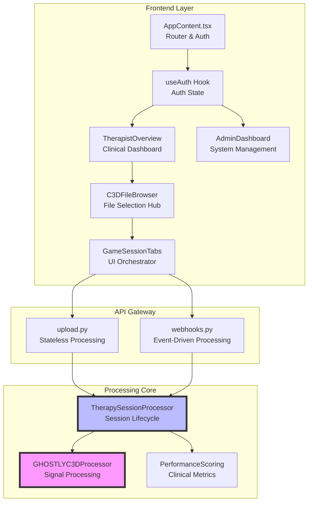

# Critical System Components

## Overview

These are the 11 most important files in the GHOSTLY+ EMG C3D Analyzer codebase. They were selected based on their architectural significance and role in the system's core functionality.

## The Architecture at a Glance

## Backend Core: The Processing Engine

### 1. TherapySessionProcessor (1,833 lines)
**`backend/services/clinical/therapy_session_processor.py`**

Manages the complete lifecycle of a therapy session from C3D file reception to data storage. Coordinates EMG processing, scoring algorithms, and data persistence.

**Why it's critical:** Central orchestrator for all session processing. Handles the main business logic flow.

### 2. GHOSTLYC3DProcessor (1,496 lines)
**`backend/services/c3d/processor.py`**

Single Source of Truth for EMG signal processing. Handles C3D file parsing, signal filtering, contraction detection, and fatigue analysis.

**Why it's critical:** Core signal processing logic. All EMG analysis flows through this processor.

### 3. PerformanceScoringService (1,065 lines)
**`backend/services/clinical/performance_scoring_service.py`**

Converts processed EMG data into clinical scores. Implements GHOSTLY+ scoring algorithms.

**Why it's critical:** Generates all performance metrics used in clinical assessments.

## API Routes

### 4. Upload Route (513 lines)
**`backend/api/routes/upload.py`**

Stateless processing endpoint for direct C3D file uploads.

### 5. Webhooks Route (355 lines)
**`backend/api/routes/webhooks.py`**

Event-driven processing endpoint for Supabase storage events.

## Frontend Components

### 6. useAuth Hook (377 lines)
**`frontend/src/hooks/useAuth.ts`**

Manages user sessions, role-based access, and security state across the React application.

### 7. TherapistOverview Component (864 lines)
**`frontend/src/components/dashboards/therapist/TherapistOverview.tsx`**

Main dashboard for therapists to monitor patient progress and review session results.

### 8. GameSessionTabs Component (433 lines)
**`frontend/src/components/tabs/shared/GameSessionTabs.tsx`**

Manages the five-tab interface for exploring session data: exercises, scores, contractions, notes, and raw data.

### 9. AdminDashboard Component (126 lines, needs expansion)
**`frontend/src/components/dashboards/admin/AdminDashboard.tsx`**

System administration interface for managing users, patients, and configurations. Currently minimal implementation.

**Why it's critical:** Required for user management, patient assignment, and system configuration.

### 10. AppContent Component (860 lines)
**`frontend/src/AppContent.tsx`**

Main application router. Manages routing logic and role-based access control.

**Why it's critical:** Controls application navigation and access to different interfaces based on user roles.

### 11. C3DFileBrowser Component (641 lines)
**`frontend/src/components/c3d/C3DFileBrowser.tsx`**

Central hub for browsing, filtering, and selecting C3D files. Orchestrates complex data relationships between files, patients, therapists, and sessions.

**Why it's critical:** Primary interface for data access. All clinical analysis workflows start with file selection through this component.

## Architectural Patterns

Key patterns used in these files:

### Domain-Driven Design (DDD)
The separation between clinical (`therapy_session_processor.py`), user management (`useAuth.ts`), and infrastructure concerns demonstrates clear domain boundaries.

### Single Source of Truth
The `GHOSTLYC3DProcessor` serves as the authoritative source for all EMG processing logic, preventing inconsistencies across the system.

### Repository Pattern with Dependency Injection
Services interact with data through clean repository interfaces, making the system testable and maintainable.

### Event-Driven Architecture
The webhook system enables scalable, asynchronous processing that doesn't block user interactions.

### Component-Based UI Architecture
React components are organized by feature and responsibility, promoting reusability and maintainability.

---

*Last updated: September 2025*