# Enhanced System Architecture

## Improved UX/UI Design Principles Applied

### 1. Visual Hierarchy with Icons and Colors

```mermaid
graph TB
    subgraph "🎨 Frontend Layer"
        UI[⚛️ React + TypeScript]:::frontend
        State[📦 Zustand Store]:::frontend
        Chart[📊 Recharts Visualization]:::frontend
    end
    
    subgraph "🔌 API Layer"
        A1[📤 upload.py<br/><i>513 lines</i>]:::api
        A2[🔔 webhooks.py<br/><i>355 lines</i>]:::api
        A3[🚀 FastAPI Router]:::api
    end
    
    subgraph "🎯 Orchestration Layer"
        O1[🏥 therapy_session_processor.py<br/><i>1,833 lines</i>]:::orchestration
        O2[⚙️ Service Layer]:::orchestration
        O3[🗂️ Repository Pattern]:::orchestration
    end
    
    subgraph "⚡ Processing Layer"
        P1[🧮 processor.py<br/><i>1,496 lines</i>]:::processing
        P2[📈 EMG Analysis Engine]:::processing
        P3[🔬 Signal Processing]:::processing
    end
    
    subgraph "💾 Persistence Layer"
        D1[🔗 Repository Interfaces]:::database
        D2[☁️ Supabase Client]:::database
        D3[🗄️ PostgreSQL + RLS]:::database
        D4[📁 File Storage]:::database
    end
    
    subgraph "🚄 Cache Layer"
        C1[⚡ Redis 7.2]:::cache
        C2[💨 Session Cache]:::cache
    end
    
    UI -.->|HTTP/WS| A3
    A1 ==>|Process| O1
    A2 ==>|Trigger| O1
    O1 ==>|Analyze| P1
    O1 -->|Store| D1
    P1 -.->|Cache| C1
    D1 -->|Query| D2
    D2 -->|Persist| D3
    D2 -->|Upload| D4
    
    classDef frontend fill:#e3f2fd,stroke:#1976d2,stroke-width:2px,color:#000,font-weight:bold
    classDef api fill:#fff3e0,stroke:#f57c00,stroke-width:2px,color:#000,font-weight:bold
    classDef orchestration fill:#fce4ec,stroke:#c2185b,stroke-width:2px,color:#000,font-weight:bold
    classDef processing fill:#f3e5f5,stroke:#7b1fa2,stroke-width:2px,color:#000,font-weight:bold
    classDef database fill:#e8f5e9,stroke:#388e3c,stroke-width:2px,color:#000,font-weight:bold
    classDef cache fill:#e0f2f1,stroke:#00796b,stroke-width:2px,color:#000,font-weight:bold
```



### 2. Data Flow with Annotations

```mermaid
flowchart TB
    Start([👤 User Action]):::user
    Upload[📤 Upload C3D File<br/><i>~5MB typical</i>]:::action
    Validate{✅ Validate Format<br/><i>< 100ms</i>}:::decision
    
    Cache[(💾 Check Cache<br/><i>Redis 7.2</i>)]:::cache
    Process[⚡ Process EMG<br/><i>~2-3 seconds</i>]:::processing
    Store[(🗄️ Store Results<br/><i>PostgreSQL</i>)]:::database
    
    Success[✨ Analysis Complete<br/><i>JSON response</i>]:::success
    Warning[⚠️ Partial Results<br/><i>Quality issues</i>]:::warning
    Error[❌ Processing Failed<br/><i>Error details</i>]:::error
    
    Start ==> Upload
    Upload --> Validate
    Validate -->|✅ Valid| Cache
    Validate -->|❌ Invalid| Error
    
    Cache -->|🎯 Hit| Success
    Cache -->|💤 Miss| Process
    
    Process -->|✅ Complete| Store
    Store --> Success
    Process -->|⚠️ Partial| Warning
    Process -->|❌ Failed| Error
    
    classDef user fill:#e1bee7,stroke:#4a148c,stroke-width:3px,font-size:14px
    classDef action fill:#c5cae9,stroke:#283593,stroke-width:2px
    classDef decision fill:#fff9c4,stroke:#f57c00,stroke-width:2px,font-style:italic
    classDef processing fill:#ffccbc,stroke:#bf360c,stroke-width:2px
    classDef cache fill:#b2dfdb,stroke:#00695c,stroke-width:2px
    classDef database fill:#c8e6c9,stroke:#2e7d32,stroke-width:2px
    classDef success fill:#a5d6a7,stroke:#1b5e20,stroke-width:3px,font-weight:bold
    classDef warning fill:#ffcc80,stroke:#e65100,stroke-width:2px
    classDef error fill:#ef9a9a,stroke:#b71c1c,stroke-width:3px,font-weight:bold
```



### 3. Performance Metrics Dashboard Style

```mermaid
graph LR
    subgraph "📊 Performance Metrics"
        subgraph "Response Times"
            RT1[API: <100ms ✅]:::fast
            RT2[Process: 2-3s ⚡]:::medium
            RT3[Cache: <10ms 🚀]:::fast
        end
        
        subgraph "Throughput"
            TP1[100 req/min 📈]:::good
            TP2[5GB/day 💾]:::good
            TP3[99.9% uptime ✨]:::excellent
        end
        
        subgraph "Resource Usage"
            RU1[CPU: 45% 🟢]:::good
            RU2[Memory: 2GB 🟡]:::medium
            RU3[Storage: 50GB 🟢]:::good
        end
    end
    
    classDef fast fill:#4caf50,stroke:#1b5e20,color:#fff,font-weight:bold
    classDef medium fill:#ff9800,stroke:#e65100,color:#fff
    classDef good fill:#8bc34a,stroke:#558b2f,color:#000
    classDef excellent fill:#00e676,stroke:#00c853,color:#fff,font-weight:bold
```



### 4. Interactive Component Map


## UX/UI Enhancement Recommendations

### 1. **Visual Hierarchy** 📊
- **Icons**: Add meaningful icons to quickly identify component types
- **Colors**: Use consistent color coding for layers
- **Typography**: Bold for important elements, italic for metadata
- **Spacing**: Clear separation between layers

### 2. **Information Architecture** 🏗️
- **Grouping**: Related components in clear subgraphs
- **Flow Direction**: Top-to-bottom for main flow, left-to-right for details
- **Progressive Disclosure**: Show high-level first, details on demand

### 3. **Data Visualization** 📈
- **Metrics**: Include performance metrics directly in diagram
- **Status Indicators**: ✅ ⚠️ ❌ for quick status recognition
- **Annotations**: Brief descriptions and line counts

### 4. **Interaction Design** 🎯
- **Different Line Styles**:
  - Solid arrows (→) for primary flow
  - Thick arrows (=>) for critical paths
  - Dotted arrows (-.->) for optional/cache paths
- **Node Shapes**: Different shapes for different component types

### 5. **Color Psychology** 🎨
- **Green**: Success, completion, good performance
- **Blue**: Information, normal operations
- **Orange**: Warnings, processing, attention needed
- **Red**: Errors, critical issues
- **Purple**: Special operations, metrics

### 6. **Accessibility** ♿
- High contrast borders
- Multiple visual cues (color + icon + text)
- Clear labels on all components
- Consistent patterns throughout

## Quick Style Guide

```css
/* Copy these styles for consistent diagrams */

/* Layer Colors */
.frontend { background: #e3f2fd; border: #1976d2; }
.api { background: #fff3e0; border: #f57c00; }
.processing { background: #f3e5f5; border: #7b1fa2; }
.database { background: #e8f5e9; border: #388e3c; }

/* Status Colors */
.success { background: #c8e6c9; border: #2e7d32; }
.warning { background: #fff9c4; border: #f57c00; }
.error { background: #ffcdd2; border: #c62828; }

/* Performance */
.fast { background: #4caf50; color: white; }
.medium { background: #ff9800; color: white; }
.slow { background: #f44336; color: white; }
```

## Best Practices Applied

1. **F-Pattern Reading**: Important info at top and left
2. **Z-Pattern Flow**: Natural eye movement through diagram
3. **5-Second Rule**: Main architecture understandable in 5 seconds
4. **Progressive Enhancement**: Basic structure → Details → Metrics
5. **Consistent Visual Language**: Same colors/icons = same meaning

This enhanced architecture provides:
- ✅ Better visual hierarchy
- ✅ Quicker comprehension
- ✅ Performance insights at a glance
- ✅ Clear component relationships
- ✅ Professional, modern appearance