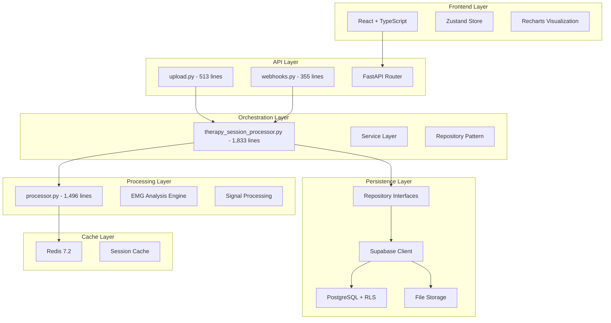
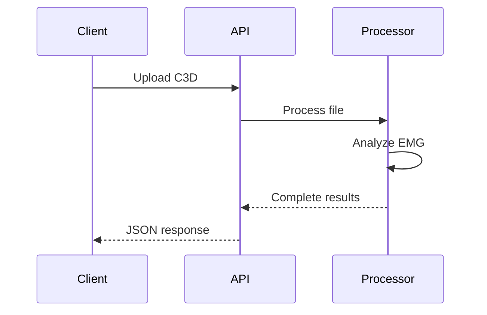
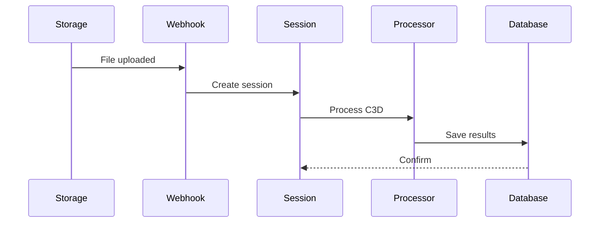

# System Architecture

The EMG C3D Analyzer implements a 4-layer architecture with Domain-Driven Design (DDD) principles to support rehabilitation research workflows.

## System Overview



## 4-Layer Architecture Details

### Layer 1: API Layer
**Purpose**: HTTP request handling and routing

**Components**:
- **upload.py** (513 lines): Stateless C3D file processing endpoint
- **webhooks.py** (355 lines): Supabase Storage webhook integration
- **FastAPI Router**: Request validation, response formatting, authentication middleware

**Responsibilities**:
- HTTP request/response handling
- Input validation and sanitization  
- Authentication token verification
- Error handling and status codes
- API documentation generation (OpenAPI/Swagger)

### Layer 2: Orchestration Layer
**Purpose**: Business logic coordination and workflow management

**Components**:
- **therapy_session_processor.py** (1,833 lines): Core session lifecycle management
- **Service Layer**: Domain-specific business logic
- **Repository Pattern**: Data access abstraction

**Responsibilities**:
- Patient-therapist relationship management
- Session creation and state tracking
- Workflow coordination across domains
- Repository pattern implementation
- Dependency injection for testability
- Transaction management

### Layer 3: Processing Layer
**Purpose**: EMG signal processing and analysis algorithms

**Components**:
- **processor.py** (1,496 lines): GHOSTLYC3DProcessor - Single Source of Truth
- **EMG Analysis Engine**: Signal processing algorithms
- **Signal Processing**: Filtering, envelope detection, contraction analysis

**Responsibilities**:
- C3D file parsing and metadata extraction
- EMG signal filtering and preprocessing
- Contraction detection (10% threshold, 100ms minimum duration)
- Statistical analysis (RMS, MAV, MPF, MDF)
- Fatigue index calculations
- Performance scoring and compliance metrics

### Layer 4: Persistence Layer
**Purpose**: Data storage and retrieval

**Components**:
- **Repository Interfaces**: Abstract data access patterns
- **Supabase Client**: PostgreSQL database operations
- **Row Level Security (RLS)**: Authorization at database level
- **File Storage**: C3D file management

**Responsibilities**:
- Database connection management
- Query optimization and indexing
- Row-level security policy enforcement
- File storage operations
- Data consistency and transactions
- Migration management

## Domain Organization

The backend follows Domain-Driven Design (DDD) principles with clear separation of business concerns:

```
backend/services/
├── analysis/       # EMG analysis algorithms and metrics
├── c3d/           # C3D file processing and metadata extraction
├── cache/         # Redis caching and performance optimization
├── clinical/      # Healthcare workflows and therapy sessions
├── data/          # Export services and metadata management
├── infrastructure/ # Cross-cutting concerns (logging, monitoring)
├── patient/       # Patient management and profile data
├── shared/        # Common utilities and base classes
└── user/          # User management and authentication
```

### Domain Responsibilities

**Analysis Domain**:
- EMG signal processing algorithms
- Statistical calculations (RMS, MAV, MPF, MDF)
- Contraction detection and analysis
- Performance metrics and scoring

**Clinical Domain**:
- Therapy session lifecycle management
- Patient-therapist relationship handling
- Clinical workflow orchestration
- Therapeutic assessment and compliance

**C3D Domain**:
- File parsing and validation
- Metadata extraction from motion capture data
- Channel mapping and signal identification
- Format conversion and preprocessing

**Data Domain**:
- CSV export functionality
- Report generation and formatting
- Metadata aggregation and transformation
- Data serialization and deserialization

**User Domain**:
- Authentication and authorization
- User profile management
- Role-based access control
- Session management

## Processing Modes

### Stateless (Upload Route)


### Stateful (Webhook Route)


## Key Design Patterns

### Repository Pattern
**Implementation**: Clean separation between business logic and data access
- Abstract repository interfaces define data operations
- Concrete implementations handle Supabase client operations
- Services depend on repository interfaces, not concrete implementations
- Enables easy testing with mock repositories

### Dependency Injection
**Implementation**: FastAPI's `Depends` system for service injection
- Repository instances injected into service constructors
- Service instances injected into API route handlers
- Configuration objects injected as dependencies
- Promotes testability and loose coupling

### Single Source of Truth
**Implementation**: GHOSTLYC3DProcessor as the authoritative EMG analysis engine
- All EMG processing flows through processor.py (1,496 lines)
- Consistent algorithms and parameter handling
- Centralized signal processing logic
- Unified output format across all processing modes

### Domain-Driven Design
**Implementation**: Business-focused service organization
- Domain services encapsulate business logic
- Clear boundaries between domains (clinical, analysis, c3d)
- Domain-specific repository implementations
- Shared utilities abstracted to common layers

## Performance Architecture

### Caching Strategy
- **Redis 7.2**: Session-based caching for computed results
- **Cache Keys**: Structured by session ID and processing parameters
- **Invalidation**: Automatic expiry and manual cache clearing
- **Hit Rate**: Optimized for repeated analysis requests

### Processing Optimization
- **Synchronous Design**: Simplified architecture using synchronous Supabase client
- **Background Tasks**: Webhook processing for non-blocking file uploads
- **Connection Pooling**: Optimized database connections
- **Memory Management**: Efficient NumPy array handling for large EMG datasets

### Database Performance
- **Row Level Security**: Authorization at database level for optimal performance
- **Indexed Queries**: Optimized for common access patterns
- **Prepared Statements**: Query compilation caching
- **Connection Management**: Persistent connections with proper cleanup

## Security Architecture

### Authentication Flow
1. **Frontend**: Supabase Auth SDK for user management
2. **API Layer**: JWT token validation using FastAPI dependencies
3. **Database**: Row Level Security policies for data access authorization
4. **Storage**: Bucket-level policies for file access control

### Authorization Model
- **Role-Based Access**: Therapist, patient, admin roles
- **RLS Policies**: Database-level access control
- **JWT Claims**: User metadata embedded in tokens
- **Zero-Trust**: No implicit trust between layers

### Data Protection
- **Encryption**: All data encrypted at rest and in transit
- **HMAC Signatures**: Webhook payload verification
- **Input Validation**: Comprehensive parameter validation
- **SQL Injection Prevention**: Parameterized queries only