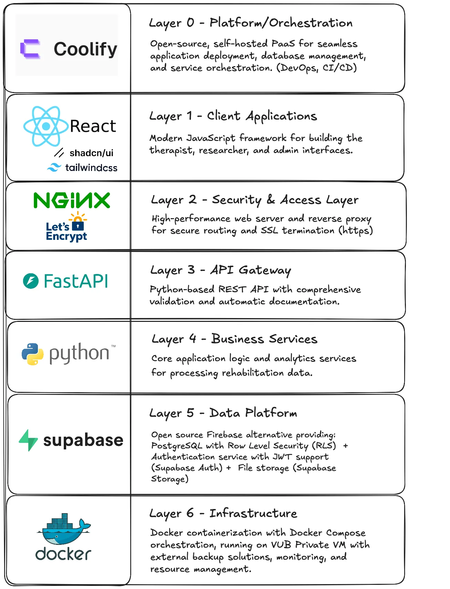
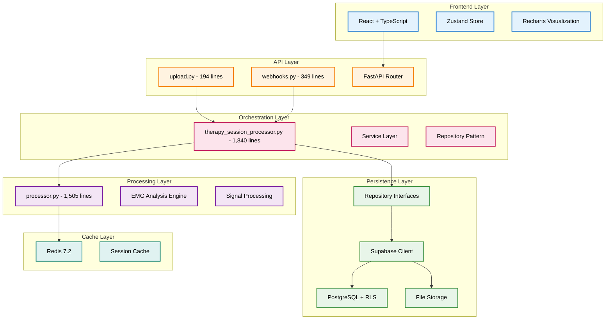
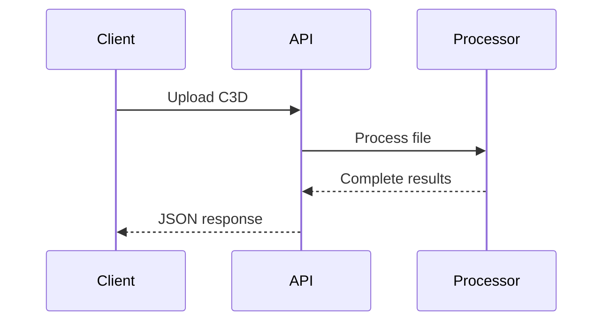
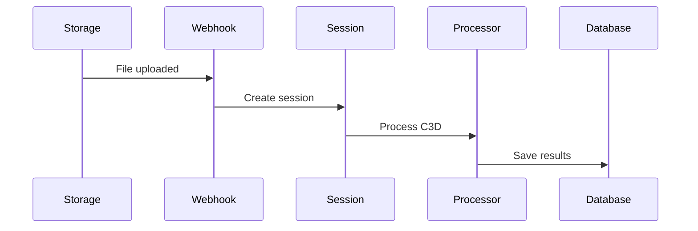

## 1. Tech Stack

The technology stack combines modern, production-proven tools selected for their reliability and simplicity. React 19 with TypeScript powers the frontend, providing type safety and component reusability. FastAPI serves as the backend framework, chosen for its high performance and automatic API documentation. Supabase handles authentication, database operations, and file storage through a single platform, reducing infrastructure complexity. Redis provides in-memory caching for session data, while Coolify simplifies deployment with built-in SSL, monitoring, and zero-downtime updates.

> **Note**: NGINX is shown in the tech stack but is not actually required when deploying with Coolify. Coolify provides its own built-in reverse proxy (Traefik) that handles SSL/TLS termination, domain routing, load balancing, and WebSocket support automatically.

## 2. System Architecture

Simple 4-layer architecture for EMG data processing.

### Overview

The system follows a clean 4-layer architecture designed for processing GHOSTLY game EMG data. Each layer has distinct responsibilities with clear boundaries, enabling independent scaling and testing. The architecture prioritizes simplicity over complexity, using proven patterns like Repository and Service layers to maintain separation of concerns while avoiding over-engineering.

### 4 Layers

#### 1. API Layer

The API layer serves as the system's entry point, handling HTTP requests and responses through FastAPI. It maintains two primary endpoints: a stateless upload route for direct file processing and a webhook route for event-driven background processing. This thin layer focuses solely on request validation, authentication, and response formatting, delegating all business logic to the orchestration layer.

- `upload.py` (194 lines) - Direct file processing
- `webhooks.py` (349 lines) - Background webhook processing
- FastAPI routes and validation

#### 2. Orchestration Layer

The orchestration layer coordinates complex workflows across multiple services and repositories. It manages the complete therapy session lifecycle, from patient lookup to result persistence, implementing the Repository pattern for clean data access abstraction. This layer ensures transactional consistency and proper error handling while keeping business logic decoupled from both API and database concerns.

- `therapy_session_processor.py` (1,840 lines) - Session management
- Repository pattern for data access
- Service layer coordination

#### 3. Processing Layer

The processing layer contains the core EMG analysis engine, serving as the single source of truth for all signal processing operations. It implements specialized algorithms for contraction detection, fatigue analysis, and clinical metric calculation. This layer operates in a stateless manner, accepting C3D binary data and returning structured analysis results without any database dependencies.

- `processor.py` (1,505 lines) - EMG analysis engine
- Single source of truth for all processing
- Signal processing algorithms

#### 4. Persistence Layer

The persistence layer manages all data storage and retrieval operations through Supabase's PostgreSQL database with Row-Level Security (RLS) for authorization. It combines structured data storage for clinical records with object storage for C3D files, while Redis provides session caching to reduce database load. This layer ensures data integrity, security, and optimal query performance.

- Supabase PostgreSQL with RLS
- File storage for C3D files
- Redis cache for performance

## 3. Processing Modes

The system supports two distinct processing modes to accommodate different usage patterns. These modes share the same core processing engine but differ in their execution context and data persistence strategies. This dual-mode approach provides flexibility for both immediate analysis needs and background batch processing workflows.

### Stateless (Upload)

The stateless mode provides immediate, synchronous processing of C3D files without database persistence. Clients upload files directly to the API endpoint and receive complete analysis results in the response. This mode is ideal for quick assessments, testing scenarios, or when users need immediate feedback without storing session data. The entire processing pipeline executes within a single HTTP request-response cycle.

### Stateful (Webhook)

The stateful mode enables asynchronous, event-driven processing triggered by Supabase Storage webhooks. When users upload C3D files to the storage bucket, a webhook notification initiates the processing pipeline, which creates therapy sessions, performs EMG analysis, and persists all results to the database. This mode supports the clinical workflow where therapists need comprehensive session tracking, patient history, and performance metrics over time.

