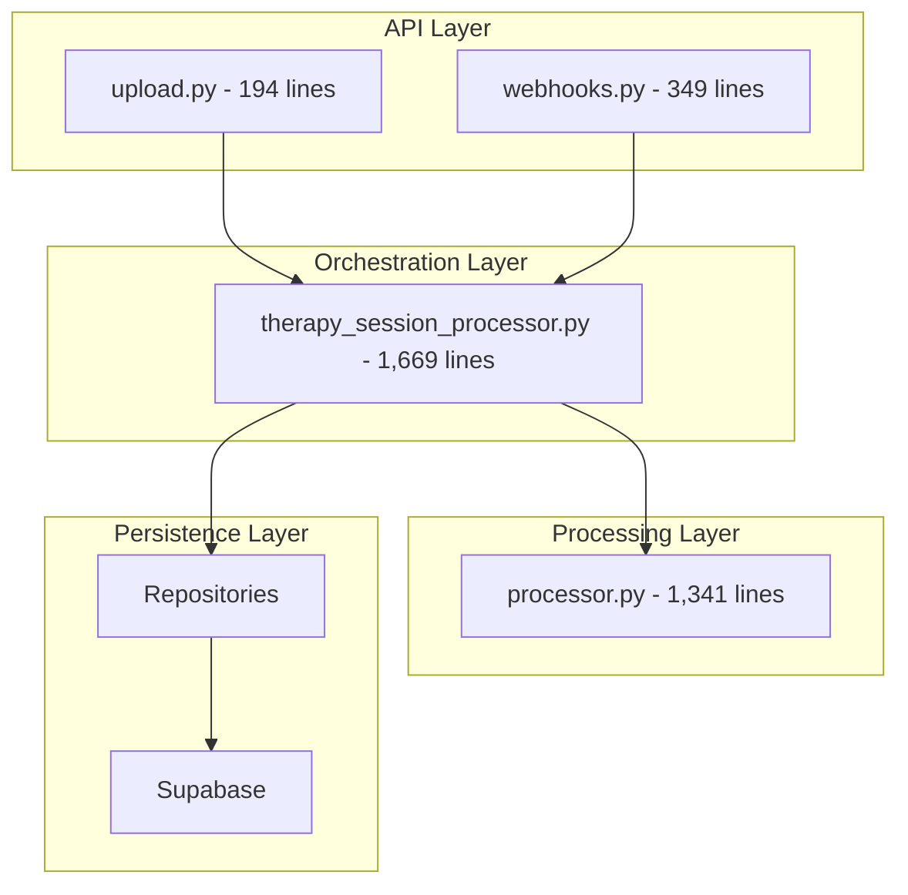
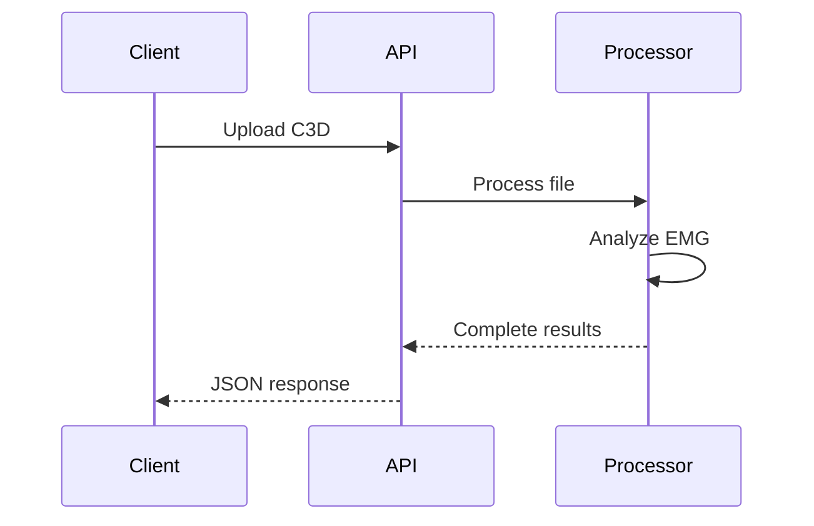
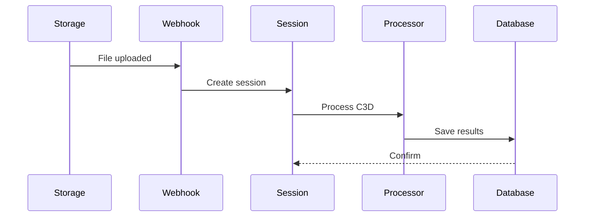

# System Architecture

4-layer architecture with Domain-Driven Design (DDD) for the EMG C3D Analyzer.

## 4-Layer Architecture



## Layer Responsibilities

### API Layer
- **upload.py**: Stateless C3D processing
- **webhooks.py**: Supabase Storage integration
- HTTP concerns, validation, responses

### Orchestration Layer
- **therapy_session_processor.py**: Session lifecycle
- Workflow coordination
- Repository pattern with dependency injection

### Processing Layer
- **processor.py**: GHOSTLYC3DProcessor
- Single Source of Truth for EMG analysis
- Signal processing algorithms

### Persistence Layer
- Repository pattern implementation
- Supabase client operations
- File storage management

## Domain Organization

```
backend/services/
├── clinical/       # Healthcare domain
├── c3d/           # File processing domain
├── data/          # Export/metadata domain
├── infrastructure/ # Cross-cutting concerns
└── cache/         # Performance optimization
```

## Processing Modes

### Stateless (Upload Route)


### Stateful (Webhook Route)


## Key Design Patterns

- **Repository Pattern**: Clean data access
- **Dependency Injection**: Testable services
- **Single Source of Truth**: Processor as authority
- **Domain-Driven Design**: Business-focused organization

## Performance

- **Redis Caching**: 50x speed improvement
- **Async Processing**: Non-blocking operations
- **Background Tasks**: Webhook processing
- **Connection Pooling**: Database optimization