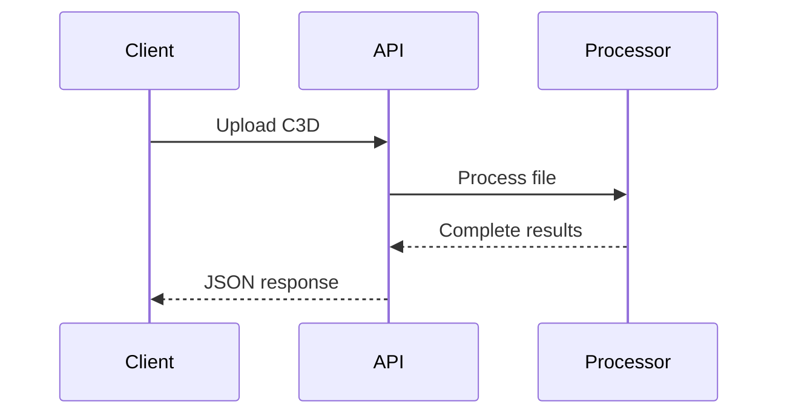
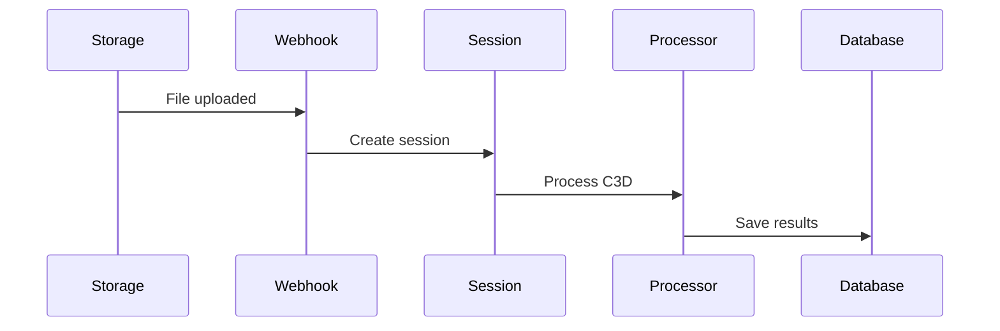

# 1. System Architecture

Simple 4-layer architecture for EMG data processing.
## Overview

## Tech stack

## 4 Layers

### 1. API Layer
- `upload.py` (194 lines) - Direct file processing
- `webhooks.py` (349 lines) - Background webhook processing
- FastAPI routes and validation

### 2. Orchestration Layer  
- `therapy_session_processor.py` (1,669 lines) - Session management
- Repository pattern for data access
- Service layer coordination

### 3. Processing Layer
- `processor.py` (1,341 lines) - EMG analysis engine
- Single source of truth for all processing
- Signal processing algorithms

### 4. Persistence Layer
- Supabase PostgreSQL with RLS
- File storage for C3D files
- Redis cache for performance

## 2 Processing Modes (2 routes)

### Stateless (Upload)

### Stateful (Webhook)

