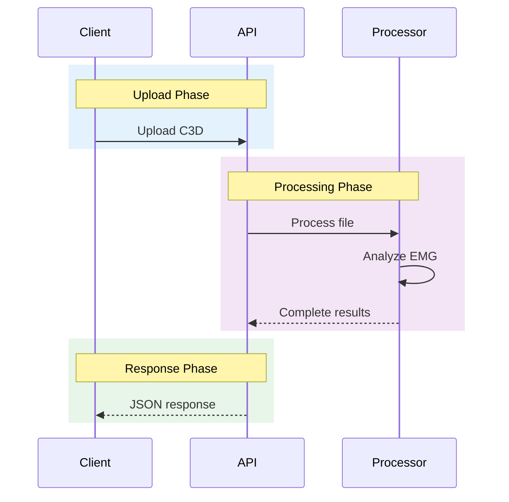
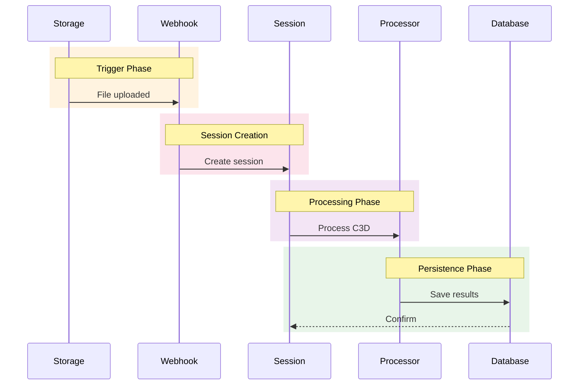

# System Architecture

The EMG C3D Analyzer implements a 4-layer architecture with Domain-Driven Design (DDD) principles to support rehabilitation research workflows.

## System Overview


## Core Architectural Principles

- **Single Source of Truth (SoT)**: `GHOSTLYC3DProcessor` serves as the authoritative EMG analysis engine
- **Dual Processing Modes**: Stateless (immediate response) vs Stateful (database persistence)
- **Repository Pattern**: Clean data access layer with dependency injection
- **Domain-Driven Design**: Services organized by business domains (clinical, c3d, infrastructure)
- **SOLID Compliance**: Single responsibility, open/closed, and dependency inversion principles

## 4-Layer Architecture Details

### Layer 1: API Layer - Dual Processing Modes
**Purpose**: HTTP request handling and routing with two distinct processing patterns

#### upload.py (194 lines) - Stateless Processing Route
- **Purpose**: Immediate EMG analysis without database persistence
- **Use Case**: Testing, preview, temporary analysis workflows
- **Key Features**:
  - Returns complete EMG signals and analytics in response
  - Uses `process_c3d_file_stateless()` method
  - FastAPI file handling with temporary storage
  - Comprehensive error handling with HTTP status codes
- **Integration**: Directly calls TherapySessionProcessor in stateless mode

#### webhooks.py (349 lines) - Stateful Processing Route
- **Purpose**: Supabase Storage event processing with full database persistence
- **Use Case**: Production workflow with patient/therapist relationships
- **Key Features**:
  - HMAC-SHA256 webhook signature verification
  - Background processing with FastAPI BackgroundTasks
  - Patient code extraction and UUID lookup
  - Complete session lifecycle management
- **Integration**: Creates session → background C3D processing → database population

**Common Responsibilities**:
- HTTP request/response handling
- Input validation and sanitization  
- Authentication token verification
- Error handling and status codes
- API documentation generation (OpenAPI/Swagger)

### Layer 2: Orchestration Layer - Workflow Management
**Purpose**: Business logic coordination and workflow management

#### therapy_session_processor.py (1,669 lines) - Session Lifecycle Orchestrator
**Architecture**: Repository pattern with dependency injection

**Core Responsibilities**:
1. **Session Management**: Create, update, track therapy sessions
2. **File Coordination**: Download from Supabase Storage, manage temporary files
3. **Processing Orchestration**: Coordinate C3D analysis with database population
4. **Database Population**: Populate all related tables (sessions, statistics, scores)

**Design Patterns**:
- **Repository Pattern**: Clean data access abstraction
- **Dependency Injection**: Testable, configurable service composition
- **Error Recovery**: Comprehensive error handling with status tracking

**Key Methods**:
```python
async def create_session()           # Create therapy session record
async def process_c3d_file()        # Complete processing workflow
async def _populate_all_database_tables()  # Database persistence
```

**Service Layer Responsibilities**:
- Patient-therapist relationship management
- Session creation and state tracking
- Workflow coordination across domains
- Transaction management and rollback
- Progress tracking and status updates

### Layer 3: Processing Layer - Single Source of Truth
**Purpose**: EMG signal processing and analysis algorithms

#### processor.py (1,341 lines) - GHOSTLYC3DProcessor Class
**Architecture**: Single Source of Truth (SoT) for all EMG processing

**Core Responsibilities**:
1. **C3D File Parsing**: ezc3d integration with GHOSTLY-specific channel detection
2. **EMG Signal Processing**: Filtering, envelope calculation, statistical analysis
3. **Contraction Detection**: MVC-based amplitude and duration thresholds
4. **Analytics Generation**: Clinical metrics (RMS, MAV, MPF, MDF, fatigue indices)

**Dual Mode Support**:
- `include_signals=True`: Full signal data (stateless mode)
- `include_signals=False`: Analytics only (stateful mode, memory optimization)

**Key Features**:
- Flexible channel mapping for real-world C3D variations
- Comprehensive metadata extraction
- Performance optimization for large datasets
- SOLID principles: single responsibility, dependency inversion

**Processing Pipeline**:
1. Parse C3D files using ezc3d library
2. Calculate EMG metrics (RMS, MAV, MPF, MDF, fatigue indices)
3. Detect muscle contractions using configurable thresholds
4. Package analysis results in structured format
5. Return either full signals or analytics based on mode

**Clinical Algorithms**:
- EMG signal filtering and preprocessing (Butterworth filters)
- Contraction detection (10% threshold, 100ms minimum duration)
- Statistical analysis with temporal windowing
- Fatigue index calculations
- Performance scoring and compliance metrics

### Layer 4: Persistence Layer
**Purpose**: Data storage and retrieval

**Components**:
- **Repository Interfaces**: Abstract data access patterns
- **Supabase Client**: PostgreSQL database operations
- **Row Level Security (RLS)**: Authorization at database level
- **File Storage**: C3D file management

**Responsibilities**:
- Database connection management
- Query optimization and indexing
- Row-level security policy enforcement
- File storage operations
- Data consistency and transactions
- Migration management

## Domain Organization

The backend follows Domain-Driven Design (DDD) principles with clear separation of business concerns:

```
backend/services/
├── analysis/       # EMG analysis algorithms and metrics
├── c3d/           # C3D file processing and metadata extraction
├── cache/         # Redis caching and performance optimization
├── clinical/      # Healthcare workflows and therapy sessions
├── data/          # Export services and metadata management
├── infrastructure/ # Cross-cutting concerns (logging, monitoring)
├── patient/       # Patient management and profile data
├── shared/        # Common utilities and base classes
└── user/          # User management and authentication
```

### Domain Responsibilities

**Analysis Domain**:
- EMG signal processing algorithms
- Statistical calculations (RMS, MAV, MPF, MDF)
- Contraction detection and analysis
- Performance metrics and scoring

**Clinical Domain**:
- Therapy session lifecycle management
- Patient-therapist relationship handling
- Clinical workflow orchestration
- Therapeutic assessment and compliance

**C3D Domain**:
- File parsing and validation
- Metadata extraction from motion capture data
- Channel mapping and signal identification
- Format conversion and preprocessing

**Data Domain**:
- CSV export functionality
- Report generation and formatting
- Metadata aggregation and transformation
- Data serialization and deserialization

**User Domain**:
- Authentication and authorization
- User profile management
- Role-based access control
- Session management

## Processing Modes

### Stateless (Upload Route)


### Stateful (Webhook Route)


## Key Design Patterns

### Repository Pattern
**Implementation**: Clean separation between business logic and data access
- Abstract repository interfaces define data operations
- Concrete implementations handle Supabase client operations
- Services depend on repository interfaces, not concrete implementations
- Enables easy testing with mock repositories

### Dependency Injection
**Implementation**: FastAPI's `Depends` system for service injection
- Repository instances injected into service constructors
- Service instances injected into API route handlers
- Configuration objects injected as dependencies
- Promotes testability and loose coupling

### Single Source of Truth
**Implementation**: GHOSTLYC3DProcessor as the authoritative EMG analysis engine
- All EMG processing flows through processor.py (1,496 lines)
- Consistent algorithms and parameter handling
- Centralized signal processing logic
- Unified output format across all processing modes

### Domain-Driven Design
**Implementation**: Business-focused service organization
- Domain services encapsulate business logic
- Clear boundaries between domains (clinical, analysis, c3d)
- Domain-specific repository implementations
- Shared utilities abstracted to common layers

## Performance Architecture

### Caching Strategy
- **Redis 7.2**: Session-based caching for computed results
- **Cache Keys**: Structured by session ID and processing parameters
- **Invalidation**: Automatic expiry and manual cache clearing
- **Hit Rate**: Optimized for repeated analysis requests

### Processing Optimization
- **Synchronous Design**: Simplified architecture using synchronous Supabase client
- **Background Tasks**: Webhook processing for non-blocking file uploads
- **Connection Pooling**: Optimized database connections
- **Memory Management**: Efficient NumPy array handling for large EMG datasets

### Database Performance
- **Row Level Security**: Authorization at database level for optimal performance
- **Indexed Queries**: Optimized for common access patterns
- **Prepared Statements**: Query compilation caching
- **Connection Management**: Persistent connections with proper cleanup

## Security Architecture

### Authentication Flow
1. **Frontend**: Supabase Auth SDK for user management
2. **API Layer**: JWT token validation using FastAPI dependencies
3. **Database**: Row Level Security policies for data access authorization
4. **Storage**: Bucket-level policies for file access control

### Authorization Model
- **Role-Based Access**: Therapist, patient, admin roles
- **RLS Policies**: Database-level access control
- **JWT Claims**: User metadata embedded in tokens
- **Zero-Trust**: No implicit trust between layers

### Data Protection
- **Encryption**: All data encrypted at rest and in transit
- **HMAC Signatures**: Webhook payload verification
- **Input Validation**: Comprehensive parameter validation
- **SQL Injection Prevention**: Parameterized queries only