# GHOSTLY+ EMG C3D Analyzer - Backend

## Overview

The backend serves as the computational engine for the GHOSTLY+ EMG C3D Analyzer system. It processes electromyography data from rehabilitation therapy sessions, calculating clinical metrics that help therapists assess patient progress. The system handles complex signal analysis tasks that can't run in the browser - like processing 175 seconds of EMG data sampled at 990Hz - while delegating simple data operations directly to Supabase for efficiency.

Built with FastAPI and Python, the backend specializes in three core responsibilities: processing C3D motion capture files, analyzing EMG signals for clinical metrics, and orchestrating therapy session workflows. The architecture follows domain-driven design principles, organizing services by their business purpose rather than technical function, which makes the codebase intuitive to navigate and maintain.

## Architecture

### Technology Stack

The backend combines Python's scientific computing ecosystem with modern web technologies:

| Layer | Technology | Purpose |
|-------|------------|---------|
| **API Framework** | FastAPI | Provides automatic API documentation, request validation, and async support |
| **Scientific Computing** | NumPy, SciPy, ezc3d | Handles EMG signal processing and C3D file parsing |
| **Database** | PostgreSQL via Supabase | Stores clinical data with Row Level Security for authorization |
| **Caching** | Redis (Python client 6.4.0) | Caches expensive calculations and session data |
| **Authentication** | Supabase Auth | Manages user sessions and JWT tokens |

### Service Architecture


### Directory Structure

The codebase is organized by business domain, making it easy to find code related to specific features:

```
backend/
├── api/                    # HTTP endpoints and routing
│   └── routes/            # API route modules (no /api prefix)
├── services/              # Business logic organized by domain
│   ├── clinical/          # Therapy sessions and patient management
│   ├── c3d/              # C3D file processing (core algorithms)
│   ├── analysis/         # EMG analysis coordination
│   ├── cache/            # Redis caching strategies
│   ├── user/             # User and therapist management
│   └── shared/           # Shared base classes and utilities
├── models/               # Pydantic data models
├── emg/                  # Core signal processing algorithms
├── database/             # Supabase client configuration
└── tests/                # Comprehensive test suite (unit/integration/e2e)
```

The most critical code lives in `services/c3d/processor.py` (1,505 lines) which handles the complex C3D parsing and EMG extraction, and `services/clinical/therapy_session_processor.py` (1,840 lines) which orchestrates the entire analysis workflow.

## API Design

### Three API Integration Approaches

The system offers three complementary approaches for accessing data and functionality. Each approach works well for different scenarios:

```mermaid
graph TB
    A1["🎯 Approach 1: Frontend → Direct Supabase"]
    A1 --> F1[React App]
    F1 -->|User JWT| S1[Supabase REST API]
    S1 -->|Auto-generated endpoints| DB1[(PostgreSQL + RLS)]
    
    A2["🔧 Approach 2: Backend → Direct Supabase"]
    A2 --> B2[Python Service]
    B2 -->|Service Key/User Token| S2[Supabase Client]
    S2 --> DB2[(PostgreSQL)]
    
    A3["⚙️ Approach 3: Frontend → FastAPI → Supabase"]
    A3 --> F3[React App]
    F3 --> API3[Custom FastAPI Route]
    API3 -->|Business Logic| S3[Supabase Client]
    S3 --> DB3[(PostgreSQL)]
    
    style A1 fill:#e8f5e9
    style A2 fill:#fff3e0
    style A3 fill:#fce4ec
    style F1 fill:#e3f2fd
    style S1 fill:#c8e6c9
    style DB1 fill:#fff3e0
    style B2 fill:#fce4ec
    style S2 fill:#c8e6c9
    style DB2 fill:#fff3e0
    style F3 fill:#e3f2fd
    style API3 fill:#ffebee
    style S3 fill:#c8e6c9
    style DB3 fill:#fff3e0
```



### Auto-Generated REST API

Supabase automatically creates REST endpoints for all public tables. You can explore these in your Supabase Dashboard under:
**Project Settings → API → REST API Documentation**

For hosted Supabase, this is typically found at:
**[https://supabase.com/dashboard/project/YOUR-PROJECT-ID/api](https://supabase.com/dashboard/project/YOUR-PROJECT-ID/api)**

*Note: The exact URL path may differ for self-hosted Supabase installations.*

This means many operations can use Supabase's built-in API directly, without custom backend code.

### When Each Approach Works Well

#### 🎯 **Approach 1: Frontend → Direct Supabase**
*Simple CRUD operations, authentication, real-time updates*

```typescript
// Loading patient data directly in React
const { data: patients } = await supabase
  .from('patients')
  .select('*')
  .eq('therapist_id', user.id)
```

**Works well for:** Patient lists, clinical notes, profile updates, file uploads

#### 🔧 **Approach 2: Backend → Direct Supabase**  
*Administrative operations, background tasks*

```python
from database.supabase_client import get_supabase_client

# Admin service using service key (bypasses RLS)
supabase = get_supabase_client(use_service_key=True)
response = supabase.from('user_profiles').insert({
    'email': new_user_email,
    'role': 'therapist'
}).execute()
```

**Works well for:** User management, admin operations, system tasks

#### ⚙️ **Approach 3: Frontend → FastAPI → Supabase**
*Complex business logic, multi-step operations*

```python
@router.post("/upload")
async def process_c3d_file(file: UploadFile):
    # Complex EMG processing
    results = c3d_processor.analyze(file.file)
    
    # Store results using Supabase client
    supabase = get_supabase_client()
    session = supabase.from('therapy_sessions').insert({
        'filename': file.filename,
        'processing_status': 'completed'
    }).execute()
    
    return {"session_id": session.data[0]['id']}
```

**Works well for:** EMG processing, file analysis, complex workflows

### FastAPI Endpoints

The custom FastAPI backend provides these specialized endpoints:

| Endpoint | Purpose | Method | When to Use |
|----------|---------|--------|-------------|
| `/upload` | Process C3D file directly | POST | Complex EMG analysis |
| `/webhooks/storage` | Handle Supabase storage events | POST | File upload processing |
| `/analysis/recalc` | Recalculate EMG metrics | POST | Recompute clinical metrics |
| `/signals` | Get processed EMG signals | GET | Signal visualization |
| `/mvc/calculate` | Calculate MVC thresholds | POST | Complex calculations |
| `/scoring/configurations` | Manage scoring settings | GET/POST | Configuration management |
| `/admin/password-vault` | Retrieve pending passwords | GET | Admin operations |
| `/admin/password-vault/{id}/retrieve` | One-time password retrieval | POST | Secure password delivery |
| `/health` | System health check | GET | Monitoring |

### Common Usage Patterns

**Processing a C3D File**: The upload endpoint handles the complete workflow - validating the file format, extracting EMG channels, processing signals with filters and envelopes, detecting contractions using MVC thresholds, calculating clinical metrics, and returning bundled results as a single response.

**Repository Pattern for Data Access**: Services use repository classes to abstract database operations, enabling clean separation between business logic and data access. Each domain has its own repositories that handle CRUD operations and complex queries.

## Authentication & Database

### Authentication Flow

The authentication system separates concerns cleanly: Supabase Auth handles user login and session management, FastAPI validates JWT tokens for protected endpoints, and PostgreSQL Row Level Security policies control data access. This separation means the API focuses on business logic while the database enforces permissions.


### Core Database Tables

The system uses a comprehensive set of tables for clinical data management. You can visualize and export the complete schema at [Supabase Database Schema Dashboard](https://supabase.com/dashboard/project/egihfsmxphqcsjotmhmm/database/schemas).

**Primary Tables:**
- `therapy_sessions` - Rehabilitation sessions with file tracking, processing status, and game metadata
- `patients` - Patient profiles with treatment plans, MVC thresholds, and scoring configurations
- `user_profiles` - User accounts with roles (therapist, researcher, admin)

**Clinical Data:**
- `patient_medical_info` - Protected medical information including diagnosis and mobility status
- `clinical_notes` - Therapist notes for files and patients
- `session_settings` - Per-session MVC thresholds and target parameters

**Analysis & Metrics:**
- `emg_statistics` - EMG signal analysis with contraction details and quality metrics
- `performance_scores` - GHOSTLY+ scoring metrics (compliance, symmetry, effort, game)
- `scoring_configuration` - Customizable scoring weights and RPE mappings
- `bfr_monitoring` - Blood flow restriction pressure monitoring and compliance

**System Tables:**
- `audit_log` - User action tracking for compliance and security
- `export_history` - Data export tracking for research purposes

### Repository Pattern

All database operations go through repository classes that provide a clean interface. The backend uses the synchronous Supabase Python client for simplicity (following KISS principle), with repositories abstracting database operations for each domain. This pattern enables easy testing through dependency injection and keeps business logic separate from data access.

## Row Level Security (RLS) - The Authorization Layer

Row Level Security (RLS) enforces data access control at the database level, ensuring HIPAA compliance and patient data privacy. While FastAPI validates JWT tokens (authentication), RLS policies control who can access what data (authorization).

**📊 View All Policies**: [Supabase RLS Dashboard](https://supabase.com/dashboard/project/egihfsmxphqcsjotmhmm/auth/policies)

### How RLS Works


### Security Roles

| Role | Access Level | Use Case |
|------|--------------|----------|
| **admin** | Full system access | System administration |
| **therapist** | Own patients only | Clinical sessions, patient data |
| **researcher** | Anonymized read-only | Research analysis |
| **service_role** | Backend operations | C3D processing, automated tasks |

### Key Security Functions

- **`get_user_role()`** - Returns user's role (therapist/admin/researcher)
- **`get_current_therapist_id()`** - Validates therapist identity
- **`auth.uid()`** - Gets authenticated user's ID

### Policy Patterns

The system uses **30+ RLS policies** across all tables with these common patterns:

1. **Ownership-Based**: Users access only their own data
2. **Role-Based**: Admins have full access
3. **Relationship-Based**: Therapists access their assigned patients
4. **Composite**: Combined conditions for complex scenarios

### Important Points

**✅ Strengths:**
- Database-level enforcement (unbypassable)
- HIPAA compliant patient data isolation
- Complete audit trail in `audit_log` table
- Zero-trust architecture

**⚠️ Remember:**
- Service role bypasses RLS - use sparingly
- All sensitive tables have RLS enabled
- Test policies by impersonating roles

## Processing & Webhooks

### Processing Pipeline

The system processes C3D files through a sophisticated pipeline: validation → channel detection → signal processing → contraction detection → metric calculation → performance scoring → database persistence. This pipeline handles both direct uploads and webhook-triggered processing from Supabase Storage events.

### Webhook Processing

Supabase Storage triggers webhooks when files are uploaded. For local development, you'll need ngrok to expose your local server:

```bash
# One-time setup: Install ngrok and configure auth token
# Download from https://ngrok.com/download
./ngrok config add-authtoken YOUR_TOKEN  # Get token from dashboard

# Start development with webhook support
./start_dev.sh --webhook  # Automatically starts ngrok tunnel

# Monitor webhook activity with emojis for easy tracking
tail -f logs/backend.error.log | grep -E "(🚀|📁|🔄|✅|❌|📊)"
```

The webhook endpoint verifies signatures for security, extracts file information from Supabase events, and triggers asynchronous C3D processing in the background, returning immediately with a processing status.

### Caching Strategy

Redis caches expensive EMG calculations with a 1-hour TTL to maintain fast response times. The caching layer significantly improves performance for repeated analysis requests and session data retrieval.

## Development

### Quick Start

```bash
# Clone and setup
cd backend
python -m venv venv
source venv/bin/activate  # On Windows: venv\Scripts\activate
pip install -r requirements.txt

# Environment variables (.env file)
SUPABASE_URL=https://xxx.supabase.co
SUPABASE_SERVICE_KEY=your-service-key
JWT_SECRET=your-jwt-secret
REDIS_URL=redis://localhost:6379

# Run development server
uvicorn main:app --reload --port 8080

# Run with webhook support (requires ngrok)
./start_dev.sh --webhook
```

### Testing

The backend includes a comprehensive test suite using pytest, covering unit tests for core EMG algorithms, integration tests for component interactions, and end-to-end tests with real clinical data. Tests focus on EMG processing accuracy, API endpoint validation, and database operations, ensuring the reliability of clinical metrics and therapy session workflows.

**Testing Commands:**
```bash
# Quick test execution
./run_tests_with_env.sh              # Run all tests with environment loaded
./run_tests_with_env.sh e2e          # Run only E2E tests  
./run_tests_with_env.sh quick        # Run tests excluding E2E

# Manual test execution (if needed)
python -m pytest tests/ -v           # All tests with verbose output
python -m pytest tests/unit/ -v      # Unit tests only
python -m pytest tests/api/ -v       # API endpoint tests
python -m pytest tests/ --cov=.      # With coverage report
```

## API Documentation & Resources

### Live API Documentation

The system provides auto-generated, interactive API documentation:

**FastAPI Swagger UI**
- Development: http://localhost:8080/docs
- Production: https://your-backend-url/docs
- Interactive testing directly in browser
- Complete request/response schemas
- Authentication testing support

**Supabase Database API**
- Dashboard: 
  - Cloud-hosted: https://supabase.com/dashboard/project/[your-project-id]/api
  - Self-hosted: http://localhost:8000/project/default/api
- Auto-generated REST endpoints for all public tables
- PostgREST filtering, sorting, and pagination
- Real-time subscriptions documentation
- SQL query builder interface

### Essential Backend Resources

- **FastAPI**: [Official Documentation](https://fastapi.tiangolo.com/) - Web framework and async patterns
- **Supabase Python**: [Client Documentation](https://supabase.com/docs/reference/python/introduction) - Database operations
- **NumPy/SciPy**: [Scientific Computing](https://numpy.org/doc/stable/) - Signal processing algorithms
- **ezc3d**: [C3D Processing](https://github.com/pyomeca/ezc3d) - Motion capture file parsing
- **Redis Python**: [Caching Guide](https://redis-py.readthedocs.io/) - Performance optimization

## Contributing

When working on the backend, follow these patterns:

1. **Domain Organization**: Place new services in the appropriate domain folder
2. **Repository Pattern**: Use repositories for all database operations
3. **Sync Supabase Client**: Stick with synchronous operations for simplicity
4. **Type Hints**: Use Pydantic models for request/response validation
5. **Testing**: Write tests for new endpoints and services
6. **Documentation**: Update this file for significant architecture changes

The backend prioritizes clarity and maintainability over premature optimization. When in doubt, choose the simpler approach that clearly expresses the business logic.