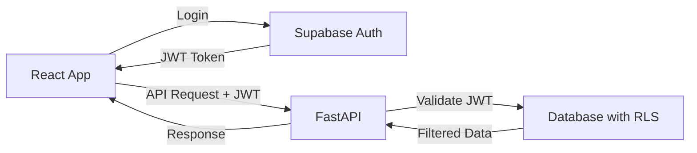

# Authentication System

JWT-based authentication using **Supabase Auth** with role-based access control following SOLID/SSoT/DRY/KISS principles.

## Architecture Overview



**Flow**: Supabase Auth → React Hook → FastAPI (validation only) → RLS (authorization)

## Clean Architecture (Jan 2025)

- **Authentication**: Supabase Auth via shared utility (who you are)
- **Authorization**: Database RLS policies (what you can do) 
- **Stack**: React 19 + authUtils.ts + Supabase Auth + FastAPI (validation) + PostgreSQL RLS
- **Principles**: Eliminated dual auth systems, implemented Single Source of Truth

## Frontend: useAuth Hook

```typescript
// frontend/src/hooks/useAuth.ts
const { user, session, loading, logout } = useAuth()

// Components use useAuth for state management
if (loading) return <LoadingSpinner />
if (!user) return <LoginPage />
```

**Responsibilities**:
- React state management for auth
- Session updates via onAuthStateChange
- Profile fetching from user_profiles table
- Role-based UI rendering (not security)

## Backend: JWT Validation Only

```python
# backend/api/dependencies/auth.py (84 lines total)
async def get_current_user(authorization: str = Header(None)) -> Optional[dict]:
    """
    Validates JWT and returns user info.
    No authorization logic - delegates to RLS.
    """
    if not authorization:
        raise HTTPException(401, "Missing authorization")
    
    # Validate JWT with Supabase
    user = supabase.auth.get_user(authorization.replace("Bearer ", ""))
    
    # Return user for RLS to handle permissions
    return {'id': user.id, 'email': user.email, 'token': authorization}
```

**Key Design**:
- **No authorization logic** in backend code
- **JWT validation only** - 84 lines total
- **Token pass-through** enables RLS enforcement
- **Stateless** - no session management

## Database: RLS Authorization

**Single Source of Truth**: All authorization happens at database level via Row-Level Security policies.

```sql
-- Example: Therapists see only their patients
CREATE POLICY "therapist_own_patients" ON patients
FOR SELECT USING (therapist_id = auth.uid());

-- Example: Patients see only their sessions
CREATE POLICY "patient_own_sessions" ON therapy_sessions
FOR SELECT USING (
    patient_id IN (
        SELECT id FROM patients 
        WHERE user_id = auth.uid()
    )
);
```

## User Roles

**Three-tier role system**:

| Role | Database Access | UI Features |
|------|----------------|-------------|
| **admin** | Full system access | Admin dashboard, user management |
| **therapist** | Own patients only | Patient list, session analysis |
| **patient** | Own data only | Personal dashboard, progress |

**Important**: Frontend uses roles for UI only; RLS enforces actual permissions.

## Authentication Flow

### Login Flow
```
1. User enters credentials
2. authUtils.login() → Supabase Auth
3. Supabase returns JWT + session
4. onAuthStateChange updates React state
5. useAuth hook re-renders UI
6. Authenticated requests include JWT
```

### Logout Flow
```
1. User clicks logout
2. useAuth.logout() called
3. authUtils.logout() → Supabase signOut
4. Session cleared, navigation to login
5. All components re-render as unauthenticated
```

### API Request Flow
```
1. Component makes API request
2. authUtils checks session freshness
3. JWT included in Authorization header
4. FastAPI validates JWT signature
5. Database RLS filters data by user
6. Only authorized data returned
```

## Critical Implementation Rules

### ✅ Single Source of Truth Pattern

```typescript
// ✅ ALWAYS use shared auth utility in services/loaders
import { getCurrentSession, login, logout } from '@/lib/authUtils';
const { session, user, error } = await getCurrentSession();

// ✅ ALWAYS use useAuth hook in React components
const { user, session, loading, logout } = useAuth();

// ❌ NEVER use direct Supabase calls in components/services
const { data: { session } } = await supabase.auth.getSession();
```

### ✅ Proper Component Usage

```typescript
// ✅ CORRECT: React components use useAuth hook
const { user, session, loading, logout } = useAuth();
if (loading) return <LoadingSpinner />;
if (!user) return <LoginPage />;

// ✅ CORRECT: Services/loaders use authUtils directly
export async function protectedLoader() {
  const { session, error } = await getAuthData();
  if (!session) throw redirect('/login');
  return { session, user: session.user };
}
```

## Common Operations

```typescript
// Login (components use useAuth)
const { login } = useAuth()
await login(email, password)

// Logout (components use useAuth)
const { logout } = useAuth()
await logout()

// Check auth state (components)
const { user, userRole, userProfile, loading } = useAuth()

// Auth checks (services/loaders)
import { isAuthenticated, getAuthData } from '@/lib/authUtils'
const authData = await getAuthData()
if (!authData.session) redirect('/login')
```

## Troubleshooting

### Common Issues

- **Invalid token**: Force logout and re-login via `useAuth.logout()`
- **Email verification**: Check email for verification link
- **Role not loading**: Check user_profiles table and profile fetching
- **Session expired**: Automatic logout performed by onAuthStateChange

### Auth Refactor Issues (Jan 2025)

- **Logout not redirecting**: Ensure using updated authUtils.ts, not old AuthService
- **Import errors**: Check for broken AuthService imports after refactor
- **Session inconsistency**: All auth calls must go through authUtils.ts
- **Navigation issues**: Route loaders should use authUtils.getAuthData()

## Security Considerations

- **JWT expiration**: 1 hour default, automatic refresh
- **Secure storage**: Tokens stored in httpOnly cookies
- **HTTPS only**: All auth operations require SSL
- **Rate limiting**: Supabase Auth includes built-in rate limits
- **Password requirements**: Minimum 6 characters (Supabase default)