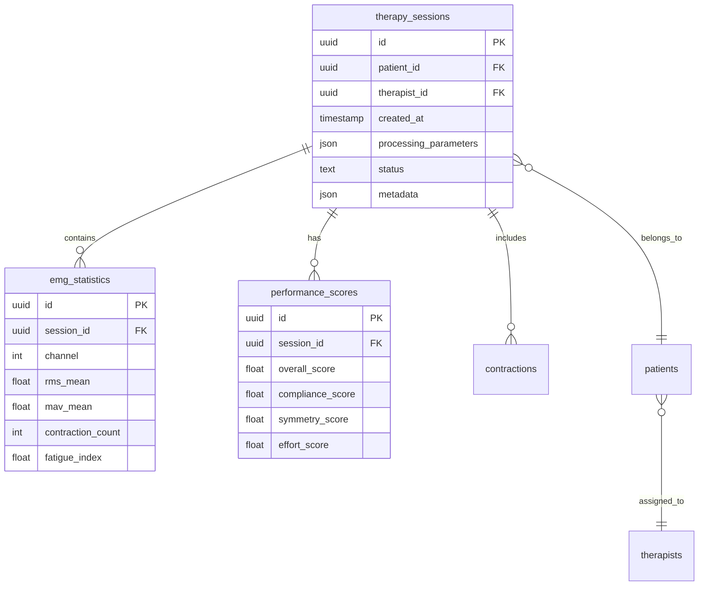

# Database Schema & Repository Pattern

PostgreSQL database with **repository pattern** for clean data access and domain-driven design.

## Architecture Overview



## Core Tables

### therapy_sessions
**Purpose**: Core session records with patient/therapist relationships

| Column | Type | Description |
|--------|------|-------------|
| id | uuid | Primary key |
| patient_id | uuid | Foreign key to patients |
| therapist_id | uuid | Foreign key to users |
| created_at | timestamp | Session timestamp |
| processing_parameters | json | MVC thresholds and settings |
| status | text | processing, completed, failed |
| metadata | json | Game data, device info |

### emg_statistics
**Purpose**: Processed EMG metrics per channel

| Column | Type | Description |
|--------|------|-------------|
| session_id | uuid | Foreign key to sessions |
| channel | int | EMG channel number |
| rms_mean | float | Root Mean Square average |
| mav_mean | float | Mean Absolute Value |
| contraction_count | int | Number of contractions |
| fatigue_index | float | Dimitrov's fatigue metric |

### performance_scores
**Purpose**: GHOSTLY+ clinical scoring metrics

| Column | Type | Description |
|--------|------|-------------|
| session_id | uuid | Foreign key to sessions |
| overall_score | float | Weighted composite score |
| compliance_score | float | Therapeutic compliance |
| symmetry_score | float | Bilateral symmetry |
| effort_score | float | Clinical effort assessment |

### contractions
**Purpose**: Individual muscle contraction events

| Column | Type | Description |
|--------|------|-------------|
| session_id | uuid | Foreign key to sessions |
| channel | int | EMG channel |
| start_time | float | Contraction start (seconds) |
| duration | float | Duration (seconds) |
| peak_amplitude | float | Maximum RMS value |
| mean_amplitude | float | Average RMS during contraction |

### patients
**Purpose**: Patient profiles with therapist assignments

| Column | Type | Description |
|--------|------|-------------|
| id | uuid | Primary key |
| user_id | uuid | Foreign key to users |
| therapist_id | uuid | Assigned therapist |
| patient_code | text | Clinical identifier |
| diagnosis | text | Medical condition |

## Repository Pattern Implementation

### Design Principles

- **Clean separation** between business logic and database access
- **Domain-driven** organization (clinical, user, shared)
- **Testable** through dependency injection
- **Type-safe** with Pydantic models

### Repository Structure

```python
# backend/services/clinical/repositories/therapy_session_repository.py
class TherapySessionRepository(AbstractRepository):
    def __init__(self, supabase_client: Client):
        self.client = supabase_client
    
    def create(self, data: dict) -> dict:
        """Create session with automatic RLS application"""
        result = self.client.table('therapy_sessions')\
            .insert(data)\
            .execute()
        return result.data[0]
    
    def get_by_patient(self, patient_id: str) -> List[dict]:
        """Query sessions - RLS automatically filters by user"""
        result = self.client.table('therapy_sessions')\
            .select('*, emg_statistics(*), performance_scores(*)')\
            .eq('patient_id', patient_id)\
            .execute()
        return result.data
```

### Domain Organization

```
services/
├── clinical/
│   └── repositories/
│       ├── patient_repository.py
│       ├── therapy_session_repository.py
│       └── emg_data_repository.py
├── user/
│   └── repositories/
│       └── user_repository.py
└── shared/
    └── repositories/
        └── abstract_repository.py
```

## Supabase Client Configuration

**Critical Design Decision**: Uses **synchronous** Supabase client (not async)

```python
# backend/database/supabase_client.py
from supabase import create_client, Client

def get_supabase_client() -> Client:
    """Returns synchronous Supabase client"""
    return create_client(
        os.getenv("SUPABASE_URL"),
        os.getenv("SUPABASE_SERVICE_KEY")
    )
```

**Why Synchronous?**
- **KISS principle** - Simpler implementation
- **Testing** - Use `MagicMock`, never `AsyncMock`
- **No performance penalty** - FastAPI handles async at route level

## Migration Management

### Naming Convention
```
supabase/migrations/YYYYMMDDHHMMSS_description.sql
```

### Example Migrations
```
20240815120000_create_therapy_sessions.sql
20240816090000_add_emg_statistics.sql
20240817100000_add_rls_policies.sql
20240818110000_add_performance_indexes.sql
```

### Creating Migrations
```bash
# Generate new migration
supabase migration new add_feature_name

# Apply migrations locally
supabase db push

# Deploy to production
supabase db push --db-url $PRODUCTION_URL
```

## Indexes and Performance

### Key Indexes
```sql
-- Session lookup by patient
CREATE INDEX idx_sessions_patient ON therapy_sessions(patient_id);

-- Session lookup by therapist
CREATE INDEX idx_sessions_therapist ON therapy_sessions(therapist_id);

-- Statistics by session
CREATE INDEX idx_statistics_session ON emg_statistics(session_id);

-- Contractions by session and channel
CREATE INDEX idx_contractions_session_channel ON contractions(session_id, channel);
```

### Query Optimization
- Use `select()` with specific columns
- Leverage foreign key relationships
- Batch inserts for large datasets
- Connection pooling via Supabase

## Usage Patterns

### Backend Service Pattern
```python
# Service uses repository
repository = TherapySessionRepository(supabase_client)
session = repository.create(session_data)
patients = repository.get_by_therapist(therapist_id)
```

### Frontend Direct Query
```typescript
// Frontend can query directly with RLS protection
const { data } = await supabase
  .from('therapy_sessions')
  .select(`
    *,
    emg_statistics (*),
    performance_scores (*)
  `)
  .eq('patient_id', patientId)
  .order('created_at', { ascending: false })
```

## Data Integrity

### Foreign Key Constraints
- Sessions must have valid patient and therapist
- Statistics/scores must reference existing sessions
- Cascading deletes for session data

### Check Constraints
```sql
-- Ensure valid score ranges
ALTER TABLE performance_scores
ADD CONSTRAINT check_score_range 
CHECK (overall_score >= 0 AND overall_score <= 100);

-- Ensure positive durations
ALTER TABLE contractions
ADD CONSTRAINT check_positive_duration 
CHECK (duration > 0);
```

### Database Triggers
- Automatic timestamps via `updated_at` triggers
- Validation triggers for business rules
- Audit logging for sensitive operations