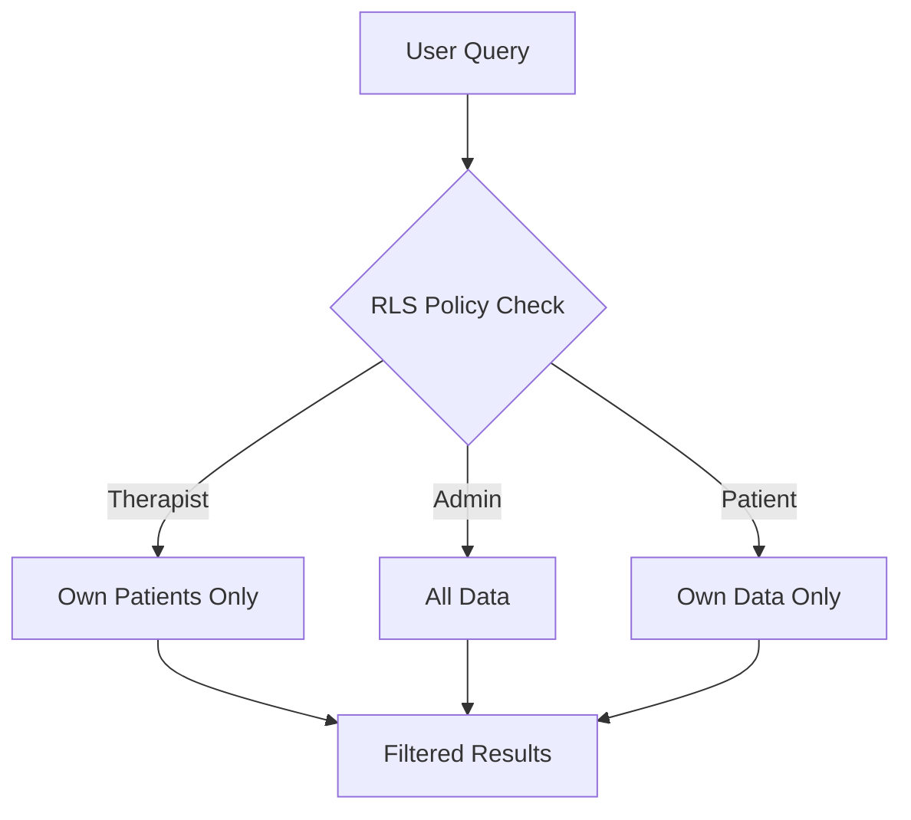

# Row Level Security (RLS) Policies

Database-level authorization that ensures users only see their own data. **Single source of truth** for all authorization in the system.

## Video Tutorial

Learn about Row Level Security with this comprehensive guide:

<iframe 
  width="383" 
  height="680" 
  src="https://www.youtube.com/embed/YAor6JTaqXI" 
  title="YouTube video player" 
  frameBorder="0" 
  allow="accelerometer; autoplay; clipboard-write; encrypted-media; gyroscope; picture-in-picture; web-share" 
  referrerPolicy="strict-origin-when-cross-origin" 
  allowFullScreen>
</iframe>

## How RLS Works



## Core RLS Pattern

```sql
-- Example: Therapists see only their patients
CREATE POLICY "therapist_own_patients" ON patients
FOR SELECT USING (therapist_id = auth.uid());

-- Storage: Files organized by patient code
public.user_owns_patient(split_part(name, '/', 1))
```

## Current Policies (18+)

### therapy_sessions Table

**Therapist Access**:
```sql
CREATE POLICY "therapist_sessions" ON therapy_sessions
FOR ALL USING (
    auth.uid() = therapist_id OR
    auth.uid() IN (
        SELECT therapist_id FROM patients 
        WHERE id = therapy_sessions.patient_id
    )
);
```

**Patient Access**:
```sql
CREATE POLICY "patient_own_sessions" ON therapy_sessions
FOR SELECT USING (
    auth.uid() IN (
        SELECT user_id FROM patients 
        WHERE id = therapy_sessions.patient_id
    )
);
```

**Admin Access**:
```sql
CREATE POLICY "admin_full_access" ON therapy_sessions
FOR ALL USING (
    auth.jwt() ->> 'role' = 'admin'
);
```

### emg_statistics Table

```sql
-- Inherit access from parent session
CREATE POLICY "stats_via_session" ON emg_statistics
FOR SELECT USING (
    session_id IN (
        SELECT id FROM therapy_sessions
        -- RLS on therapy_sessions applies here
    )
);
```

### patients Table

```sql
-- Therapists manage assigned patients
CREATE POLICY "therapist_manage_patients" ON patients
FOR ALL USING (
    therapist_id = auth.uid() OR
    auth.jwt() ->> 'role' = 'admin'
);

-- Patients view own profile only
CREATE POLICY "patient_view_self" ON patients
FOR SELECT USING (
    user_id = auth.uid()
);
```

### Storage Policies

```sql
-- C3D files organized by patient code
CREATE POLICY "storage_by_patient" ON storage.objects
FOR SELECT USING (
    bucket_id = 'c3d-examples' AND
    public.user_owns_patient(split_part(name, '/', 1))
);
```

## Policy Categories

### 1. Direct Ownership
User owns the resource directly:
```sql
CREATE POLICY "user_owns_resource" ON table_name
FOR ALL USING (user_id = auth.uid());
```

### 2. Relationship-Based
Access through relationships:
```sql
CREATE POLICY "therapist_patient_relationship" ON sessions
FOR SELECT USING (
    patient_id IN (
        SELECT id FROM patients 
        WHERE therapist_id = auth.uid()
    )
);
```

### 3. Role-Based
Access based on user role:
```sql
CREATE POLICY "admin_access" ON table_name
FOR ALL USING (
    auth.jwt() ->> 'role' = 'admin'
);
```

### 4. Composite Rules
Multiple conditions combined:
```sql
CREATE POLICY "complex_access" ON table_name
FOR SELECT USING (
    -- Own data
    user_id = auth.uid() OR
    -- Assigned therapist
    therapist_id = auth.uid() OR
    -- Admin override
    auth.jwt() ->> 'role' = 'admin'
);
```

## Testing RLS Policies

### Test Script
```bash
# Production RLS test
./backend/run_rls_test_production.sh

# What it tests:
# - Therapist can only see assigned patients
# - Patient can only see own data
# - Admin can see everything
# - Unauthorized users see nothing
```

### Manual Testing
```sql
-- Test as specific user
SET LOCAL "request.jwt.claims" = '{"sub": "user-uuid", "role": "therapist"}';

-- Run query
SELECT * FROM therapy_sessions;
-- Should only return sessions for that therapist's patients

-- Reset
RESET "request.jwt.claims";
```

### Testing in Application
```python
# Backend automatically applies RLS
sessions = supabase.table('therapy_sessions')\
    .select('*')\
    .execute()
# Returns only sessions user has access to

# Frontend also respects RLS
const { data } = await supabase
    .from('therapy_sessions')
    .select('*')
// Automatically filtered by current user
```

## Performance Optimization

### Index Support for RLS
```sql
-- Index for therapist lookup
CREATE INDEX idx_therapist_id ON patients(therapist_id);

-- Index for user lookup
CREATE INDEX idx_user_id ON patients(user_id);

-- Composite index for session queries
CREATE INDEX idx_session_lookup ON therapy_sessions(patient_id, therapist_id);
```

### Query Planning
```sql
-- Explain RLS query performance
EXPLAIN ANALYZE
SELECT * FROM therapy_sessions
WHERE patient_id = 'uuid';
```

## Important Notes

### Security Principles
- RLS is the **single source of truth** for authorization
- Backend doesn't implement authorization logic
- All queries automatically filtered by RLS
- Performance optimized with proper indexes

### Common Pitfalls
- **Service key bypasses RLS** - Use carefully
- **Missing policies = no access** - Default deny
- **Policy conflicts** - Most permissive wins
- **Testing** - Always test with different roles

### Migration Best Practices
```sql
-- Always create policies in migrations
BEGIN;

-- Create table
CREATE TABLE new_table (...);

-- Enable RLS
ALTER TABLE new_table ENABLE ROW LEVEL SECURITY;

-- Add policies
CREATE POLICY "policy_name" ON new_table ...;

COMMIT;
```

## Debugging RLS Issues

### Check Current User
```sql
SELECT auth.uid();
SELECT auth.jwt() ->> 'role';
```

### View Policies
```sql
SELECT * FROM pg_policies 
WHERE tablename = 'therapy_sessions';
```

### Test Policy Logic
```sql
-- Simulate policy evaluation
SELECT * FROM therapy_sessions
WHERE (
    -- Paste policy USING clause here
    auth.uid() = therapist_id
);
```

### Common Issues
- **No data returned**: Check if user has policy access
- **Too much data**: Policy might be too permissive
- **Performance issues**: Add supporting indexes
- **Policy not working**: Ensure RLS is enabled on table