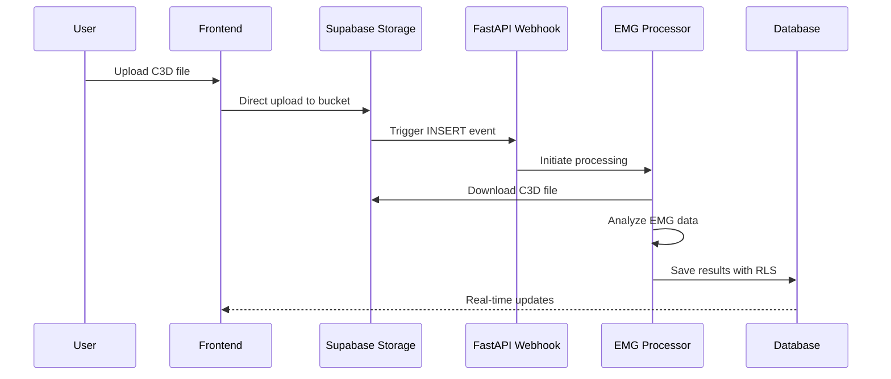

# File Storage & C3D Uploads

C3D file storage using **Supabase Storage** with webhook-triggered processing for automated EMG analysis.

## Upload Architecture



## Storage Configuration

### Bucket Setup
- **Bucket name**: `c3d-examples`
- **File types**: `.c3d` files only (binary format)
- **Max file size**: 50MB
- **Structure**: `{patient_code}/{timestamp}_{filename}.c3d`

### Storage Policies
```sql
-- Patients upload to their folder
CREATE POLICY "patient_upload" ON storage.objects
FOR INSERT WITH CHECK (
    bucket_id = 'c3d-examples' AND
    (storage.foldername(name))[1] = auth.jwt() ->> 'patient_code'
);

-- Therapists access patient files
CREATE POLICY "therapist_read" ON storage.objects
FOR SELECT USING (
    bucket_id = 'c3d-examples' AND
    public.user_owns_patient(split_part(name, '/', 1))
);
```

## Frontend Upload

### Direct Upload Pattern
```typescript
// Upload directly to Supabase Storage
const { data, error } = await supabase.storage
  .from('c3d-examples')
  .upload(`${patientCode}/${timestamp}_${fileName}`, file, {
    contentType: 'application/octet-stream',
    upsert: false
  })

// Monitor upload progress
const { data, error } = await supabase.storage
  .from('c3d-examples')
  .upload(path, file, {
    onUploadProgress: (progress) => {
      const percentage = (progress.loaded / progress.total) * 100
      setUploadProgress(percentage)
    }
  })
```

### File Validation
```typescript
// Validate before upload
const validateC3DFile = (file: File): boolean => {
  // Check file extension
  if (!file.name.endsWith('.c3d')) return false
  
  // Check file size (50MB limit)
  if (file.size > 50 * 1024 * 1024) return false
  
  // Check binary signature (optional)
  // C3D files start with specific byte pattern
  
  return true
}
```

## Webhook Processing

### Webhook Endpoint
```python
# backend/api/routes/webhooks.py (349 lines)
@router.post("/webhooks/storage/c3d-upload")
async def handle_c3d_upload(
    request: Request,
    background_tasks: BackgroundTasks,
    webhook_security: WebhookSecurity = Depends()
):
    # 1. Verify HMAC signature
    signature = request.headers.get("webhook-signature")
    body = await request.body()
    
    if not webhook_security.verify_signature(body, signature):
        raise HTTPException(401, "Invalid signature")
    
    # 2. Extract file metadata
    payload = await request.json()
    file_path = payload["record"]["name"]
    bucket_id = payload["record"]["bucket_id"]
    
    # 3. Process in background
    background_tasks.add_task(
        process_c3d_file,
        file_path=file_path,
        bucket_id=bucket_id
    )
    
    return {"status": "processing"}
```

### Processing Pipeline
```python
async def process_c3d_file(file_path: str, bucket_id: str):
    """Background processing of uploaded C3D file"""
    
    # 1. Extract patient/therapist from path
    patient_code = file_path.split('/')[0]
    patient = patient_repository.get_by_code(patient_code)
    
    # 2. Download file from storage
    file_bytes = supabase.storage.from_(bucket_id).download(file_path)
    
    # 3. Process with GHOSTLYC3DProcessor
    processor = GHOSTLYC3DProcessor()
    results = processor.process_c3d_bytes(file_bytes)
    
    # 4. Create therapy session
    session = therapy_session_processor.create_session(
        patient_id=patient.id,
        therapist_id=patient.therapist_id,
        c3d_file_path=file_path,
        processing_results=results
    )
    
    # 5. Cleanup temporary files
    cleanup_temp_files()
```

## Security

### HMAC Signature Verification
```python
# backend/services/infrastructure/webhook_security.py
class WebhookSecurity:
    def verify_signature(self, body: bytes, signature: str) -> bool:
        """Verify webhook signature using HMAC-SHA256"""
        secret = os.getenv("SUPABASE_WEBHOOK_SECRET")
        
        expected = hmac.new(
            secret.encode(),
            body,
            hashlib.sha256
        ).hexdigest()
        
        return hmac.compare_digest(expected, signature)
```

### Environment Variables
```bash
# Required for webhook security
SUPABASE_WEBHOOK_SECRET=your-webhook-secret
SUPABASE_SERVICE_KEY=your-service-key
```

## Development Setup

### Local Testing with ngrok
```bash
# 1. Install ngrok (one-time)
# Download from: https://ngrok.com/download
# Get token: https://dashboard.ngrok.com/get-started/your-authtoken
./ngrok config add-authtoken YOUR_TOKEN

# 2. Start with webhook testing
cd project_root
./start_dev.sh --webhook

# This automatically:
# - Starts backend on port 8080
# - Starts frontend on port 3000
# - Creates ngrok tunnel
# - Shows webhook URL for Supabase config

# 3. Configure in Supabase Dashboard
# URL: https://YOUR_NGROK_URL.ngrok-free.app/webhooks/storage/c3d-upload
# Events: INSERT on c3d-examples bucket
# Secret: Your webhook secret

# 4. Monitor webhook activity
tail -f logs/backend.error.log | grep -E "(🚀|📁|🔄|✅|❌)"
```

### Testing Workflow
1. Upload C3D file via Supabase Dashboard or frontend
2. Storage triggers webhook to ngrok URL
3. Backend receives and processes file
4. Results saved to database
5. Frontend shows processed results

## File Management

### Naming Convention
```
{patient_code}/{timestamp}_{original_name}.c3d

Examples:
P001/20240815_143022_session1.c3d
P002/20240815_150534_therapy.c3d
```

### Cleanup Strategy
```python
# Temporary files during processing
def cleanup_temp_files():
    """Remove temporary files after processing"""
    temp_dir = "/tmp/c3d_processing"
    if os.path.exists(temp_dir):
        shutil.rmtree(temp_dir)
```

### Storage Limits
- **Per file**: 50MB maximum
- **Per bucket**: 100GB (Supabase free tier)
- **Retention**: Indefinite (manual cleanup required)

## Error Handling

### Upload Failures
```typescript
// Frontend error handling
const handleUploadError = (error: StorageError) => {
  switch (error.statusCode) {
    case 413:
      showError("File too large (max 50MB)")
      break
    case 409:
      showError("File already exists")
      break
    case 403:
      showError("Permission denied")
      break
    default:
      showError("Upload failed")
  }
}
```

### Webhook Failures
```python
# Backend retry logic
@retry(
    stop=stop_after_attempt(3),
    wait=wait_exponential(multiplier=1, min=4, max=10)
)
async def process_with_retry(file_path: str):
    """Process with automatic retry on failure"""
    return await process_c3d_file(file_path)
```

## Performance Optimization

### Chunked Uploads
```typescript
// For large files, use resumable uploads
const { data, error } = await supabase.storage
  .from('c3d-examples')
  .uploadToSignedUrl(path, file, {
    upsert: false,
    chunkSize: 1024 * 1024 // 1MB chunks
  })
```

### Parallel Processing
```python
# Process multiple files concurrently
async def process_batch(file_paths: List[str]):
    tasks = [process_c3d_file(path) for path in file_paths]
    results = await asyncio.gather(*tasks)
    return results
```

### Caching Strategy
- Cache processed results in Redis for 24 hours
- Skip reprocessing if file hash matches
- Serve cached results for duplicate requests