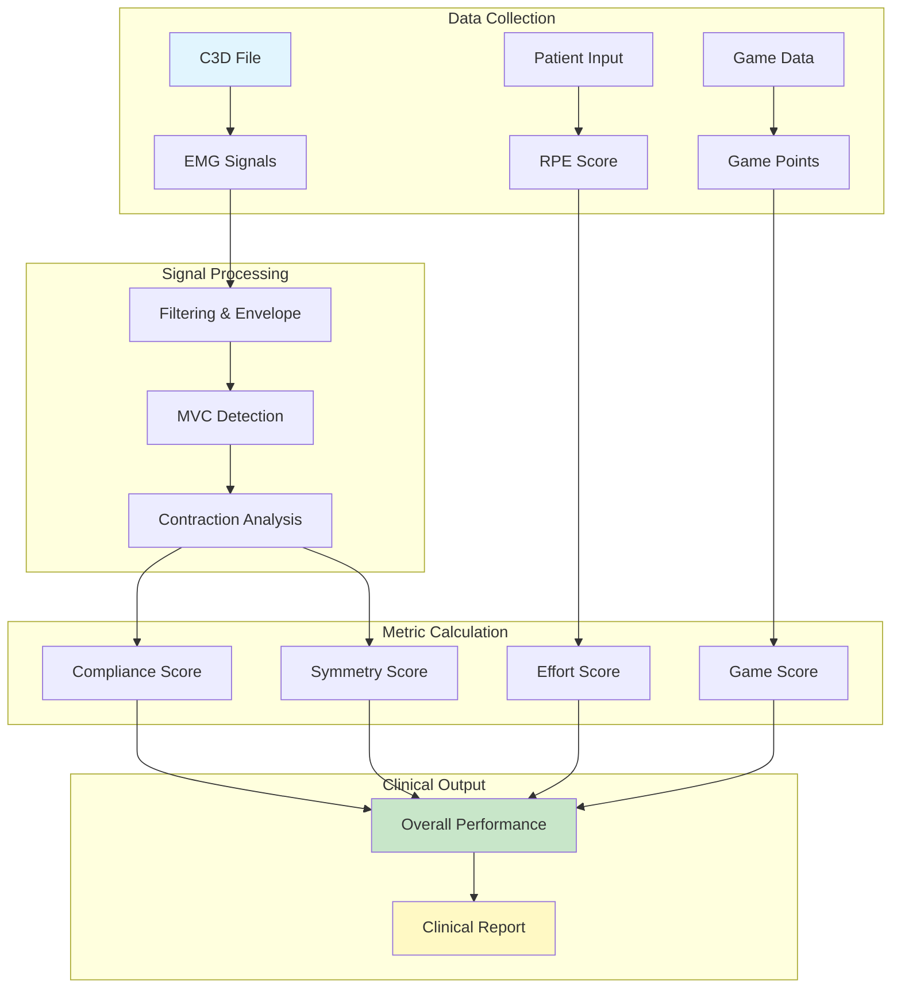

# Clinical Metrics & Scoring

## Overview

The GHOSTLY+ scoring system analyzes EMG data to provide quantitative assessment of rehabilitation therapy sessions. The system calculates performance metrics that evaluate:

- Exercise intensity sufficient for muscle adaptation
- Bilateral symmetry between legs
- Session safety and appropriate challenge level
- Patient engagement and compliance

## Clinical Context

This scoring system supports the GHOSTLY+ multicenter clinical trial for 120 hospitalized adults (≥65 years) with restricted mobility, using Blood Flow Restriction (BFR) therapy.

### Treatment Protocol
- **Duration**: 14 days
- **Frequency**: 5 sessions per week
- **Structure**: 3 game rounds per session with rest breaks
- **Volume**: 12 contractions per leg per round
- **Target Intensity**: ≥75% maximum voluntary contraction (MVC)

### Key Terminology

**Compliance**: Intra-session metric measuring execution quality. Assesses whether force and duration targets required for muscle adaptation were achieved.

**Adherence**: Inter-session metric measuring consistency across treatment days. Indicates sustained patient engagement over the treatment period.

## Scoring Architecture

## Scoring System

### Overall Performance Score

**Overall Performance Formula:**

$$P_{\text{overall}} = (w_c \times S_{\text{compliance}} + w_s \times S_{\text{symmetry}} + w_e \times S_{\text{effort}} + w_g \times S_{\text{game}}) \times C_{\text{BFR}}$$

| **Metric** | **Weight** | **Clinical Purpose** |
|------------|------------|---------------------|
| **Therapeutic Compliance** | **50%** | Measures exercise intensity and volume |
| **Muscle Symmetry** | **25%** | Assesses bilateral balance |
| **Subjective Effort** | **25%** | Validates appropriate challenge level |
| **Game Performance** | **0%** | Optional engagement metric |

**Note**: C_BFR (BFR Safety Factor) serves as a safety gate. Score becomes zero if blood flow restriction pressure exceeds safe limits.

### 1. Therapeutic Compliance Score

Measures whether prescribed exercise intensity and duration achieve therapeutic effect.

**Therapeutic Compliance Formula:**

$$S_{\text{compliance}} = \frac{S_{\text{left}} + S_{\text{right}}}{2}$$

Each leg score combines three components:

| **Component** | **Measurement** | **Target** |
|---------------|-----------------|-----------|
| **Completion Rate** | Contractions performed | 12/12 (100%) |
| **Intensity Rate** | Force relative to MVC | ≥75% |
| **Duration Rate** | Contraction hold time | ≥2 seconds |

**Clinical Significance**: Primary indicator of therapeutic dose. Low compliance suggests insufficient stimulus for muscle adaptation.

### 2. Muscle Symmetry Score

Quantifies performance balance between legs.

**Muscle Symmetry Formula:**

$$S_{\text{symmetry}} = \left(1 - \frac{|S_{\text{left}} - S_{\text{right}}|}{S_{\text{left}} + S_{\text{right}}}\right) \times 100$$

| **Score Range** | **Clinical Interpretation** | **Recommended Action** |
|-----------------|----------------------------|------------------------|
| **>90%** | Within normal limits | Progress exercise difficulty |
| **80-90%** | Acceptable asymmetry | Continue current protocol |
| **70-80%** | Moderate asymmetry | Focus on weaker side |
| **&lt;70%** | Significant asymmetry | Clinical review required |

**Clinical Significance**: Asymmetry may indicate weakness, pain, or compensatory patterns requiring intervention.

### 3. Subjective Effort Score (RPE)

Based on Borg CR-10 Scale (0-10 rating of perceived exertion).

| **RPE Range** | **Score** | **Clinical Interpretation** |
|---------------|-----------|---------------------------|
| 4-6 | 100% | Target range for elderly rehabilitation |
| 3, 7 | 80% | Acceptable, monitor for adjustment |
| 2, 8 | 60% | Outside target, consider modification |
| 0-1, 9-10 | 20% | Requires immediate adjustment |

**Clinical Significance**: RPE 4-6 represents optimal balance between therapeutic stimulus and safety for elderly patients.

### 4. Game Performance Score

Optional metric for patient engagement assessment.

**Game Performance Formula:**

$$S_{\text{game}} = \frac{\text{points}_{\text{achieved}}}{\text{points}_{\text{max}}} \times 100$$

**Note**: Weighted at 0% by default. Game performance does not correlate directly with therapeutic benefit.

## Scoring Configuration

The system applies configurable scoring weights and thresholds through a hierarchical configuration system:

1. **Session Configuration**: Immutable configuration locked at session creation
2. **Patient Configuration**: Current settings for the patient's treatment plan
3. **Global Default**: GHOSTLY-TRIAL-DEFAULT configuration
4. **System Defaults**: Fallback values from config.py

This hierarchy ensures consistent scoring within sessions while allowing flexibility for research protocols and patient-specific adjustments.

### Administrator Interface

Authorized users (therapists, researchers, administrators) can customize the scoring system through the settings interface:

**Configurable Parameters**:
- **Performance Formula Weights**: Adjust the contribution of each component (compliance, symmetry, effort, game) to the overall score
- **Compliance Sub-weights**: Fine-tune how completion rate, intensity, and duration combine for compliance scoring
- **RPE Mapping**: Customize effort scoring by defining which RPE values map to specific score percentages
- **Configuration Scope**: Apply settings globally, per-patient, or per-therapist for research flexibility

These customizations enable:
- Protocol-specific scoring for different research studies
- Patient-specific adjustments based on clinical needs
- Therapist preferences for their patient cohorts
- A/B testing of different scoring strategies

## Clinical Example

**Patient Profile**: 72-year-old, Day 5 post-knee replacement

### Session Data
- **Left Leg**: 11/12 contractions (9 meeting force threshold, 10 meeting duration)
- **Right Leg**: 12/12 contractions (8 meeting force threshold, 11 meeting duration)
- **BFR Pressure**: 52% (within safe range)
- **Patient RPE**: 6 (hard but manageable)
- **Game Score**: 850/1000 points

### Calculated Scores
- **Compliance**: 87.3%
- **Symmetry**: 98.8%
- **Effort**: 100%
- **Game**: 85% (weight: 0%)

### Overall Score: 93.4%

**Clinical Interpretation**: Session achieved therapeutic targets with good bilateral symmetry and appropriate patient effort. Minor force deficit on operated leg is expected at this recovery stage.

**Recommendation**: Maintain current protocol with consideration for gradual resistance progression.

## Performance Categories

| **Score Range** | **Category** | **Clinical Action** |
|-----------------|--------------|-------------------|
| **≥90%** | Target achieved | Progress difficulty |
| **80-89%** | Adequate | Continue protocol |
| **70-79%** | Below target | Review and adjust |
| **60-69%** | Poor | Modify approach |
| **&lt;60%** | Inadequate | Comprehensive reassessment |

## Technical Reference

### Database Schema

Key tables for clinical data management:
- **`therapy_sessions`** - Session metadata and processing status
- **`emg_statistics`** - EMG signal analysis results
- **`performance_scores`** - Calculated clinical metrics
- **`scoring_configuration`** - Customizable scoring weights

[View Complete Schema](https://supabase.com/dashboard/project/egihfsmxphqcsjotmhmm/database/schemas)

