# Development Guide

## Overview

Claude Code is a terminal-based AI coding assistant that can directly edit files and run commands in your project. It uses the Model Context Protocol (MCP) to connect with specialized servers that provide documentation, analysis tools, and database access.

This project optionally integrates with [SuperClaude](https://github.com/NomenAK/SuperClaude), a configuration framework that adds structured commands and workflows to Claude Code through the `/sc:` prefix.

**References**: [Claude Code Docs](https://docs.claude.com/en/docs/claude-code/overview) | [MCP Protocol](https://modelcontextprotocol.io) | [Anthropic Cookbook](https://github.com/anthropics/anthropic-cookbook)

## Quick Start

```bash
# Install Claude Code globally
npm install -g @anthropic-ai/claude-code

# Navigate to project and start
cd emg-c3d-analyzer
claude

# Native development (recommended)
./start_dev_simple.sh              # Backend + Frontend
./start_dev_simple.sh --test       # With test suite
./start_dev_simple.sh --webhook    # With ngrok tunnel

# Docker development
./start_dev_docker.sh               # Containerized stack
./start_dev_docker.sh --build       # Rebuild images
./start_dev_docker.sh logs          # View all logs
```

## MCP Architecture

The Model Context Protocol (MCP) is a standardized interface that allows Claude Code to connect with external tools and data sources. Each MCP server provides specific capabilities - from reading documentation to running browser tests.

```mermaid
graph TB
    CC[Claude Code] --> MCP[MCP Protocol]
    MCP --> S1[Context7<br/>📚 Docs Server]
    MCP --> S2[Sequential<br/>🧠 Analysis Server]
    MCP --> S3[Supabase<br/>🗄️ Database Server]
    MCP --> S4[Playwright<br/>🎭 Testing Server]
    MCP --> S5[Magic<br/>🎨 UI Server]
    MCP --> S6[Serena<br/>💾 Memory Server]
    
    S1 --> D1[Framework Docs]
    S2 --> D2[Code Analysis]
    S3 --> D3[Database Ops]
    S4 --> D4[Browser Testing]
    S5 --> D5[UI Components]
    S6 --> D6[Project Memory]
    
    style CC fill:#e1f5fe
    style MCP fill:#fff3e0
```



## Development Workflow

Standard workflow when using Claude Code:


## Essential Commands

### Development Workflow

| Task | Command | Description |
|------|---------|-------------|
| **Start Dev (Native)** | `./start_dev_simple.sh` | Backend and frontend servers |
| **Start Dev (Docker)** | `./start_dev_docker.sh` | Containerized development |
| **Run Tests** | `./start_dev_simple.sh --test` | Complete test suite |
| **Webhooks** | `./start_dev_simple.sh --webhook` | Includes ngrok tunnel |
| **Backend Only** | `cd backend && uvicorn main:app --reload` | FastAPI on port 8080 |
| **Frontend Only** | `cd frontend && npm start` | Vite dev server on port 3000 |

### Claude Code Commands

Commands starting with `/sc:` are part of the SuperClaude framework, which provides structured workflows for common development tasks. These commands are optional enhancements to standard Claude Code functionality.

| Command | Purpose | Example |
|---------|---------|---------|
| `/sc:load` | Load project context | `/sc:load src/` |
| `/sc:plan` | Create implementation plan | `/sc:plan "auth feature"` |
| `/sc:implement` | Build feature | `/sc:implement "JWT auth"` |
| `/sc:test` | Run tests | `/sc:test --coverage` |
| `/sc:analyze` | Code analysis | `/sc:analyze --focus security` |
| `/sc:save` | Save session state | `/sc:save "auth-complete"` |

### Testing Commands

```bash
# Backend (33 tests)
cd backend && python -m pytest tests/ -v
python -m pytest tests/ --cov=backend    # With coverage

# Frontend (78 tests)
cd frontend && npm test -- --run         # Run once
npm test -- --coverage                   # With coverage

# E2E Tests
python -m pytest tests/test_e2e* -v -s   # Uses C3D test files
```

## MCP Server Capabilities

### Server Coordination Matrix

| Server | Primary Use | Key Features | Integration |
|--------|------------|--------------|-------------|
| **Context7** | Documentation | Framework patterns, API docs | Library reference |
| **Sequential** | Analysis | Multi-step reasoning | Debugging support |
| **Supabase** | Database | CRUD operations, RLS policies | Database access |
| **Playwright** | Testing | Browser automation | E2E testing |
| **Magic** | UI Components | React patterns | Component generation |
| **Serena** | Memory | Project context | Session persistence |

### Coordination Patterns

```yaml
Feature Development:
  Sequential: Plans architecture
  Magic: Generates UI components
  Context7: Ensures compliance
  Playwright: Validates behavior

Bug Investigation:
  Sequential: Root cause analysis
  Serena: Historical context
  Context7: Pattern verification
  
Performance Optimization:
  Sequential: Bottleneck identification
  Serena: Previous optimizations
  Playwright: Performance metrics
```

## Webhook Development

For Supabase Storage webhooks, use ngrok for local testing:

```bash
# One-time ngrok setup
ngrok config add-authtoken YOUR_TOKEN

# Start with webhook support
./start_dev_simple.sh --webhook

# Monitor webhook activity
tail -f logs/backend.error.log | grep -E "(🚀|📁|🔄|✅|❌)"
```

Configure in Supabase Dashboard:
1. Storage → Webhooks → Add webhook
2. URL: `https://YOUR_NGROK_URL.ngrok-free.app/webhooks/storage/c3d-upload`
3. Events: `storage.objects.create`
4. Bucket: `c3d-examples`

## Production Deployment

### Backend Deployment
- **Platform**: Coolify or Vercel
- **Requirements**: Python 3.11+, 512MB RAM
- **Docker**: `docker build -f backend/Dockerfile -t emg-backend .`
- **Environment**: Production variables in `.env`

### Frontend Deployment
- **Platform**: Vercel (automatic from GitHub)
- **Build**: `npm run build` generates static files
- **API**: Proxy `/api/*` to backend URL
- **Preview**: Automatic for pull requests

### Environment Variables

**Backend (.env)**:
```env
SUPABASE_URL=https://your-project.supabase.co
SUPABASE_SERVICE_KEY=your-service-key
WEBHOOK_SECRET=your-webhook-secret
REDIS_URL=redis://localhost:6379  # Optional
```

**Frontend (.env.local)**:
```env
VITE_SUPABASE_URL=https://your-project.supabase.co
VITE_SUPABASE_ANON_KEY=your-anon-key
VITE_API_URL=http://localhost:8080  # Production differs
```

## Docker Operations

### Development Environment

```bash
# Start development stack
./start_dev_docker.sh                   # Full development environment
./start_dev_docker.sh --build           # Rebuild images and start
./start_dev_docker.sh --staging         # Use staging configuration
./start_dev_docker.sh --production      # Use production configuration

# Container management
./start_dev_docker.sh logs              # View all logs
./start_dev_docker.sh logs backend      # View specific service logs
./start_dev_docker.sh shell backend     # Open shell in container
./start_dev_docker.sh status            # Show service status
./start_dev_docker.sh down              # Stop all services

# Advanced operations
./start_dev_docker.sh clean-docker      # Clean Docker resources
./start_dev_docker.sh clean-docker --aggressive  # Remove all unused images
./start_dev_docker.sh clean-docker --all         # Clean everything (including volumes)
```

### Manual Docker Commands

```bash
# Build and run manually
docker build -f backend/Dockerfile -t emg-backend .
docker run -p 8080:8080 --env-file .env emg-backend

# Docker Compose (if using directly)
docker compose -f docker/compose/docker-compose.dev.yml up -d
docker compose logs -f backend
docker compose down -v
```

### Docker Features

- **ARM64/Apple Silicon**: Automatic platform detection and compatibility
- **Health Monitoring**: Built-in service health checks and recovery
- **Error Handling**: Comprehensive error recovery and cleanup
- **Disk Management**: Advanced cleanup with disk space monitoring
- **Multiple Environments**: Support for dev, staging, and production configs

## Common Issues & Solutions

### Port Conflicts
```bash
lsof -i :8080 && kill -9 $(lsof -t -i:8080)  # Backend
lsof -i :3000 && kill -9 $(lsof -t -i:3000)  # Frontend
```

### Environment Reset
```bash
rm -rf backend/venv frontend/node_modules
./start_dev_simple.sh  # Reinstalls everything
```

### Cache Clear
```bash
rm -rf frontend/node_modules/.cache
find backend -name __pycache__ -exec rm -r {} +
```

## Video Tutorial

<iframe width="560" height="315" src="https://www.youtube.com/embed/amEUIuBKwvg?si=vud7gXUWbCIfRuAm&start=383" title="Claude Code Tutorial" frameborder="0" allow="accelerometer; autoplay; clipboard-write; encrypted-media; gyroscope; picture-in-picture; web-share" referrerpolicy="strict-origin-when-cross-origin" allowfullscreen></iframe>

## Additional Resources

- [Claude Code Overview](https://docs.claude.com/en/docs/claude-code/overview) - Getting started guide
- [MCP Protocol Docs](https://modelcontextprotocol.io) - Server integration
- [Anthropic Cookbook](https://github.com/anthropics/anthropic-cookbook) - Code examples
- [Project Repository](https://github.com/ggustin93/emg-c3d-analyzer) - Source code

---

*For detailed backend architecture, see [Backend Documentation](./backend.md). For quick setup, refer to [Getting Started](./getting-started.md).*