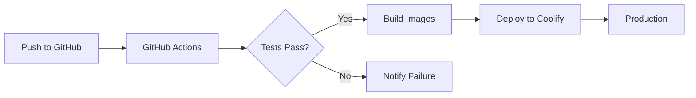

# CI/CD Pipeline

Automated testing and deployment using GitHub Actions.

## Pipeline Overview



## GitHub Actions Workflows

### Test Workflow
```yaml
# .github/workflows/test.yml
name: Test
on: [push, pull_request]

jobs:
  test:
    runs-on: ubuntu-latest
    steps:
      - uses: actions/checkout@v3
      
      - name: Backend Tests
        run: |
          cd backend
          pip install -r requirements.txt
          python -m pytest tests/ -v
          
      - name: Frontend Tests
        run: |
          cd frontend
          npm ci
          npm test -- --run
```

### Build & Deploy
```yaml
# .github/workflows/deploy.yml
name: Deploy
on:
  push:
    branches: [main]

jobs:
  deploy:
    runs-on: ubuntu-latest
    steps:
      - uses: actions/checkout@v3
      
      - name: Build Docker Images
        run: |
          docker build -t backend ./backend
          docker build -t frontend ./frontend
          
      - name: Deploy to Coolify
        run: |
          curl -X POST ${{ secrets.COOLIFY_WEBHOOK }}
```

## Test Suite

### Backend (135 tests)
- Unit tests: EMG processing algorithms
- Integration tests: API endpoints
- E2E tests: Real C3D file processing

### Frontend (78 tests)
- Component tests: React components
- Hook tests: Business logic
- Integration tests: User workflows

## Quality Gates

- ✅ All tests must pass
- ✅ Code coverage maintained
- ✅ ESLint/TypeScript checks pass
- ✅ Docker builds succeed

## Deployment Strategy

### Development
- Every push triggers tests
- Feature branches deployed to preview

### Production
- Main branch auto-deploys
- Rollback on failure
- Health checks before routing traffic

## Monitoring

- Build status badges
- Slack/Email notifications
- Deployment history
- Performance metrics