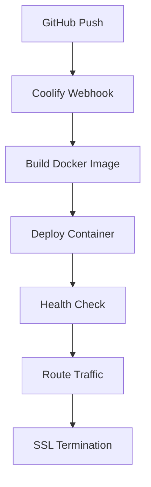

# Coolify Deployment

Self-hosted PaaS for easy deployment and management of the EMG C3D Analyzer.

## What is Coolify?

Coolify is an open-source, self-hostable Heroku/Netlify alternative that provides:
- One-click deployments
- Automatic SSL certificates
- Built-in monitoring
- Docker-based infrastructure
- GitOps workflows

## Deployment Architecture



## Setup Process

### 1. Install Coolify
```bash
# On your VPS/server
curl -fsSL https://cdn.coollabs.io/coolify/install.sh | bash
```

### 2. Configure Application
```yaml
# In Coolify Dashboard
Application:
  name: emg-c3d-analyzer
  type: Docker Compose
  source: GitHub Repository
  branch: main
  
Environment:
  SUPABASE_URL: ${{secrets.SUPABASE_URL}}
  SUPABASE_ANON_KEY: ${{secrets.SUPABASE_ANON_KEY}}
  REDIS_URL: redis://redis:6379
```

### 3. Deploy
- Connect GitHub repository
- Set environment variables
- Configure domain
- Deploy application

## Features Used

### Automatic Deployments
- GitHub webhook triggers
- Branch-based deployments
- Rollback capabilities

### Monitoring
- Container health checks
- Resource usage metrics
- Application logs
- Alert notifications

### SSL/TLS
- Let's Encrypt integration
- Automatic certificate renewal
- Force HTTPS redirect

## Configuration

### Environment Variables
```bash
# Set in Coolify secrets
SUPABASE_URL
SUPABASE_ANON_KEY
SUPABASE_SERVICE_KEY
REDIS_CACHE_TTL_SECONDS=3600
NODE_ENV=production
```

### Health Checks
```yaml
healthcheck:
  test: ["CMD", "curl", "-f", "http://localhost:8080/health"]
  interval: 30s
  timeout: 10s
  retries: 3
```

## Advantages

- **Simplicity**: Deploy with git push
- **Cost-effective**: Self-hosted on any VPS
- **Control**: Full access to infrastructure
- **Monitoring**: Built-in observability
- **Scaling**: Easy horizontal scaling