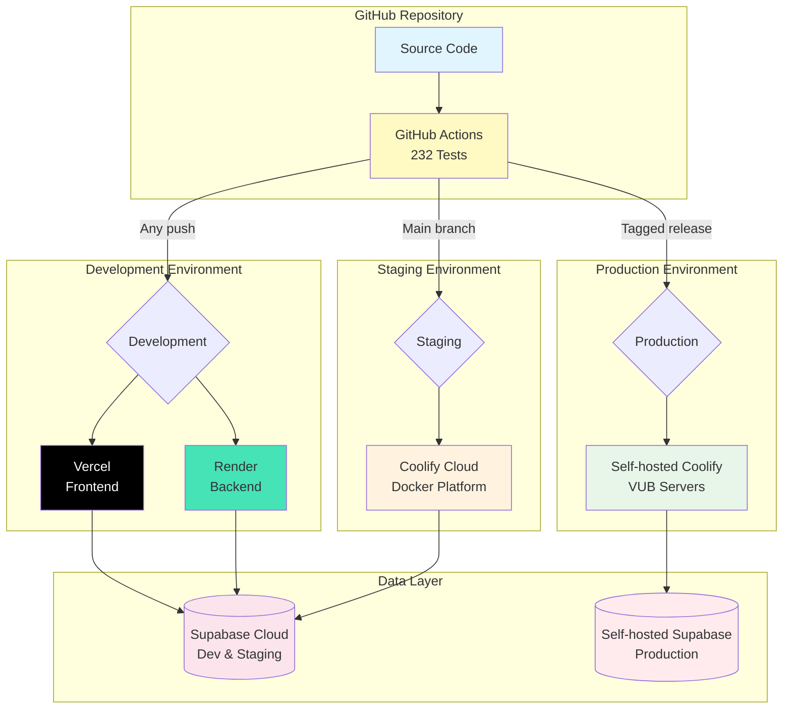

# DevOps & Deployment Guide

## Overview

The EMG C3D Analyzer deploys across three environments, each optimized for different needs. We use Vercel and Render for rapid development with zero configuration, Coolify Cloud for staging with Docker containers, and self-hosted Coolify for production to ensure medical data sovereignty. Our GitHub Actions pipeline automatically tests and deploys code, making the deployment process smooth and reliable.

## Deployment Environments

### Environment Comparison

| Environment | Platform | Database | Purpose | Auto-Deploy |
|------------|----------|----------|---------|-------------|
| **Development** | Vercel + Render | Supabase Cloud | Rapid iteration | ✅ On push |
| **Staging** | Coolify Cloud | Supabase Cloud | Docker testing, demos | ✅ On main |
| **Production** | Self-hosted Coolify | Self-hosted Supabase | Live medical data | Manual approval |

### Choosing the Right Environment

- **Development**: Perfect for feature development and quick testing. Every code push gets its own preview URL.
- **Staging**: Use this for client demos and integration testing. It mirrors production but uses cloud services.
- **Production**: Reserved for live patient data with full GDPR compliance and institutional control.

## Architecture



## CI/CD Pipeline

Every push to GitHub triggers our automated pipeline with 232 tests (154 backend + 78 frontend). The pipeline ensures code quality through unit tests, integration tests, security scanning, and build validation before any deployment happens.

### Quality Gates
- ✅ All tests must pass
- ✅ TypeScript and Python linting succeeds
- ✅ Security scanning finds no critical issues
- ✅ Docker images build successfully

## Quick Deployment Guide

### Development (Vercel + Render)

**Frontend on Vercel:**
1. Import repository at [vercel.com](https://vercel.com)
2. Set root: `frontend`, framework: Vite
3. Add environment variables (see below)
4. Deploy - takes 2 minutes

**Backend on Render:**
1. Create Web Service at [render.com](https://render.com)
2. Set root: `backend`, start: `uvicorn main:app --host 0.0.0.0 --port $PORT`
3. Add environment variables (see below)
4. Deploy - automatic HTTPS included

### Staging & Production (Coolify)

Both Coolify environments follow the same simple process:

1. **Connect GitHub**: Link repository to Coolify project
2. **Set Docker Compose**: `docker/compose/docker-compose.coolify.yml`
3. **Add Variables**: Configure all environment variables
4. **Deploy**: Push to main branch triggers deployment
5. **Verify**: Check `/api/health` endpoint

## Environment Variables

### Backend (All Environments)
```bash
# Supabase Configuration
SUPABASE_URL=https://your-project.supabase.co
SUPABASE_SERVICE_KEY=eyJhbGc...  # Service role - keep secret!
SUPABASE_ANON_KEY=eyJhbGc...     # Public key

# Application Settings
ENVIRONMENT=production            # or development, staging
SECRET_KEY=your-secret-key       # Generate: openssl rand -hex 32

# Redis (Coolify environments only)
REDIS_URL=redis://redis:6379/0
```

### Frontend (All Environments)
```bash
# API Configuration
VITE_API_URL=https://your-backend-url  # Render/Coolify URL
VITE_SUPABASE_URL=https://your-project.supabase.co
VITE_SUPABASE_ANON_KEY=eyJhbGc...     # Same public key as backend
```

## Local Development

For local development, we provide simple scripts that handle everything:

```bash
# Start both frontend and backend
./start_dev_simple.sh

# With webhook testing (includes ngrok)
./start_dev_simple.sh --webhook

# Run all tests
./start_dev_simple.sh --test
```

## Monitoring & Maintenance

### Health Checks

Quick commands to verify your deployment:

```bash
# API Health
curl https://your-app.com/api/health

# Frontend
open https://your-app.com

# Logs (Coolify)
# Dashboard → Service → View Logs
```

### Updating Applications

- **Development**: Automatic on every push
- **Staging**: Automatic when merging to main
- **Production**: Manual approval in Coolify dashboard

### Rollback

If something goes wrong:
1. **Coolify**: Dashboard → Deployments → Select previous → Rollback
2. **Git**: `git revert HEAD && git push origin main`

## Troubleshooting

Common issues and quick fixes:

| Issue | Solution |
|-------|----------|
| Frontend can't reach backend | Check VITE_API_URL environment variable |
| Supabase connection fails | Verify service key hasn't expired |
| High memory usage | Increase Coolify resource limits |
| Build fails | Clear Docker cache in Coolify |

## Security Reminders

- 🔐 Never commit secrets - use environment variables
- 🔄 Rotate Supabase keys quarterly
- 🔒 Always use HTTPS, even in development
- 📊 Monitor logs for suspicious activity
- 🔧 Update Docker images monthly

## Essential Resources

### Documentation
- [Coolify Docs](https://coolify.io/docs) - Deployment platform
- [Vercel Docs](https://vercel.com/docs) - Frontend hosting
- [Render Docs](https://render.com/docs) - Backend hosting
- [Supabase Docs](https://supabase.com/docs) - Database & Auth

### Project Configuration
- CI/CD Pipeline: `/.github/workflows/ci.yml`
- Docker Setup: `/docker/compose/docker-compose.coolify.yml`
- Environment Config: Check respective platform dashboards

## Getting Help

If you encounter issues:
1. Check the troubleshooting table above
2. Review service logs for specific errors
3. Verify all environment variables are set
4. Ask in the team's #deployment Slack channel

---

*This guide covers the essentials for deploying the EMG C3D Analyzer. For detailed Docker configurations or advanced CI/CD customization, refer to the source files listed above.*