# DevOps & Deployment Guide

## Overview

The GHOSTLY+ Dashboard deploys across three environments, each optimized for different needs. We use Vercel and Render for rapid development with zero configuration, Coolify Cloud for staging with Docker containers, and self-hosted Coolify for production to ensure medical data sovereignty. Our GitHub Actions pipeline tests code and provides deployment automation to staging with optional manual production deployment (webhook setup is ready but requires configuration).

## Deployment Environments

**Environment Comparison**

| Environment | Platform | Database | Purpose | Auto-Deploy |
|------------|----------|----------|---------|-------------|
| **Development/Demo** | Vercel + Render | Supabase Cloud | Rapid iteration + medical team demos | ✅ On push |
| **Staging** | Coolify Cloud | Self-hosted Supabase | Production mirror, testing | ⚙️ Auto-deploy ([webhook setup required](#webhook-configuration)) |
| **Production** | Self-hosted Coolify | Self-hosted Supabase | Live medical data | 🔒 Manual trigger ([see deployment flow](#deployment-flow)) |

**Choosing the Right Environment**

- **Development/Demo**: Remote environment for feature development and medical team demonstrations. Every code push gets its own preview URL.
- **Staging**: True production mirror with identical infrastructure for accurate testing and validation.
- **Production**: Reserved for live patient data with full GDPR compliance and institutional control.

## Architecture

```mermaid
graph TB
    subgraph "GitHub Repository"
        Code[Source Code] --> Actions[GitHub Actions<br/>Comprehensive Tests]
    end
    
    Actions -->|Any push| Dev{Development}
    Actions -->|CI Success<br/>main/develop| Staging{Staging}
    Staging -->|Manual Trigger| Prod{Production}
    
    subgraph "Development Environment"
        Dev --> Vercel[Vercel<br/>Frontend]
        Dev --> Render[Render<br/>Backend]
    end
    
    subgraph "Staging Environment"
        Staging --> CoolifyCloud[Coolify Cloud<br/>Docker Platform<br/>🔄 Auto-deploy]
        CoolifyCloud --> Webhook1[Webhook<br/>Trigger]
    end
    
    subgraph "Production Environment"
        Prod --> CoolifySelf[Self-hosted Coolify<br/>VUB Servers<br/>🔒 Manual approval]
        CoolifySelf --> Webhook2[Webhook<br/>Trigger]
    end
    
    subgraph "Data Layer"
        SupabaseCloud[(Supabase Cloud<br/>Development Only)]
        SupabaseSelf[(Self-hosted Supabase<br/>Staging & Production)]
    end
    
    Vercel --> SupabaseCloud
    Render --> SupabaseCloud
    CoolifyCloud --> SupabaseSelf
    CoolifySelf --> SupabaseSelf
    
    Actions -.->|Webhook| Webhook1
    Actions -.->|Manual Action| Webhook2
    
    style Code fill:#e1f5fe
    style Actions fill:#fff9c4
    style Vercel fill:#000000,color:#fff
    style Render fill:#46e3b7
    style CoolifyCloud fill:#fff3e0
    style CoolifySelf fill:#e8f5e9
    style SupabaseCloud fill:#fce4ec
    style SupabaseSelf fill:#ffebee
    style Webhook1 fill:#ffeb3b
    style Webhook2 fill:#ff9800
```



## CI/CD Pipeline

Every push to GitHub triggers our automated pipeline with comprehensive test coverage (backend + frontend). The pipeline ensures code quality through unit tests, integration tests, security scanning, and build validation before any deployment happens.

**Quality Gates**
- ✅ All tests must pass
- ✅ TypeScript and Python linting succeeds
- ✅ Security scanning finds no critical issues
- ✅ Docker images build successfully

**Deployment Flow**

Our CI/CD pipeline follows a **staging-first deployment strategy** for maximum safety:

1. **Code Push** → GitHub Actions runs all tests
2. **CI Success** → Automatic deployment to **Staging** (requires webhook configuration for both main and develop branches)
3. **Staging Validation** → Test in staging environment
4. **Manual Approval** → Trigger production deployment when ready

This approach ensures:
- 🧪 Every change is tested in staging before production
- 🔒 Production requires explicit human approval
- 📊 Clear audit trail of deployments
- 🔄 Easy rollback if issues are discovered

## Implementation Guides

<details>
<summary><strong>Development Environment (Vercel + Render)</strong> - Zero-config rapid deployment</summary>

**Quick Setup for Development/Demo:**

**Frontend on Vercel:**
1. Import repository at [vercel.com](https://vercel.com)
2. Set root: `frontend`, framework: Vite
3. Add environment variables ([see configuration](#environment-variables))
4. Deploy - takes 2 minutes

**Backend on Render:**
1. Create Web Service at [render.com](https://render.com)
2. Set root: `backend`, start: `uvicorn main:app --host 0.0.0.0 --port $PORT`
3. Add environment variables ([see configuration](#environment-variables))
4. Deploy - automatic HTTPS included

</details>

<details>
<summary><strong>Staging & Production (Coolify)</strong> - Docker-based deployment for production-like environments</summary>

**Docker-based deployment for production-like environments:**

1. **Connect GitHub**: Link repository to Coolify project
2. **Set Docker Compose**: 
   - Staging: `docker/compose/docker-compose.staging.yml`
   - Production: `docker/compose/docker-compose.production.yml`
3. **Configure Database**:
   - **Staging**: Self-hosted Supabase (production mirror)
   - **Production**: Self-hosted Supabase (separate instance)
   - **Note**: Staging can optionally use Supabase Cloud for quick demos
4. **Configure Webhooks**: Get webhook URLs from Coolify dashboard
5. **Add GitHub Secrets**: Configure webhook URLs ([see CI/CD Integration](#webhook-configuration))
6. **Deploy**: 
   - Staging: Automatic on CI success (after webhook configuration)
   - Production: Manual trigger from GitHub Actions or Coolify dashboard
7. **Verify**: Check `/api/health` endpoint ([see monitoring](#operations--monitoring))

**Production Reference**: [Coolify Installation Notes](./coolify-installation-debian13-vubmachine.md) - Personal setup notes for VUB machine

</details>

## Database Security Architecture

Our EMG C3D Analyzer includes **role-based database security** designed for healthcare data protection:

**Access Control (RLS Policies)**: 37 database policies that ensure users only see their authorized data:
- **Therapists**: Can access patients assigned to them (with active account verification)
- **Researchers**: Access to anonymized research data only (patient names/details blocked)
- **Admins**: System-wide access for management tasks

**Database Functions**: 20 helper functions that handle common operations:
- User authentication (`get_user_role()`, account verification)
- Clinical data processing (scoring calculations, BMI tracking)
- File management (linking C3D files to patient records)
- Cleanup routines (removing expired tokens and passwords)

> **📋 Reference**: Detailed security setup in `/supabase/migrations/RLS_POLICIES_SUMMARY.md`

<details>
<summary><strong>Database Configuration Strategy</strong> - Self-hosted vs Cloud options</summary>

**Recommended Setup (Production Parity):**
- Use self-hosted Supabase for both staging and production
- Separate database instances but identical configuration
- Ensures true production mirroring and GDPR compliance

**Self-Hosted Supabase Options:**
1. **Integrated Docker Stack** (Recommended):
   - Uncomment Supabase services in `/docker/compose/docker-compose.production.yml`
   - All services (postgres, postgrest, gotrue, realtime, storage, kong) included
   - Set `SUPABASE_MODE=selfhosted` in Coolify environment variables

2. **Standalone Deployment**:
   - Deploy separate Supabase instance following [official Docker guide](https://supabase.com/docs/guides/self-hosting/docker)
   - Connect via external `SUPABASE_URL` environment variable

**Alternative for Quick Demos:**
- Staging can use Supabase Cloud when data sensitivity isn't a concern
- Faster setup but may have subtle behavioral differences
- Set via `SUPABASE_URL` environment variable in Coolify

</details>

## Environment Variables

**Platform Configuration Locations:**
- **Vercel**: Project Settings → Environment Variables
- **Render**: Service → Environment tab
- **Coolify**: Project → Environment Variables

**Required Variables:**
- `SUPABASE_URL` and `SUPABASE_SERVICE_KEY` (database connection)
- `VITE_API_BASE_URL` (frontend to backend communication)
- `SUPABASE_STORAGE_BUCKET` (file storage, default: `EMG-TRIAL-DATA`)
- `WEBHOOK_SECRET` (production security)
- `REDIS_URL` (Coolify deployments only)

## Production Configuration

<details>
<summary><strong>DNS & Domain Setup</strong> - Configure domain names and DNS records</summary>

**DNS Requirements:**
- Create A record pointing your domain to server IP address
- For wildcard domains: Create A record for `*.${DOMAIN}`

**Domain Configuration in Coolify:**
1. Navigate to your application in Coolify dashboard
2. Set domain with `https://` prefix (enables auto-SSL)
3. Coolify automatically requests Let's Encrypt certificate
4. Verify DNS propagation (can take up to 48 hours)

**Troubleshooting:**
- DNS validation uses Cloudflare DNS (1.1.1.1) by default
- Change DNS servers in Settings if needed
- For CDN services (Cloudflare proxy), use DNS challenge instead

📖 **Reference**: [Coolify DNS Configuration](https://coolify.io/docs/knowledge-base/dns-configuration)

</details>

<details>
<summary><strong>HTTPS/SSL Configuration</strong> - Automatic and custom SSL certificates</summary>

**Automatic SSL (Recommended):**
- Configure domain with `https://` prefix in Coolify
- Let's Encrypt certificate generated automatically
- Requires DNS A record pointing to server IP

**Custom SSL Certificates:**
```bash
# Copy certificate files to server
scp domain.cert root@${SERVER_IP}:/data/coolify/proxy/certs/
scp domain.key root@${SERVER_IP}:/data/coolify/proxy/certs/

# Configure in Coolify dashboard: Server > Proxy > Dynamic Configuration
```

**Certificate Troubleshooting:**
```bash
# Force regenerate Let's Encrypt certificates
rm /data/coolify/proxy/acme.json
# Then restart Coolify proxy via dashboard
```

📖 **Reference**: [Coolify SSL Documentation](https://coolify.io/docs/knowledge-base/proxy/traefik/custom-ssl-certs)

</details>

<details>
<summary><strong>Automated Database Backups</strong> - Backup scheduling and disaster recovery</summary>

**PostgreSQL Backup Setup:**
1. Navigate to PostgreSQL database in Coolify dashboard
2. Go to Backup section
3. Configure schedule using cron expressions:
   - Daily: `0 0 * * *` (midnight)
   - Weekly: `0 0 * * 0` (Sunday midnight)
   - Monthly: `0 0 1 * *` (1st of month)

**Storage Options:**
- **Local**: Stored on server with retention limits
- **S3 Integration**: Upload to cloud storage for disaster recovery
- **Retention**: Configure by number of backups, days, or storage size

**Manual Backup:**
```bash
# PostgreSQL backup command
pg_dump --format=custom --no-acl --no-owner \
  --username postgres "${DATABASE_NAME}" > "backup_$(date +%Y_%m_%d).dump"
```

📖 **Reference**: [Coolify Database Backups](https://coolify.io/docs/databases/backups)

</details>

## CI/CD with Coolify Integration

<details>
<summary><strong>Webhook Configuration</strong> - Connect GitHub Actions to Coolify deployments</summary>

Our deployment pipeline uses webhooks to trigger Coolify deployments:

### Get Webhook URLs from Coolify

**Staging (Digital Ocean Coolify Cloud):**
1. Go to your Coolify Cloud dashboard
2. Navigate to your project → Settings → Webhooks
3. Copy the webhook URL for staging deployment

**Production (VUB Self-Hosted Coolify):**
1. Access your self-hosted Coolify instance
2. Navigate to your project → Settings → Webhooks
3. Copy the webhook URL for production deployment

### Configure GitHub Secrets

Add these secrets to your GitHub repository:

```bash
# Go to Settings → Secrets and variables → Actions
COOLIFY_STAGING_WEBHOOK=https://coolify.io/api/webhook/${YOUR_STAGING_WEBHOOK_ID}
COOLIFY_PRODUCTION_WEBHOOK=https://coolify.vub.ac.be/api/webhook/${YOUR_PRODUCTION_WEBHOOK_ID}
```

</details>

<details>
<summary><strong>Manual Production Deployment</strong> - Secure production deployment process</summary>

Production deployments require manual approval for safety:

### Via GitHub Actions UI
1. Go to **Actions** tab in GitHub
2. Select **"🚀 Deploy to Production"** workflow
3. Click **"Run workflow"**
4. Type **"DEPLOY"** in the confirmation field
5. Add optional deployment notes
6. Click **"Run workflow"** button

### Via GitHub CLI
```bash
gh workflow run deploy-production.yml \
  -f confirm_production=DEPLOY \
  -f deployment_notes="Release v1.2.3 - Bug fixes"
```

### Deployment Status Monitoring

See **[Operations & Monitoring](#operations--monitoring)** section for comprehensive deployment verification and monitoring procedures.

</details>

<details>
<summary><strong>Troubleshooting CI/CD</strong> - Common deployment issues and solutions</summary>

| Issue | Solution |
|-------|----------|
| Webhook not triggering | Verify GitHub Secret is correctly set |
| Staging deployment fails | Check Coolify logs for Docker build errors |
| Production workflow won't run | Ensure you typed "DEPLOY" exactly |
| Tests passing locally but failing in CI | Check environment variables in GitHub Actions |

</details>

## Local Development

For local development setup and commands, see **[Development Guide](../development.md)** - includes all development workflows, testing, and Docker commands.

## Operations & Monitoring

<details>
<summary><strong>Health Checks & Verification</strong> - Verify deployment status across all environments</summary>

**API Health Verification:**
```bash
# Development/Demo
curl "https://${RENDER_APP_NAME}.onrender.com/api/health"
# Expected: {"status":"healthy","timestamp":"2025-09-27T10:00:00Z","version":"1.0.0"}

# Staging
curl "https://staging-api.${DOMAIN}/api/health"
# Expected: {"status":"healthy","environment":"staging","database":"connected"}

# Production  
curl "https://api.${DOMAIN}/api/health"
# Expected: {"status":"healthy","environment":"production","database":"connected"}
```

**Frontend Verification:**
- **Development/Demo**: Check Vercel dashboard for deployment URL
- **Staging**: Access via Coolify dashboard → Project → Frontend service URL
- **Production**: Access via Coolify dashboard → Project → Frontend service URL

**Deployment Status Monitoring:**
- **Staging**: Coolify Cloud dashboard → Deployments tab
- **Production**: Self-hosted Coolify → Deployments tab  
- **GitHub**: Actions tab shows workflow status

**Log Access:**
- **Coolify**: Dashboard → Project → Service → View Logs
- **Vercel**: Dashboard → Project → Functions → View Logs
- **Render**: Dashboard → Service → Logs tab

</details>

<details>
<summary><strong>Rollback Procedures</strong> - Emergency recovery and rollback options</summary>

**Quick Rollback (Coolify Environments):**
1. Go to Coolify dashboard → Deployments
2. Find the previous successful deployment
3. Click **"Rollback"** button
4. Deployment reverts in ~2 minutes

**Git-based Rollback (All Environments):**
```bash
# Revert the last commit
git revert HEAD
git push origin main

# This triggers a new deployment with the reverted code
```

**Emergency Rollback (Production):**
1. **Immediate**: Use Coolify rollback for fastest recovery
2. **Verification**: Test staging environment first if possible
3. **Communication**: Update team on rollback status
4. **Root Cause**: Investigate issue after service restoration

</details>

## Troubleshooting

Common issues and quick fixes:

| Issue | Solution | Verification |
|-------|----------|-------------|
| Frontend can't reach backend | Check VITE_API_BASE_URL environment variable | Test with `curl ${VITE_API_BASE_URL}/health` |
| Supabase connection fails | Verify service key hasn't expired and RLS policies | Check logs for "authentication failed" |
| High memory usage | Increase Coolify resource limits | Monitor via Coolify dashboard metrics |
| Build fails | Clear Docker cache in Coolify | Check build logs for specific error |
| Webhook not triggering | Verify GitHub Secret matches Coolify webhook URL | Test webhook with `curl -X POST $WEBHOOK_URL` |
| SSL certificate issues | Regenerate certificates and check DNS | Verify with `curl -I https://${DOMAIN}` |

## Self-Hosted Supabase Deployment

For production environments requiring data sovereignty and GDPR compliance, deploy your own Supabase instance.

> **💡 Quick Setup**: The production Docker Compose file (`/docker/compose/docker-compose.production.yml`) includes a complete self-hosted Supabase stack (lines 300-348). Simply uncomment the services and follow the configuration steps below.

<details>
<summary><strong>Production Database Setup (Cloud→Self-Hosted Migration)</strong> - Recommended workflow from development to production</summary>

**Recommended Development Workflow:**

### Development Phase (Supabase Cloud)
- Start with [Supabase Cloud](https://app.supabase.com) for rapid iteration and collaboration
- Develop schema, functions, and RLS policies with instant feedback
- Use for development/demo environment and team sharing
- Benefit from managed infrastructure during active development

### Production Migration (Self-Hosted)
- **Option 1**: Uncomment Supabase services in `/docker/compose/docker-compose.production.yml` (lines 300-348)
- **Option 2**: Deploy standalone self-hosted Supabase using [official Docker guide](https://supabase.com/docs/guides/self-hosting/docker)
- Migrate stable schema using pg_dump approach detailed above
- Ensures medical data sovereignty and GDPR compliance
- Provides institutional control over sensitive rehabilitation data

**Environment Configuration for Self-Hosted Mode:**
```bash
# Set in Coolify Environment Variables
SUPABASE_MODE=selfhosted
POSTGRES_PASSWORD=your-secure-password
JWT_SECRET=your-jwt-secret-min-32-chars
ANON_KEY=your-anon-key
SERVICE_KEY=your-service-key
```

</details>

<details>
<summary><strong>Deploy Database Schema</strong> - Database migration and schema deployment</summary>

```bash
# Step 1: Create the snapshot
pg_dump --schema-only --no-owner --no-privileges \
  --create --clean --if-exists \
  -h db.${SUPABASE_PROJECT_ID}.supabase.co \
  -U postgres \
  -d postgres > "production_snapshot_$(date +%Y_%m_%d).sql"

# Step 2: Apply to target database  
psql "${TARGET_DATABASE_URL}" < "production_snapshot_$(date +%Y_%m_%d).sql"
```

**Current database state (as of 2025-09-27, numbers may change):**
- ~15 tables across public and private schemas
- ~39 RPC functions (some from development iterations may need cleanup)
- ~37 RLS policies for comprehensive security
- Triggers and indexes for performance
- Default scoring configurations

### Create Storage Bucket
```bash
# Create storage bucket for C3D files
supabase storage create EMG-TRIAL-DATA --public false

# Or via Dashboard: Storage → New Bucket
```

### Production Environment Setup

Configure environment variables directly in your Coolify project dashboard. Use the same variable names as development but with production-specific values (URLs, keys, etc.).

</details>

<details>
<summary><strong>Production Verification & Testing</strong> - Verify deployment and test all components</summary>

### Production Verification

```sql
-- Verify database deployment (numbers may vary)
SELECT 
    'Tables' as item, COUNT(*) as count
FROM information_schema.tables 
WHERE table_schema IN ('public', 'private')
UNION ALL
SELECT 
    'Functions', COUNT(*)
FROM pg_proc p
JOIN pg_namespace n ON n.oid = p.pronamespace
WHERE n.nspname = 'public'
AND p.prokind = 'f';
```

### Database Snapshot Best Practices

The pg_dump approach above captures your complete database schema including:
- All tables, functions, and RLS policies
- Triggers, indexes, and constraints  
- Supabase-specific configurations
- Date-stamped files for version tracking

**Note**: Some RPC functions and RLS policies may be from development iterations and could be optimized in future updates.

### Production Deployment Checklist

- [ ] Database schema deployed successfully  
- [ ] RLS policies active on all tables
- [ ] Storage bucket created with policies
- [ ] Default scoring configurations inserted
- [ ] Environment variables configured
- [ ] API endpoints responding correctly
- [ ] Authentication flow verified
- [ ] Database backups configured

**Verification**: Run the SQL query above to confirm table and function counts match your expectations.

**Testing Checklist:**
```bash
# 1. Verify database connectivity
psql "${DATABASE_URL}" -c "SELECT version();"

# 2. Test RLS policies
psql "${DATABASE_URL}" -c "SELECT count(*) FROM information_schema.table_privileges WHERE grantee = 'authenticated';"

# 3. Verify storage bucket
curl "${SUPABASE_URL}/storage/v1/bucket/EMG-TRIAL-DATA" -H "Authorization: Bearer ${SUPABASE_ANON_KEY}"

# 4. Test authentication endpoint
curl "${SUPABASE_URL}/auth/v1/health" -H "apikey: ${SUPABASE_ANON_KEY}"
```

</details>


## Essential Resources

<details>
<summary><strong>📚 Official Documentation References</strong> - Core platform documentation and guides</summary>

**Core Platform Documentation:**
- **[Docker Compose](https://docs.docker.com/compose/)** - Multi-container application deployment and production orchestration
- **[Coolify](https://github.com/coollabsio/coolify)** - Self-hosted deployment platform with installation guides and templates
- **[Supabase Self-Hosted](https://supabase.com/docs/guides/self-hosting/docker)** - Official Docker deployment guide for data sovereignty
- **[GitHub Actions](https://docs.github.com/en/actions)** - CI/CD workflows and deployment automation

**Platform-Specific Guides:**
- **[Vercel](https://vercel.com/docs)** - Frontend hosting and deployment
- **[Render](https://render.com/docs)** - Backend hosting with auto-scaling
- **[Supabase Cloud](https://supabase.com/docs)** - Managed database and authentication services

</details>

<details>
<summary><strong>📖 Additional Documentation</strong> - Supporting technical documentation</summary>

- [Docker Documentation](https://docs.docker.com/) - Containerization and orchestration
- [PostgreSQL Docs](https://www.postgresql.org/docs/) - Database administration

</details>

<details>
<summary><strong>⚙️ Project Configuration</strong> - Key configuration files and locations</summary>

- CI/CD Pipeline: `/.github/workflows/ci.yml`
- Docker Setup: `/docker/compose/docker-compose.production.yml`
- Environment Config: Check respective platform dashboards

</details>

<details>
<summary><strong>📋 Reference Documentation</strong> - Project-specific setup notes</summary>

- **[Coolify Installation Notes](./coolify-installation-debian13-vubmachine.md)** - Personal reference for VUB Coolify setup

</details>


---

*This guide covers the essential deployment workflows for the EMG C3D Analyzer across development, staging, and production environments.*