# DevOps & Deployment Guide

## Overview

The EMG C3D Analyzer deploys across three environments, each optimized for different needs. We use Vercel and Render for rapid development with zero configuration, Coolify Cloud for staging with Docker containers, and self-hosted Coolify for production to ensure medical data sovereignty. Our GitHub Actions pipeline automatically tests and deploys code, making the deployment process smooth and reliable.

## Deployment Environments

### Environment Comparison

| Environment | Platform | Database | Purpose | Auto-Deploy |
|------------|----------|----------|---------|-------------|
| **Development** | Vercel + Render | Supabase Cloud | Rapid iteration | ✅ On push |
| **Staging** | Coolify Cloud | Self-hosted Supabase | Production mirror, testing | ✅ On CI success (main/develop) |
| **Production** | Self-hosted Coolify | Self-hosted Supabase | Live medical data | 🔒 Manual trigger after staging |

### Choosing the Right Environment

- **Development**: Perfect for feature development and quick testing. Every code push gets its own preview URL.
- **Staging**: True production mirror with identical infrastructure for accurate testing and validation.
- **Production**: Reserved for live patient data with full GDPR compliance and institutional control.

## Architecture

```mermaid
graph TB
    subgraph "GitHub Repository"
        Code[Source Code] --> Actions[GitHub Actions<br/>232 Tests]
    end
    
    Actions -->|Any push| Dev{Development}
    Actions -->|CI Success<br/>main/develop| Staging{Staging}
    Staging -->|Manual Trigger| Prod{Production}
    
    subgraph "Development Environment"
        Dev --> Vercel[Vercel<br/>Frontend]
        Dev --> Render[Render<br/>Backend]
    end
    
    subgraph "Staging Environment"
        Staging --> CoolifyCloud[Coolify Cloud<br/>Docker Platform<br/>🔄 Auto-deploy]
        CoolifyCloud --> Webhook1[Webhook<br/>Trigger]
    end
    
    subgraph "Production Environment"
        Prod --> CoolifySelf[Self-hosted Coolify<br/>VUB Servers<br/>🔒 Manual approval]
        CoolifySelf --> Webhook2[Webhook<br/>Trigger]
    end
    
    subgraph "Data Layer"
        SupabaseCloud[(Supabase Cloud<br/>Development Only)]
        SupabaseSelf[(Self-hosted Supabase<br/>Staging & Production)]
    end
    
    Vercel --> SupabaseCloud
    Render --> SupabaseCloud
    CoolifyCloud --> SupabaseSelf
    CoolifySelf --> SupabaseSelf
    
    Actions -.->|Webhook| Webhook1
    Actions -.->|Manual Action| Webhook2
    
    style Code fill:#e1f5fe
    style Actions fill:#fff9c4
    style Vercel fill:#000000,color:#fff
    style Render fill:#46e3b7
    style CoolifyCloud fill:#fff3e0
    style CoolifySelf fill:#e8f5e9
    style SupabaseCloud fill:#fce4ec
    style SupabaseSelf fill:#ffebee
    style Webhook1 fill:#ffeb3b
    style Webhook2 fill:#ff9800
```



## CI/CD Pipeline

Every push to GitHub triggers our automated pipeline with 232 tests (154 backend + 78 frontend). The pipeline ensures code quality through unit tests, integration tests, security scanning, and build validation before any deployment happens.

### Quality Gates
- ✅ All tests must pass
- ✅ TypeScript and Python linting succeeds
- ✅ Security scanning finds no critical issues
- ✅ Docker images build successfully

### Deployment Flow

Our CI/CD pipeline follows a **staging-first deployment strategy** for maximum safety:

1. **Code Push** → GitHub Actions runs all tests
2. **CI Success** → Automatic deployment to **Staging** (both main and develop branches)
3. **Staging Validation** → Test in staging environment
4. **Manual Approval** → Trigger production deployment when ready

This approach ensures:
- 🧪 Every change is tested in staging before production
- 🔒 Production requires explicit human approval
- 📊 Clear audit trail of deployments
- 🔄 Easy rollback if issues are discovered

## Quick Deployment Guide

### Development (Vercel + Render)

**Frontend on Vercel:**
1. Import repository at [vercel.com](https://vercel.com)
2. Set root: `frontend`, framework: Vite
3. Add environment variables (see below)
4. Deploy - takes 2 minutes

**Backend on Render:**
1. Create Web Service at [render.com](https://render.com)
2. Set root: `backend`, start: `uvicorn main:app --host 0.0.0.0 --port $PORT`
3. Add environment variables (see below)
4. Deploy - automatic HTTPS included

### Staging & Production (Coolify)

Both Coolify environments now use webhook-based deployment:

1. **Connect GitHub**: Link repository to Coolify project
2. **Set Docker Compose**: 
   - Staging: `docker/compose/docker-compose.staging.yml`
   - Production: `docker/compose/docker-compose.production.yml`
3. **Configure Database**:
   - **Staging**: Self-hosted Supabase (production mirror)
   - **Production**: Self-hosted Supabase (separate instance)
   - **Note**: Staging can optionally use Supabase Cloud for quick demos
4. **Configure Webhooks**: Get webhook URLs from Coolify dashboard
5. **Add GitHub Secrets**: Configure webhook URLs (see CI/CD Integration below)
6. **Deploy**: 
   - Staging: Automatic on CI success
   - Production: Manual trigger from GitHub Actions
7. **Verify**: Check `/api/health` endpoint

#### Production Deployment (VUB Self-Hosted)

For detailed production deployment on VUB infrastructure, including server access, Coolify installation, and production-specific configuration:

**📖 [Production Deployment Guide](./production-deployment.md)** - Colleague-friendly step-by-step guide for VUB production environment

#### Database Configuration Note

**Recommended Setup (Production Parity):**
- Use self-hosted Supabase for both staging and production
- Separate database instances but identical configuration
- Ensures true production mirroring and GDPR compliance

**Alternative for Quick Demos:**
- Staging can use Supabase Cloud when data sensitivity isn't a concern
- Faster setup but may have subtle behavioral differences
- Set via `SUPABASE_URL` environment variable in Coolify

## Environment Variables

### Backend (All Environments)
```bash
# Supabase Configuration
SUPABASE_URL=https://your-project.supabase.co
SUPABASE_SERVICE_KEY=eyJhbGc...  # Service role - keep secret!
SUPABASE_ANON_KEY=eyJhbGc...     # Public key

# Application Settings
ENVIRONMENT=production            # or development, staging
SECRET_KEY=your-secret-key       # Generate: openssl rand -hex 32

# Redis (Coolify environments only)
REDIS_URL=redis://redis:6379/0
```

### Frontend (All Environments)
```bash
# API Configuration
VITE_API_URL=https://your-backend-url  # Render/Coolify URL
VITE_SUPABASE_URL=https://your-project.supabase.co
VITE_SUPABASE_ANON_KEY=eyJhbGc...     # Same public key as backend
```

## CI/CD with Coolify Integration

### Webhook Configuration

Our deployment pipeline uses webhooks to trigger Coolify deployments:

#### 1. Get Webhook URLs from Coolify

**Staging (Digital Ocean Coolify Cloud):**
1. Go to your Coolify Cloud dashboard
2. Navigate to your project → Settings → Webhooks
3. Copy the webhook URL for staging deployment

**Production (VUB Self-Hosted Coolify):**
1. Access your self-hosted Coolify instance
2. Navigate to your project → Settings → Webhooks
3. Copy the webhook URL for production deployment

#### 2. Configure GitHub Secrets

Add these secrets to your GitHub repository:

```bash
# Go to Settings → Secrets and variables → Actions
COOLIFY_STAGING_WEBHOOK=https://coolify.io/api/webhook/xxx
COOLIFY_PRODUCTION_WEBHOOK=https://coolify.vub.ac.be/api/webhook/xxx
```

### Manual Production Deployment

Production deployments require manual approval for safety:

#### Via GitHub Actions UI:
1. Go to **Actions** tab in GitHub
2. Select **"🚀 Deploy to Production"** workflow
3. Click **"Run workflow"**
4. Type **"DEPLOY"** in the confirmation field
5. Add optional deployment notes
6. Click **"Run workflow"** button

#### Via GitHub CLI:
```bash
gh workflow run deploy-production.yml \
  -f confirm_production=DEPLOY \
  -f deployment_notes="Release v1.2.3 - Bug fixes"
```

### Deployment Status Monitoring

#### Check Deployment Progress:
- **Staging**: Coolify Cloud dashboard → Deployments tab
- **Production**: Self-hosted Coolify → Deployments tab
- **GitHub**: Actions tab shows workflow status

#### Verify Deployment:
```bash
# Check staging
curl https://staging-api.yourdomain.com/api/health

# Check production
curl https://api.yourdomain.com/api/health
```

### Rollback Procedures

If issues are discovered after deployment:

#### Quick Rollback (Coolify):
1. Go to Coolify dashboard → Deployments
2. Find the previous successful deployment
3. Click **"Rollback"** button
4. Deployment reverts in ~2 minutes

#### Git-based Rollback:
```bash
# Revert the last commit
git revert HEAD
git push origin main

# This triggers a new deployment with the reverted code
```

### Troubleshooting CI/CD

| Issue | Solution |
|-------|----------|
| Webhook not triggering | Verify GitHub Secret is correctly set |
| Staging deployment fails | Check Coolify logs for Docker build errors |
| Production workflow won't run | Ensure you typed "DEPLOY" exactly |
| Tests passing locally but failing in CI | Check environment variables in GitHub Actions |

## Local Development

For local development, we provide simple scripts that handle everything:

```bash
# Start both frontend and backend
./start_dev_simple.sh

# With webhook testing (includes ngrok)
./start_dev_simple.sh --webhook

# Run all tests
./start_dev_simple.sh --test
```

## Monitoring & Maintenance

### Health Checks

Quick commands to verify your deployment:

```bash
# API Health
curl https://your-app.com/api/health

# Frontend
open https://your-app.com

# Logs (Coolify)
# Dashboard → Service → View Logs
```

### Updating Applications

- **Development**: Automatic on every push
- **Staging**: Automatic when merging to main
- **Production**: Manual approval in Coolify dashboard

### Rollback

If something goes wrong:
1. **Coolify**: Dashboard → Deployments → Select previous → Rollback
2. **Git**: `git revert HEAD && git push origin main`

## Troubleshooting

Common issues and quick fixes:

| Issue | Solution |
|-------|----------|
| Frontend can't reach backend | Check VITE_API_URL environment variable |
| Supabase connection fails | Verify service key hasn't expired |
| High memory usage | Increase Coolify resource limits |
| Build fails | Clear Docker cache in Coolify |

## Self-Hosted Supabase Deployment

For production environments requiring data sovereignty and GDPR compliance, deploy your own Supabase instance.

### Production Database Setup (3 Steps)

#### 1. Create Supabase Project
- Go to [https://app.supabase.com](https://app.supabase.com) for cloud-hosted
- Or deploy self-hosted Supabase using [Docker](https://supabase.com/docs/guides/self-hosting/docker)
- Save your project URL and keys from API Settings

#### 2. Deploy Database Schema
```bash
# Using Supabase CLI (Recommended for production)
supabase link --project-ref YOUR_PROJECT_REF
psql $DATABASE_URL < supabase/migrations/production_snapshot_2025_09_11.sql

# Or via Dashboard SQL Editor
# Copy entire production_snapshot_2025_09_11.sql and run
```

**Production snapshot includes:**
- 13 tables (11 public + 2 private)
- 33 stored procedures and functions
- All RLS policies for security
- Triggers and indexes for performance
- Default scoring configurations

#### 3. Create Storage Bucket
```bash
# Create storage bucket for C3D files
supabase storage create c3d-examples --public false

# Or via Dashboard: Storage → New Bucket
```

### Production Environment Variables

```bash
# Backend (.env)
SUPABASE_URL=https://YOUR_PROJECT_REF.supabase.co
SUPABASE_SERVICE_KEY=your-service-role-key  # Keep secret!
SUPABASE_ANON_KEY=your-anon-key

# Frontend (.env)
VITE_SUPABASE_URL=https://YOUR_PROJECT_REF.supabase.co
VITE_SUPABASE_ANON_KEY=your-anon-key
VITE_API_URL=https://your-api-domain.com  # Production API URL
```

### Production Verification

```sql
-- Verify database deployment
SELECT 
    'Tables' as item, COUNT(*) as count, '13' as expected
FROM information_schema.tables 
WHERE table_schema IN ('public', 'private')
UNION ALL
SELECT 
    'Functions', COUNT(*), '33'
FROM pg_proc p
JOIN pg_namespace n ON n.oid = p.pronamespace
WHERE n.nspname = 'public';
```

### Creating a Full Production Snapshot

To capture your complete database state including all procedures, RLS policies, and triggers:

```bash
# Method 1: Using Supabase CLI (Recommended)
supabase db dump --schema-only > production_snapshot_$(date +%Y_%m_%d).sql

# Method 2: Using pg_dump with all objects
pg_dump --schema-only --no-owner --no-privileges \
  --create --clean --if-exists \
  -h db.YOUR_PROJECT.supabase.co \
  -U postgres \
  -d postgres > production_snapshot_$(date +%Y_%m_%d).sql

# Method 3: Extract from Supabase Dashboard
# SQL Editor → Run this query → Export results
SELECT 
  'CREATE OR REPLACE FUNCTION ' || proname || '(' || 
  pg_get_function_identity_arguments(oid) || ') RETURNS ' ||
  pg_get_function_result(oid) || ' AS $$ ' || 
  prosrc || ' $$ LANGUAGE ' || lanname || ';'
FROM pg_proc p
JOIN pg_language l ON p.prolang = l.oid
WHERE pronamespace = 'public'::regnamespace;
```

**What gets captured:**
- All tables with exact structure
- All 33+ stored procedures and functions
- All RLS policies and permissions
- All triggers and indexes
- All views and materialized views
- Default data and configurations

### Production Deployment Checklist

- [ ] All 13 tables created with correct structure
- [ ] All 33 functions deployed and working
- [ ] RLS policies active on all tables
- [ ] Storage bucket created with policies
- [ ] Default scoring configurations inserted
- [ ] Environment variables configured
- [ ] API endpoints responding correctly
- [ ] Authentication flow verified
- [ ] Webhook integration configured
- [ ] Database backups configured

**Full documentation**: See `/supabase/README.md` for migration management, troubleshooting, and utilities.

## Security Reminders

- 🔐 Never commit secrets - use environment variables
- 🔄 Rotate Supabase keys quarterly
- 🔒 Always use HTTPS, even in development
- 📊 Monitor logs for suspicious activity
- 🔧 Update Docker images monthly

## Essential Resources

### Documentation
- [Coolify Docs](https://coolify.io/docs) - Deployment platform
- [Vercel Docs](https://vercel.com/docs) - Frontend hosting
- [Render Docs](https://render.com/docs) - Backend hosting
- [Supabase Docs](https://supabase.com/docs) - Database & Auth

### Project Configuration
- CI/CD Pipeline: `/.github/workflows/ci.yml`
- Docker Setup: `/docker/compose/docker-compose.coolify.yml`
- Environment Config: Check respective platform dashboards

### Deployment Guides
- **[Production Deployment](./production-deployment.md)** - VUB self-hosted Coolify setup
- **[Complete Installation Guide](./coolify-installation-debian13-vubmachine.md)** - Technical implementation details


---

*This guide covers the essentials for deploying the EMG C3D Analyzer. For detailed production deployment on VUB infrastructure, see the Production Deployment Guide above. For technical implementation details, refer to the Complete Installation Guide.*