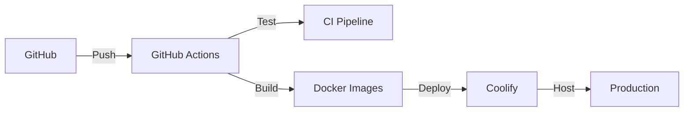

# DevOps & Infrastructure

Containerization, CI/CD, and deployment strategies for the EMG C3D Analyzer.

## Architecture



## Development Environments

### Native Development (Recommended)
```bash
# Fast, lightweight development
./start_dev_simple.sh

# With webhook testing
./start_dev_simple.sh --webhook
```

### Docker Development
```bash
# Full containerized environment
./start_dev.sh

# Rebuild containers
./start_dev.sh --rebuild
```

## Key Components

### 🐳 [Docker](./docker/overview)
- Development and production containers
- Multi-stage builds for optimization
- Docker Compose orchestration
- Environment-specific configurations

### 🚀 [CI/CD Pipeline](./ci-cd/overview)
- GitHub Actions workflows
- Automated testing (223 tests)
- Build and deployment automation
- Quality gates and checks

### 🌊 [Coolify](./coolify/overview)
- Self-hosted PaaS solution
- One-click deployments
- Built-in monitoring
- Automatic SSL certificates

### 🏗️ [Infrastructure](./infrastructure/overview)
- Monitoring and logging
- Security best practices
- Scaling strategies
- Backup and recovery

## Current Setup

### GitHub Actions
- **Test Workflow**: Runs on every push
- **Build Workflow**: Creates Docker images
- **Deploy Workflow**: Deploys to Coolify

### Docker Configuration
- **Frontend**: Node 20 Alpine image
- **Backend**: Python 3.11 slim image
- **Redis**: Official Redis 7.2 image
- **Nginx**: Reverse proxy configuration

### Coolify Deployment
- **Server**: Self-hosted VPS
- **Domain**: Configured with SSL
- **Monitoring**: Built-in health checks
- **Backups**: Automated daily

## Environment Variables

```bash
# Production essentials
SUPABASE_URL=https://your-project.supabase.co
SUPABASE_ANON_KEY=your-anon-key
SUPABASE_SERVICE_KEY=your-service-key
REDIS_URL=redis://redis:6379
```

## Deployment Flow

1. **Development**: Local testing with `start_dev_simple.sh`
2. **Testing**: CI pipeline runs 223 tests
3. **Building**: Docker images created
4. **Staging**: Deploy to Coolify staging
5. **Production**: Promote to production

## Performance Metrics

- **Build Time**: ~3 minutes
- **Test Suite**: ~2 minutes
- **Deployment**: ~1 minute
- **Rollback**: <30 seconds