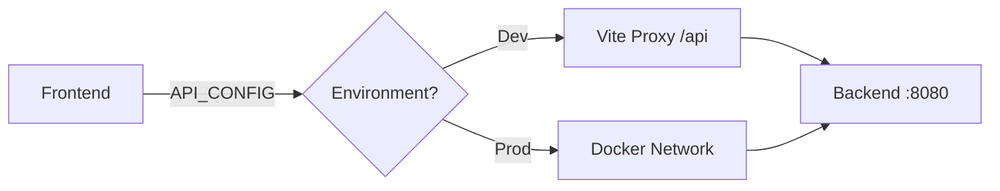

# Frontend API Patterns

The `API_CONFIG` pattern exists because historically the frontend (Vercel) and backend (Render) were deployed separately, requiring different URLs. Now with Coolify and Docker Compose, everything runs together on Debian 13, but we maintain this pattern for consistency and development/production separation.

## Architecture



## The Single Pattern

```typescript
// src/config/apiConfig.ts
export const API_CONFIG = {
  baseUrl: import.meta.env.VITE_API_URL || (
    import.meta.env.DEV ? '/api' : 'http://localhost:8080'
  )
};

// ✅ ALWAYS use this pattern
import { API_CONFIG } from '@/config/apiConfig';
const response = await fetch(`${API_CONFIG.baseUrl}/patients`);
```

## Development

```javascript
// vite.config.ts
proxy: {
  '/api': {
    target: 'http://localhost:8080',
    rewrite: (path) => path.replace(/^\/api/, '')
  }
}
```

## Production (Coolify)

In your Docker Compose environment:

```yaml
# docker-compose.yml
services:
  frontend:
    environment:
      - VITE_API_URL=http://backend:8080
  backend:
    expose:
      - "8080"
```

Or set in Coolify's environment variables:
```bash
VITE_API_URL=https://your-domain.com/api
```

## Example Usage

```typescript
async function fetchData() {
  const response = await fetch(`${API_CONFIG.baseUrl}/sessions`);
  if (!response.ok) throw new Error('Request failed');
  return response.json();
}
```

## Don't Do This

```typescript
// ❌ Never hardcode
fetch('/api/patients');
fetch('http://localhost:8080/patients');

// ❌ Never use conditional URLs
fetch(isDev ? '/api/patients' : 'https://api.com/patients');
```

## Quick Reference

| Environment | baseUrl | Actual Request | Backend Gets |
|------------|---------|----------------|--------------|
| Development | `/api` | `/api/patients` | `/patients` |
| Production (Coolify) | Configured URL | `https://domain/api/patients` | `/patients` |

**One pattern, all environments.**