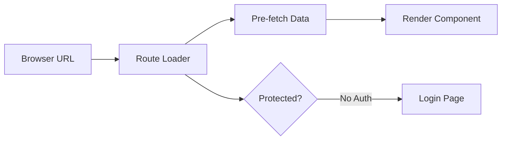

# Navigation & Routing

The navigation system orchestrates all user movement through the application using React Router v7's data loading patterns. Routes pre-fetch data before components render, eliminating loading states and ensuring protected content validates authentication before any UI appears. This architecture delivers sub-200ms page transitions while maintaining security boundaries.

## Route Architecture



## Core Pattern

```typescript
// Route definition with data loader
const router = createBrowserRouter([
  {
    path: '/',
    element: <RootLayout />,
    loader: rootLoader,  // Fetches auth state
    children: [
      {
        path: 'dashboard',
        element: <DashboardLayout />,
        loader: protectedLoader,  // Validates auth before render
        children: [
          { index: true, element: <Dashboard /> },
          { path: 'patients', element: <PatientList /> }
        ]
      },
      {
        path: 'login',
        element: <PublicLayout />,
        loader: publicLoader,  // Redirects if already authenticated
        action: loginAction,   // Handles form submission
      }
    ]
  }
]);
```

## Route Loaders

Loaders run before components render, ensuring data is ready:

```typescript
// Protected route loader
export async function protectedLoader() {
  const authData = await AuthService.getAuthData();
  if (!authData.session) {
    // Preserve intended destination
    const from = window.location.pathname;
    throw redirect(`/login?from=${encodeURIComponent(from)}`);
  }
  return authData;
}

// Public route loader (login page)
export async function publicLoader() {
  const authData = await AuthService.getAuthData();
  if (authData.session) {
    // Already logged in, go to dashboard
    throw redirect('/dashboard');
  }
  return null;
}
```

## Navigation Patterns

### Programmatic Navigation

```typescript
import { useNavigate } from 'react-router-dom';

function MyComponent() {
  const navigate = useNavigate();
  
  // Navigate to route
  navigate('/dashboard');
  
  // Navigate with query params
  navigate('/analysis?file=test.c3d&date=2025-01-30');
  
  // Replace current entry in history
  navigate('/dashboard', { replace: true });
  
  // Go back
  navigate(-1);
}
```

### Link Components

```tsx
import { Link, NavLink } from 'react-router-dom';

// Basic navigation
<Link to="/dashboard">Dashboard</Link>

// Active link styling
<NavLink 
  to="/patients" 
  className={({ isActive }) => isActive ? 'active' : ''}
>
  Patients
</NavLink>

// Link with state
<Link to="/analysis" state={{ from: 'dashboard' }}>
  New Analysis
</Link>
```

## Layout Hierarchy

Three layout levels provide consistent structure:

```typescript
// 1. Root Layout - Always rendered
function RootLayout() {
  const authData = useLoaderData();
  return (
    <AuthContext.Provider value={authData}>
      <Outlet /> {/* Child routes render here */}
    </AuthContext.Provider>
  );
}

// 2. Dashboard Layout - Protected routes
function DashboardLayout() {
  const { user, userRole } = useOutletContext();
  return (
    <>
      <Header user={user} />
      <main>
        <Outlet context={{ user, userRole }} />
      </main>
      <Footer />
    </>
  );
}

// 3. Public Layout - Unauthenticated routes
function PublicLayout() {
  return (
    <>
      <PublicHeader />
      <Outlet />
    </>
  );
}
```

## Form Actions

Handle form submissions with actions:

```tsx
// Login form with action
export async function loginAction({ request }) {
  const formData = await request.formData();
  const email = formData.get('email');
  const password = formData.get('password');
  
  try {
    await AuthService.login(email, password);
    return redirect('/dashboard');
  } catch (error) {
    return { error: error.message };
  }
}

// Component using action
function LoginPage() {
  const actionData = useActionData();
  const navigation = useNavigation();
  
  return (
    <Form method="post">
      {actionData?.error && <Alert>{actionData.error}</Alert>}
      <input name="email" type="email" required />
      <input name="password" type="password" required />
      <Button 
        type="submit" 
        disabled={navigation.state === 'submitting'}
      >
        {navigation.state === 'submitting' ? 'Signing in...' : 'Sign In'}
      </Button>
    </Form>
  );
}
```

## Quick Reference

| Operation | Code | Description |
|-----------|------|-------------|
| Navigate | `navigate('/path')` | Go to route |
| Replace | `navigate('/path', { replace: true })` | Replace current history entry |
| Back | `navigate(-1)` | Go back in history |
| Get params | `useParams()` | Access URL parameters |
| Get search | `useSearchParams()` | Access query string |
| Get location | `useLocation()` | Current location object |
| Get data | `useLoaderData()` | Access loader data |
| Check loading | `useNavigation()` | Navigation state |

## Performance

- **Pre-fetching**: Loaders fetch data before render
- **No loading states**: Users never see spinners for navigation
- **Sub-200ms transitions**: Fast route changes
- **Browser native**: Back/forward buttons work correctly
- **Code splitting**: Routes load on demand with `lazy()`