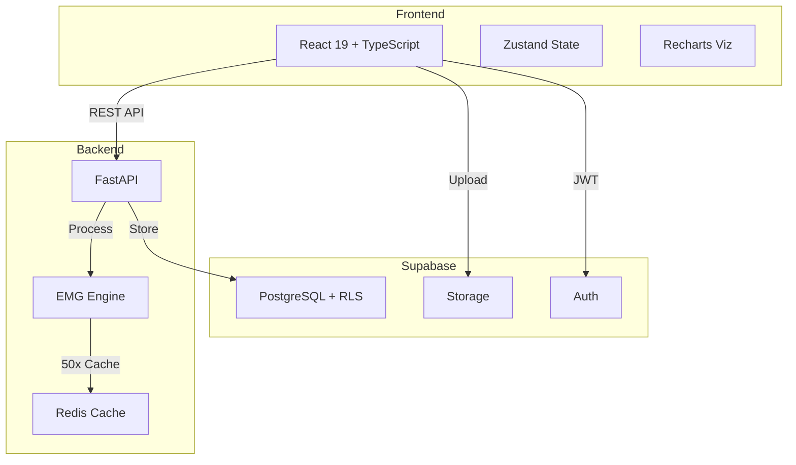

# GHOSTLY+ EMG C3D Analyzer

**Research-focused EMG analysis platform for the GHOSTLY+ rehabilitation gaming project**

<div style={{backgroundColor: '#fff3cd', border: '1px solid #ffc107', borderRadius: '4px', padding: '12px', marginBottom: '20px'}}>
⚠️ <strong>Research Software Notice</strong><br/>
This platform is under active development for rehabilitation research. It processes C3D files from the GHOSTLY serious game platform and is not intended for medical diagnosis or clinical production use.
</div>

## 🎯 Platform Purpose

The EMG C3D Analyzer serves as a **rehabilitation technology demonstrator**, bridging the gap between serious gaming therapy and clinical assessment. It transforms raw motion capture data from the GHOSTLY+ game into actionable therapeutic insights through advanced signal processing and analysis.

### Core Capabilities

#### 📊 **EMG Signal Processing**
- GHOSTLY-specific dual-channel detection (CH1, CH2)
- Drag-and-drop C3D file upload with instant processing
- Real-time signal filtering and envelope detection
- Sampling rate adaptation (1000-2000 Hz support)

#### 🔬 **Clinical Analysis Metrics**  
- **Time Domain**: RMS (Root Mean Square), MAV (Mean Absolute Value)
- **Frequency Domain**: MPF (Mean Power Frequency), MDF (Median Frequency)
- **Fatigue Assessment**: Progressive fatigue indices with temporal windowing
- **Performance Scoring**: GHOSTLY+ compliance metrics with BFR monitoring

#### 💪 **Contraction Detection**
- Automated identification with configurable MVC thresholds (20% default)
- Duration-based validation (500ms minimum)
- Peak amplitude and timing analysis
- Channel-specific contraction counting

#### 📈 **Interactive Visualization**
- Multi-channel synchronized plotting
- Zoom/pan with contraction highlighting
- Real-time parameter adjustment
- Export-ready clinical reports

### Processing Modes
- **Stateless Mode**: Immediate analysis without persistence (upload route)
- **Stateful Mode**: Database-backed with session management (webhook route)

## 🏗️ System Architecture



### 4-Layer Architecture
1. **API Layer**: `upload.py` (194 lines), `webhooks.py` (349 lines)
2. **Orchestration**: `therapy_session_processor.py` (1,669 lines)
3. **Processing**: `processor.py` (1,341 lines) - Single Source of Truth
4. **Persistence**: Repository pattern with Supabase

### Tech Stack
| Component | Technology | Purpose |
|-----------|------------|---------|
| **Frontend** | React 19, TypeScript, Zustand, Tailwind, shadcn/ui | Interactive clinical UI |
| **Backend** | FastAPI, Python 3.11+, NumPy, SciPy, ezc3d | EMG processing engine |
| **Database** | Supabase (PostgreSQL with 18+ RLS policies) | Secure data persistence |
| **Cache** | Redis 7.2 | 50x performance improvement |
| **DevOps** | Docker, GitHub Actions, Coolify | CI/CD and deployment |
| **AI Dev** | Claude Code, Cursor, MCP Servers | Agentic development |

## Quick Start

```bash
# Clone repository
git clone https://github.com/ggustin93/emg-c3d-analyzer.git
cd emg-c3d-analyzer

# Start development (recommended)
./start_dev_simple.sh

# With webhooks
./start_dev_simple.sh --webhook

# Docker alternative
./start_dev.sh
```

### Access Points
- Frontend: http://localhost:3000
- API Docs: http://localhost:8080/docs
- Documentation: http://localhost:3002

## Documentation Sections

### Platform & Infrastructure
- **[Supabase Platform](./supabase/overview)** - Authentication, Storage, Database, RLS
- **[DevOps & CI/CD](./devops/overview)** - Docker, GitHub Actions, Coolify
- **[API Reference](./api/overview)** - REST endpoints and patterns

### Development
- **[Architecture](./architecture/overview)** - 4-layer system design
- **[Agentic Development](./agentic-development/overview)** - Claude Code & Cursor workflows
- **[Testing](./testing/overview)** - 223 tests across frontend/backend

### Domain Specifics
- **[Signal Processing](./signal-processing/overview)** - EMG algorithms and metrics
- **[Frontend](./frontend/react-architecture)** - React components and state
- **[Backend](./backend/api-design)** - FastAPI services and processing
