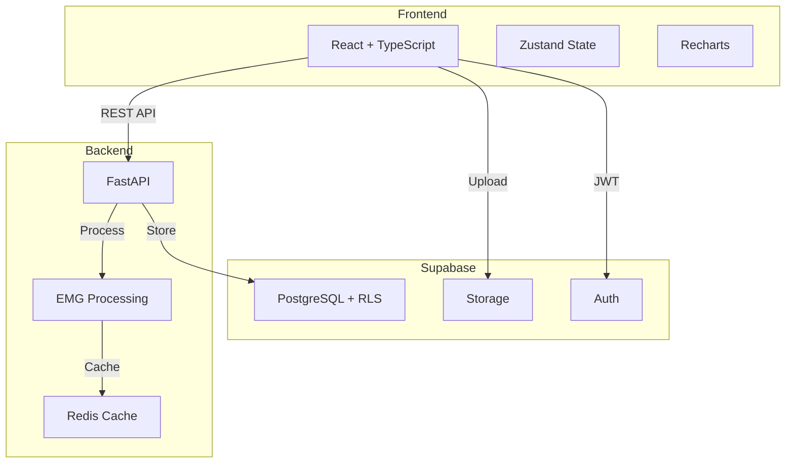

# EMG C3D Analyzer

EMG analysis platform for processing C3D files from the GHOSTLY rehabilitation gaming system.

<div style={{backgroundColor: '#fff3cd', border: '1px solid #ffc107', borderRadius: '4px', padding: '12px', marginBottom: '20px'}}>
⚠️ <strong>Research Software</strong><br/>
This software is for rehabilitation research purposes. Not intended for medical diagnosis or clinical production use.
</div>

## Purpose

Processes motion capture data (C3D format) from the GHOSTLY game to analyze Electromyography (EMG) signals for therapeutic assessment.

## Technical Capabilities

### Signal Processing
- Two-channel EMG detection (CH1, CH2)
- Default sampling rate: 1000 Hz
- Signal filtering and envelope detection
- Smoothing window: 100 samples

### Contraction Detection
- Threshold: 10% of maximum amplitude (configurable)
- Minimum duration: 100ms
- Merge threshold: 200ms for related contractions
- Refractory period: 50ms

### Analysis Metrics
- Time domain: RMS, MAV
- Frequency domain: MPF, MDF
- Fatigue indices
- Performance scoring

### Processing Modes
- **Stateless**: Direct file upload and immediate response
- **Stateful**: Database persistence via webhook integration

## System Architecture



### 4-Layer Architecture
1. **API Layer**: `upload.py` (513 lines), `webhooks.py` (355 lines)
2. **Orchestration**: `therapy_session_processor.py` (1,833 lines)
3. **Processing**: `processor.py` (1,496 lines)
4. **Persistence**: Repository pattern with Supabase

### Technology Stack
| Component | Technology |
|-----------|------------|
| Frontend | React, TypeScript, Zustand, Tailwind CSS, shadcn/ui |
| Backend | FastAPI, Python 3.11+, NumPy, SciPy, ezc3d |
| Database | PostgreSQL (via Supabase) with Row Level Security |
| Cache | Redis 7.2 |
| DevOps | Docker, GitHub Actions |

## Development Setup

```bash
# Clone repository
git clone https://github.com/ggustin93/emg-c3d-analyzer.git
cd emg-c3d-analyzer

# Start development
./start_dev_simple.sh

# With webhook testing
./start_dev_simple.sh --webhook

# Run tests
./start_dev_simple.sh --test
```

### Access Points
- Frontend: http://localhost:3000
- API Documentation: http://localhost:8080/docs
- Docusaurus: http://localhost:3002

## Documentation Structure

### Infrastructure
- [Supabase Platform](./supabase/overview) - Database, authentication, storage
- [DevOps](./devops/overview) - Docker, CI/CD, deployment
- [API Reference](./api/overview) - Endpoint documentation

### Development
- [Architecture](./architecture/overview) - System design
- [Testing](./testing/overview) - Test suite documentation

### Technical Domains
- [Signal Processing](./signal-processing/overview) - EMG algorithms
- [Frontend](./frontend/react-architecture) - React components
- [Backend](./backend/api-design) - FastAPI services
