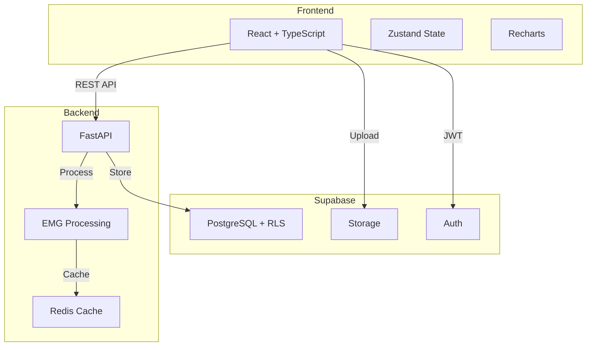

# GHOSTLY+ EMG C3D Analyzer

Full-stack web application designed to analyze Electromyography (EMG) data from C3D motion capture files, demonstrating rehabilitation technology architecture using React, FastAPI, and EMG signal processing algorithms for therapeutic assessment and research.

<div style={{backgroundColor: '#fff3cd', border: '1px solid #ffc107', borderRadius: '4px', padding: '12px', marginBottom: '20px'}}>
⚠️ <strong>Important Notice</strong><br/>
This repository is a research-focused EMG analysis platform, initiated as part of the GHOSTLY+ rehabilitation gaming project. The codebase is under active development and contains incomplete features that have not been clinically validated. It is specifically designed for C3D files generated by the GHOSTLY serious game platform and is not intended for medical diagnosis or production clinical use.
</div>

## Visual Overview

### EMG Signal Analysis Dashboard

*Main analysis interface showing multi-channel EMG signals with real-time contraction detection*

### Performance Analytics

*Comprehensive performance analysis with muscle-specific compliance scoring*

### Clinical Scoring

*Visual analytics for rehabilitation progress tracking with BFR monitoring*

## Key Features

### 📊 EMG Data Processing
- Upload C3D files with drag-and-drop interface
- Extraction of raw and processed EMG signals using GHOSTLY-specific channel detection
- Support for multi-channel EMG analysis

### 📈 Signal Analysis
- Calculate EMG metrics including RMS amplitude, Mean Absolute Value (MAV)
- Spectral parameters (Mean Power Frequency, Median Frequency)
- Fatigue indices with temporal windowing
- Advanced signal filtering and envelope detection

### ⚡ Contraction Detection
- Automated muscle contraction identification
- Configurable MVC thresholds and duration criteria
- Merge threshold for related contractions
- Refractory period management

### 📉 Visualization
- Interactive EMG signal plotting with multi-channel comparison
- Zoom/pan capabilities with contraction highlighting
- Real-time signal type switching (Raw/Activated)
- Clinical color coding for quick assessment

### ⚙️ Configuration
- Configurable muscle naming and color coding
- Session parameter management
- Role-based access controls
- Therapist-specific customization

### 📊 Analytics
- Performance scoring system with completion, intensity, and duration metrics
- Blood Flow Restriction (BFR) monitoring
- Therapeutic compliance tracking
- Export capabilities for research

## Technical Capabilities

### Signal Processing
- Two-channel EMG detection (CH1, CH2)
- Default sampling rate: 1000 Hz
- Signal filtering and envelope detection
- Smoothing window: 100 samples

### Contraction Detection
- Threshold: 10% of maximum amplitude (configurable)
- Minimum duration: 100ms
- Merge threshold: 200ms for related contractions
- Refractory period: 50ms

### Analysis Metrics
- Time domain: RMS, MAV
- Frequency domain: MPF, MDF
- Fatigue indices
- Performance scoring

### Processing Modes
- **Stateless**: Direct file upload and immediate response
- **Stateful**: Database persistence via webhook integration

## System Architecture



### 4-Layer Architecture
1. **API Layer**: `upload.py` (513 lines), `webhooks.py` (355 lines)
2. **Orchestration**: `therapy_session_processor.py` (1,833 lines)
3. **Processing**: `processor.py` (1,496 lines)
4. **Persistence**: Repository pattern with Supabase

### Technology Stack
| Component | Technology |
|-----------|------------|
| Frontend | React, TypeScript, Zustand, Tailwind CSS, shadcn/ui |
| Backend | FastAPI, Python 3.11+, NumPy, SciPy, ezc3d |
| Database | PostgreSQL (via Supabase) with Row Level Security |
| Cache | Redis 7.2 |
| DevOps | Docker, GitHub Actions |

## Development Setup

```bash
# Clone repository
git clone https://github.com/ggustin93/emg-c3d-analyzer.git
cd emg-c3d-analyzer

# Start development
./start_dev_simple.sh

# With webhook testing
./start_dev_simple.sh --webhook

# Run tests
./start_dev_simple.sh --test
```

### Access Points
- Frontend: http://localhost:3000
- API Documentation: http://localhost:8080/docs
- Docusaurus: http://localhost:3002

## Documentation Structure

### Infrastructure
- [Supabase Platform](./supabase/overview) - Database, authentication, storage
- [DevOps](./devops/overview) - Docker, CI/CD, deployment
- [API Reference](./api/overview) - Endpoint documentation

### Development
- [Architecture](./architecture/overview) - System design
- [Testing](./testing/overview) - Test suite documentation

### Technical Domains
- [Signal Processing](./signal-processing/overview) - EMG algorithms
- [Frontend](./frontend/react-architecture) - React components
- [Backend](./backend/api-design) - FastAPI services
