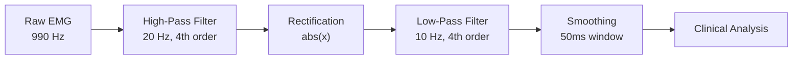

# EMG Signal Processing Documentation

## Introduction

This document describes the signal processing pipeline we've implemented to transform electromyography (EMG) data from the GHOSTLY rehabilitation system into metrics for therapeutic assessment. The approach attempts to balance clinical relevance with computational efficiency, though we acknowledge that many parameters require validation by medical professionals before clinical deployment.

The pipeline processes EMG signals sampled at 990 Hz from C3D files. These files contain both raw EMG data and pre-processed signals from the GHOSTLY system, which we utilize in complementary ways to extract muscle activation patterns and therapeutic metrics.

<strong>Development & Validation Notes</strong>

### How This System Was Built
We developed this EMG signal processing system with assistance from AI tools to help with research and technical implementation:

- **Perplexity MCP**: Helped us research biomedical literature and clinical standards
- **Claude 3.5 Sonnet**: Assisted with code development and documentation

### Important Medical Disclaimer
⚠️ **Please note**: This system requires validation by qualified medical professionals before any clinical use. While we've based our approach on established research, the specific parameters and thresholds need professional review for different patient populations and clinical settings.

### Current Status
This is a research and development tool. We've tried to follow best practices from EMG literature, but we acknowledge that proper clinical validation is essential. The system is open source so medical professionals can review and adapt it as needed.

## Signal Processing Pipeline

The processing chain transforms raw EMG signals through five sequential stages, each addressing specific signal characteristics:

### Stage 1: Signal Quality Validation

Before processing, we validate signal quality to ensure meaningful analysis:

- **Duration Requirements**: 10 seconds minimum (sufficient for pattern analysis), 600 seconds maximum (prevents fatigue artifacts)
- **Sample Requirements**: Minimum 1,000 samples at 1 kHz sampling rate
- **Signal Variation**: Standard deviation > 1×10⁻¹⁰ (ensures active signal)
- **Data Integrity**: No NaN or infinite values permitted

Signals failing validation are flagged with specific clinical guidance rather than processed with potentially misleading results.

### Stage 2: High-Pass Filtering (20 Hz)

The high-pass filter removes low-frequency components that don't represent muscle activation:

- **Purpose**: Eliminates DC offset, baseline drift, and movement artifacts
- **Implementation**: 4th-order Butterworth filter with zero-phase distortion (filtfilt)
- **Clinical Rationale**: EMG power below 20 Hz primarily contains movement artifacts rather than muscle activation signals
- **Effect**: Stabilizes baseline for amplitude measurements

### Stage 3: Full-Wave Rectification

Rectification converts the bipolar EMG signal to unipolar amplitude representation:

- **Method**: Absolute value transformation (|x|)
- **Purpose**: Prepares signal for envelope extraction
- **Clinical Rationale**: Muscle activation intensity relates to signal amplitude regardless of polarity

### Stage 4: Low-Pass Filtering (10 Hz)

The low-pass filter creates a smooth amplitude envelope:

- **Purpose**: Extracts the slowly-varying amplitude envelope from rectified signal
- **Implementation**: 4th-order Butterworth filter with zero-phase distortion
- **Clinical Rationale**: The 10 Hz cutoff preserves contraction dynamics while removing high-frequency components
- **Result**: Smooth envelope suitable for contraction detection

### Stage 5: Moving Average Smoothing

Final smoothing refines the envelope for analysis:

- **Window Size**: 50 milliseconds (adaptive to sampling rate)
- **Method**: Uniform moving average convolution
- **Purpose**: Further reduces residual fluctuations in the envelope
- **Clinical Standard**: 50ms window is established practice in EMG analysis

## Contraction Detection Algorithm

The contraction detection algorithm attempts to address the inherent challenges of EMG signal analysis through a dual-signal approach when the data permits.

### Dual-Signal Strategy

The GHOSTLY system provides multiple signal types in the C3D file, which we leverage for improved detection accuracy:

1. **Dual-Signal Mode** (when C3D file contains both signals):
   - **Timing Signal**: We use the "Activated" signal already pre-processed by the GHOSTLY system
     - This signal comes directly from the C3D file
     - It has been optimized by the device for clean temporal detection
     - We rely on this for determining contraction onset and offset times
   
   - **Amplitude Signal**: We use our computed RMS envelope
     - Derived from the raw EMG signal through our processing pipeline
     - Provides accurate amplitude measurements for MVC compliance assessment
     - Used exclusively for intensity quantification, not timing
   
   - **Rationale**: This separation acknowledges that timing detection and amplitude measurement have different optimal processing requirements

2. **Single-Signal Mode** (fallback when only one signal type is available):
   - Uses the RMS envelope for both timing and amplitude
   - Less optimal but maintains functionality with limited data

### Detection Process

The algorithm follows a systematic approach to identify meaningful muscle contractions:

1. **Signal Preparation**
   - Rectification of timing signal
   - Smoothing with adaptive window (typically 100 samples)
   - Threshold calculation (10% of maximum amplitude)

2. **Contraction Identification**
   - Detection of signal regions above threshold
   - Filtering by minimum duration (100ms default)
   - Merging closely-spaced contractions (200ms gap tolerance)
   - Optional refractory period enforcement

3. **Quality Assessment**
   Each detected contraction is evaluated against therapeutic criteria:
   - **MVC Compliance**: Maximum amplitude ≥ 75% of Maximum Voluntary Contraction
   - **Duration Compliance**: Duration meets session-specific requirements
   - **Good Contractions**: Meet both MVC and duration criteria

<strong>Key Parameters</strong> - Detection thresholds and timing values

| Parameter | Default Value | Rationale |
|-----------|--------------|-----------|
| Threshold Factor | 10% of max | Based on preliminary 2024-2025 research, requires further validation |
| Minimum Duration | 100 ms | Attempts to distinguish contractions from artifacts |
| Merge Threshold | 200 ms | Addresses physiological oscillations that may split single contractions |
| Refractory Period | 0 ms (disabled) | Available for populations requiring recovery time |
| Maximum Duration | Configurable | Safety limit to handle potential detection errors |

## Clinical Metrics Calculation

The system computes multiple categories of metrics, each providing complementary insights into muscle function and therapeutic progress.

### Amplitude-Based Metrics

These metrics quantify muscle activation intensity:

- **Root Mean Square (RMS)**: Square root of the mean of squared signal values. Well-established metric that correlates with force production under isometric conditions.
- **Mean Absolute Value (MAV)**: Average of absolute signal values. Similar to RMS but more stable in presence of artifacts.

<strong>Fatigue Analysis Metrics</strong> - Frequency-domain fatigue detection methods

Muscle fatigue manifests as spectral compression toward lower frequencies. We implement three complementary metrics:

- **Mean Power Frequency (MPF)**: Weighted average frequency of the power spectrum. >10% decrease from baseline indicates fatigue.
- **Median Frequency (MDF)**: Frequency dividing the power spectrum into equal halves. More robust to noise than MPF.
- **Dimitrov's Fatigue Index (FI_nsm5)**: Ratio of spectral moment M₋₁ to M₅. Increasing values indicate progressing fatigue (Dimitrov et al., 2006).

Spectral analysis requires minimum 256 samples (≈260ms at 990 Hz) using Welch's periodogram with 50% overlapping windows.

:::warning Medical Validation Required
These fatigue detection methods require validation by qualified medical professionals for specific patient populations and therapeutic contexts.
:::

<strong>Implementation Architecture</strong> - Technical system structure

The signal processing system consists of two modules:

- **`signal_processing.py`**: Low-level signal operations (filtering, validation, preprocessing)
- **`emg_analysis.py`**: Clinical analysis functions (contraction detection, metrics calculation)

Key design principles: separation of concerns, centralized parameters, reproducibility, and graceful error handling.

<strong>Clinical Validation Requirements</strong> - Parameters requiring medical professional validation

The following parameters require validation by qualified medical professionals before clinical deployment:

- **Contraction Detection**: 10% amplitude threshold, 100ms minimum duration, 200ms merge threshold
- **Fatigue Detection**: 10% MPF/MDF decrease threshold, temporal window sizing
- **MVC Compliance**: 75% MVC threshold for therapeutic compliance, duration requirements

These parameters may need adjustment for specific patient populations and muscle groups.

<strong>Technical Implementation</strong> - System architecture and processing flow

The pipeline processes EMG data from C3D files (990 Hz sampling rate) through the five-stage pipeline, performs contraction detection and metric calculation, then stores results in Supabase. The system includes signal quality validation, handles edge cases gracefully, and provides fallback modes for degraded signal conditions.

## Summary

This signal processing pipeline represents our current approach to transforming EMG data from the GHOSTLY system into metrics for therapeutic use. We use the pre-processed "Activated" signal from the C3D files for temporal detection while computing our own RMS envelope for amplitude assessment. This dual-signal strategy attempts to balance timing precision and intensity measurement.

While we've based our parameters on available clinical literature, we recognize that proper validation by medical professionals is essential before clinical deployment. The modular architecture should facilitate such validation and allow for parameter adjustments based on clinical experience with specific patient populations.

---

*Note: This system requires validation by qualified medical professionals before clinical use. All threshold parameters should be verified for specific patient populations and therapeutic applications.*