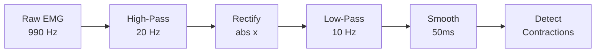

# EMG Signal Processing

**Purpose**: Transform raw EMG data from C3D files into clinical metrics.

**Source**: [`backend/emg/signal_processing.py`](https://github.com/user/emg-c3d-analyzer/blob/main/backend/emg/signal_processing.py) | [`backend/emg/emg_analysis.py`](https://github.com/user/emg-c3d-analyzer/blob/main/backend/emg/emg_analysis.py)

## Processing Pipeline

*Source: `signal_processing.py:45-62`*

## Key Parameters

| Parameter | Value | Source Location |
|-----------|-------|-----------------|
| **High-Pass Filter** | 20 Hz | `signal_processing.py:48` |
| **Low-Pass Filter** | 10 Hz | `signal_processing.py:56` |
| **Filter Order** | 4 | `signal_processing.py:57` |
| **Smoothing Window** | 50 ms | `signal_processing.py:61` |
| **Detection Threshold** | 10% | `emg_analysis.py:24` |
| **Min Contraction** | 100 ms | `emg_analysis.py:27` |
| **Merge Gap** | 200 ms | `emg_analysis.py:29` |

## Dual-Signal Approach

*Implementation: `emg_analysis.py:129-131`*

- **Timing Signal**: Uses "Activated" or preprocessed signal for onset/offset detection
- **Amplitude Signal**: Uses RMS envelope for intensity measurement
- **Rationale**: Separates temporal precision from amplitude accuracy

## Output Metrics

### Contraction Analysis
- Count, duration (ms), amplitude (RMS)
- Work (area under curve), fatigue indicators

### Quality Validation
- Signal range validation (`signal_processing.py:118`)
- Minimum sample requirements (`signal_processing.py:65`)
- Clinical duration limits (10s-10min) (`signal_processing.py:72-73`)

## Clinical Thresholds

**Signal Quality** (`signal_processing.py:76-127`):
- Minimum variation: 1e-10
- Duration: 10-600 seconds
- Sample requirement: 1000 samples minimum

**Detection Criteria** (`emg_analysis.py:78-85`):
- Threshold: 10% of signal range (adaptive)
- Duration: 100ms minimum contraction
- Gap merging: 200ms physiological tolerance
- Refractory: 50ms between contractions

## File References

**Core Implementation**:
- [`signal_processing.py`](backend/emg/signal_processing.py) - Filtering and preprocessing
- [`emg_analysis.py`](backend/emg/emg_analysis.py) - Contraction detection
- [`processor.py`](backend/services/c3d/processor.py) - Main processing orchestration

**Next**: [Filtering Details](./butterworth-filtering) | [Detection Algorithm](./contraction-detection)