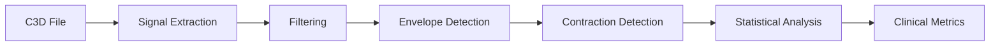

# Signal Processing Overview

The EMG C3D Analyzer implements comprehensive signal processing algorithms for EMG data analysis.

## Processing Pipeline



## Core Algorithms

### 1. Butterworth Filtering

- **Band-pass**: 20-500Hz
- **Order**: 4th order filter
- **Purpose**: Remove noise and artifacts
- **Implementation**: SciPy signal processing

```python
def apply_butterworth_filter(signal, fs=990):
    nyquist = fs / 2
    low = 20 / nyquist
    high = 500 / nyquist
    b, a = butter(4, [low, high], btype='band')
    return filtfilt(b, a, signal)
```

### 2. Envelope Detection

- **Method**: Rectification + Low-pass filter
- **Window**: Adaptive based on signal
- **Output**: Signal envelope for analysis

### 3. Contraction Detection

#### MVC Threshold Logic
- **Threshold**: 20% MVC (default)
- **Duration**: Minimum 500ms
- **Channels**: Bilateral (CH1/CH2)

#### Detection Algorithm
1. Calculate baseline noise
2. Apply MVC threshold
3. Identify contraction periods
4. Validate duration criteria

## Statistical Metrics

### Time Domain
- **RMS** (Root Mean Square)
- **MAV** (Mean Absolute Value)
- **Peak amplitude**
- **Duration metrics**

### Frequency Domain
- **MPF** (Mean Power Frequency)
- **MDF** (Median Frequency)
- **Power spectrum analysis**

### Fatigue Analysis
- **Fatigue index** calculation
- **Temporal windowing**
- **Trend analysis**

## Implementation Details

### Key Files
- `processor.py` - Core processing engine
- `signal_processing.py` - Algorithm implementations
- `contraction_detector.py` - Detection logic

### Performance
- **Sampling Rate**: 990Hz
- **Processing Time**: Less than 2s for 175s data
- **Memory**: Optimized for large datasets

## Clinical Applications

### Rehabilitation Assessment
- Motor control evaluation
- Fatigue monitoring
- Progress tracking
- Performance scoring

### Quality Metrics
- Signal-to-noise ratio
- Contraction consistency
- Bilateral symmetry
- Temporal patterns

## Next Steps

- [Butterworth Filtering Details](./butterworth-filtering)
- [Envelope Detection](./envelope-detection)
- [Contraction Detection](./contraction-detection)
- [Statistical Analysis](./statistical-analysis)