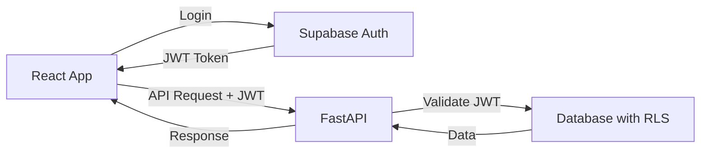

# Authentication

Simple JWT-based authentication using Supabase Auth.

## How It Works



## Frontend: useAuth Hook

```typescript
// frontend/src/hooks/useAuth.ts
const { user, loading, signIn, signOut } = useAuth()
```

## Backend: JWT Validation Only

```python
# backend/api/dependencies/auth.py (84 lines)
async def get_current_user(authorization: str = Header(None)) -> Optional[str]:
    # Validates JWT, returns user_id
    # Database RLS handles actual authorization
```

## Key Points

- Frontend uses Supabase Auth directly
- Backend only validates JWT tokens
- Database RLS policies enforce all authorization
- No authorization logic in backend code

## Current Implementation

- ✅ Login/logout functionality
- ✅ JWT validation in FastAPI
- ✅ RLS policies for data protection
- ✅ Therapist-patient relationships in database