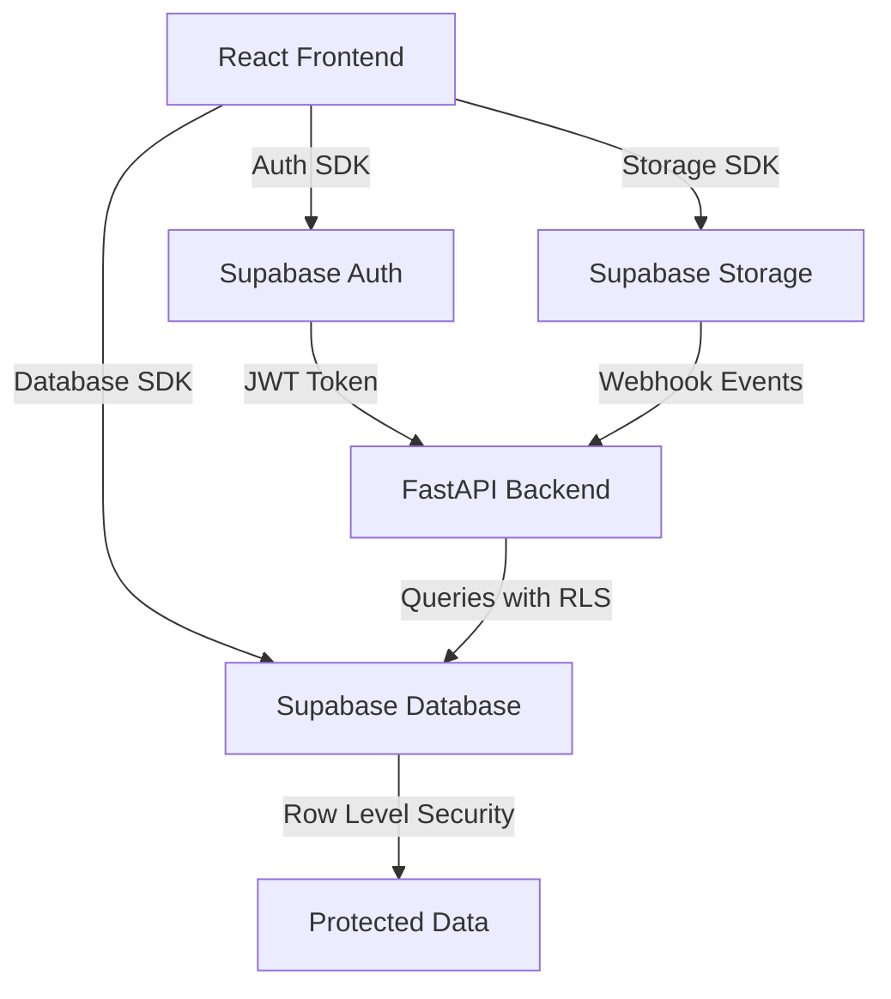

# Supabase Platform Integration

The EMG C3D Analyzer leverages Supabase as its complete backend platform, providing authentication, storage, database, and real-time capabilities.

## Platform Architecture



## Core Components

### 🔐 Authentication
- **JWT-based authentication** with secure token management
- **Role-based access control** (therapist, admin, patient)
- **Session management** with automatic refresh
- **Social auth providers** support

[Learn more about Authentication →](./auth/overview)

### 📦 Storage
- **Direct file uploads** from frontend to Supabase Storage
- **Webhook integration** for automated processing
- **HMAC signature verification** for security
- **Bucket policies** for access control

[Learn more about Storage →](./storage/overview)

### 🗄️ Database
- **PostgreSQL** with advanced features
- **Repository pattern** for clean data access
- **Migration management** with version control
- **Optimized queries** with indexes

[Learn more about Database →](./database/overview)

### 🛡️ Row Level Security (RLS)
- **18+ security policies** protecting data
- **Therapist-patient relationships** enforced at database level
- **Zero-trust architecture** - never trust the client
- **Performance optimized** policies

[Learn more about RLS →](./rls/overview)

## Integration Points

### Frontend Integration
```typescript
// Direct Supabase client usage
import { supabase } from '@/lib/supabase'

// Authentication
const { data: session } = await supabase.auth.getSession()

// Storage upload
const { data, error } = await supabase.storage
  .from('c3d-examples')
  .upload(path, file)

// Database query (with RLS)
const { data: sessions } = await supabase
  .from('therapy_sessions')
  .select('*')
  .order('created_at', { ascending: false })
```

### Backend Integration
```python
# JWT validation only
from api.dependencies.auth import get_current_user

@app.post("/api/protected")
async def protected_route(user_id: str = Depends(get_current_user)):
    # Backend validates JWT
    # Database enforces access via RLS
    return {"user_id": user_id}
```

## Architecture Decisions

### When to Use Direct Supabase vs FastAPI

**Use Direct Supabase for:**
- Simple CRUD operations
- Authentication flows
- Real-time subscriptions
- File uploads to Storage
- User profile management

**Use FastAPI for:**
- Complex EMG processing algorithms
- Heavy computational tasks
- External API integrations
- Webhook processing
- Binary file manipulation
- Multi-step workflows

> **Principle**: Follow KISS - use the simplest tool that solves the problem effectively

## Security Model

1. **Frontend** - Handles UI and user interactions
2. **Supabase Auth** - Manages authentication and issues JWTs
3. **FastAPI** - Validates JWTs but doesn't enforce authorization
4. **RLS Policies** - Enforce all authorization at the database level
5. **Result** - Defense in depth with multiple security layers

## Performance Considerations

- **Connection pooling** for optimal database performance
- **Prepared statements** to prevent SQL injection
- **Indexed queries** for fast data retrieval
- **Caching strategies** with Redis for computed results
- **Optimistic UI updates** for responsive user experience

## Next Steps

- [Set up Authentication](./auth/overview) - Configure user authentication
- [Configure Storage](./storage/overview) - Set up file uploads
- [Design Database Schema](./database/overview) - Plan your data model
- [Implement RLS Policies](./rls/overview) - Secure your data