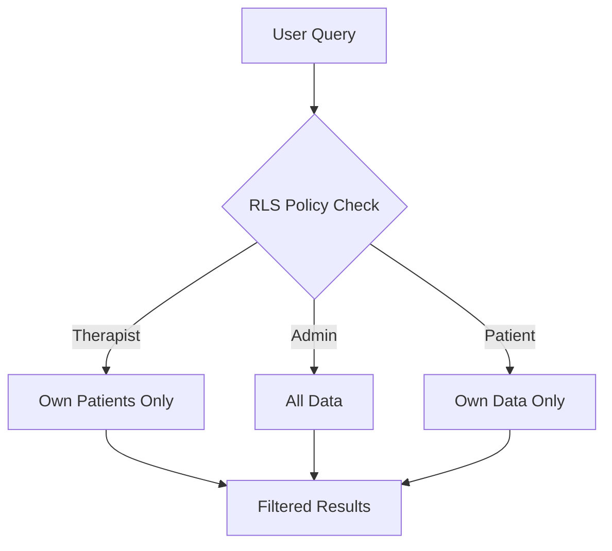

# Row Level Security (RLS)

Database-level authorization that ensures users only see their own data.

## How RLS Works



## Key RLS Pattern

```sql
-- Therapists see their own sessions
CREATE POLICY "therapist_sessions" ON therapy_sessions
FOR ALL USING (
    auth.uid() = therapist_id
);

-- Patients see their own data
CREATE POLICY "patient_own_data" ON therapy_sessions
FOR SELECT USING (
    auth.uid() IN (
        SELECT user_id FROM patients 
        WHERE id = therapy_sessions.patient_id
    )
);
```

## Current Policies (18+)

### therapy_sessions
- Therapists: Full access to own sessions
- Patients: Read-only to own sessions
- Admins: Full access to all

### emg_statistics
- Inherit access from parent session
- No direct access without session context

### patients
- Therapists: Manage assigned patients
- Patients: View own profile only

## Testing RLS

```bash
# Test script available
./backend/run_rls_test_production.sh

# Verifies policies work correctly
# Tests different user roles
# Ensures no data leaks
```

## Important Notes

- RLS is the **single source of truth** for authorization
- Backend doesn't implement authorization logic
- All queries automatically filtered by RLS
- Performance optimized with proper indexes