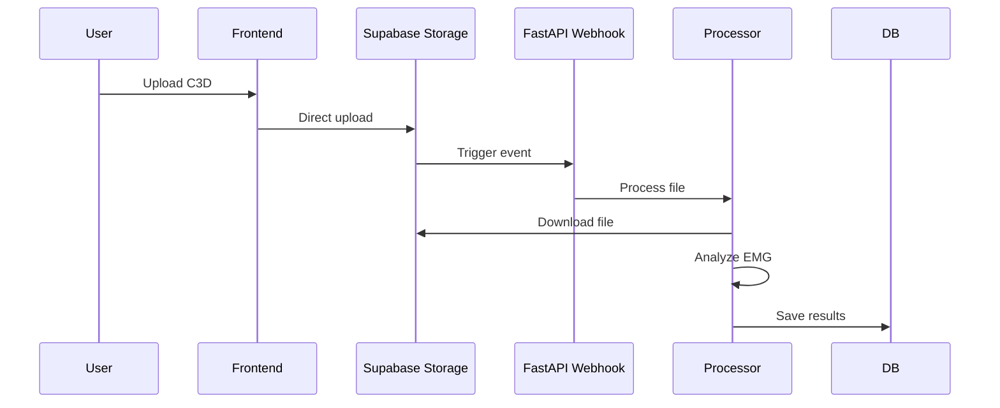

# Storage

C3D file storage with webhook-triggered processing.

## Upload Flow



## Configuration

### Storage Bucket
- Bucket name: `c3d-examples`
- File types: `.c3d` files only
- Max file size: 50MB

### Webhook Setup
```bash
# Development with ngrok
./start_dev_simple.sh --webhook

# Configure in Supabase Dashboard:
# URL: https://YOUR_NGROK_URL/webhooks/storage/c3d-upload
# Events: INSERT on c3d-examples bucket
```

## Backend Processing

```python
# backend/api/routes/webhooks.py (349 lines)
@router.post("/webhooks/storage/c3d-upload")
async def handle_c3d_upload(
    request: Request,
    background_tasks: BackgroundTasks
):
    # Verify HMAC signature
    # Extract file metadata
    # Process in background
    background_tasks.add_task(process_c3d_file, file_path)
```

## Security

- HMAC-SHA256 signature verification
- Webhook secrets in environment variables
- Temporary file cleanup after processing