# GHOSTLY+ EMG C3D Analyzer - Testing

## Overview

The testing infrastructure ensures reliability and accuracy of EMG signal processing through comprehensive validation across all system layers. The system validates everything from core signal processing algorithms to complete patient workflows using actual C3D files from GHOSTLY therapy sessions.

Built on pytest for Python and Vitest for React, the test suite provides rapid feedback during development while maintaining strict quality gates for production deployments. The architecture follows a pyramid approach with extensive unit tests, targeted integration tests, and comprehensive end-to-end validation using real clinical data.

## Test Architecture

### Testing Flow

```mermaid
graph TD
    subgraph "Test Execution Pipeline"
        Dev[Developer Changes] --> Local[Local Tests]
        Local --> |Pass| Commit[Git Commit]
        Commit --> CI[CI Pipeline]
    end
    
    subgraph "Test Categories"
        CI --> Unit[Unit Tests<br/>Core Algorithms]
        CI --> Integration[Integration Tests<br/>Service Layer]
        CI --> API[API Tests<br/>Endpoints]
        CI --> E2E[E2E Tests<br/>Real C3D Files]
    end
    
    subgraph "Quality Gates"
        Unit --> Coverage{Coverage ≥62%}
        Integration --> Validation{All Pass}
        API --> Contract{API Contract}
        E2E --> Clinical{Clinical Accuracy}
        
        Coverage --> Deploy[Deployment Ready]
        Validation --> Deploy
        Contract --> Deploy
        Clinical --> Deploy
    end
    
    style Dev fill:#e1f5fe
    style Local fill:#fce4ec
    style CI fill:#f3e5f5
    style Unit fill:#e8f5e9
    style Integration fill:#e3f2fd
    style API fill:#fff3e0
    style E2E fill:#ffebee
    style Deploy fill:#c8e6c9
```



### Test Structure

The testing suite includes comprehensive coverage across both backend and frontend:

- **Backend**: 45 test files with pytest covering EMG processing, API endpoints, and E2E workflows
- **Frontend**: 27 test files with Vitest covering React components, hooks, and user interactions
- **Test Strategy**: Focus on behavior testing with real C3D data validation

## Backend Testing (Python/pytest)

### Test Structure

```
backend/tests/
├── api/                    # API endpoint tests
│   ├── test_upload.py     # C3D upload endpoints
│   ├── test_auth.py       # Authentication flows
│   └── test_webhooks.py   # Supabase webhooks
├── unit/                   # Unit tests by domain
│   ├── emg/               # Signal processing (7 files)
│   ├── clinical/          # Clinical metrics (3 files)
│   └── c3d/               # C3D parsing (1 file)
├── integration/           # Service integration
├── e2e/                   # End-to-end workflows
└── fixtures/              # Test data
    ├── sample.c3d         # Standard test file (1.23MB)
    └── complex.c3d        # Multi-channel EMG
```

### Running Backend Tests

```bash
# Quick test execution
./run_tests_with_env.sh              # All tests with environment
./run_tests_with_env.sh e2e          # E2E tests only
./run_tests_with_env.sh quick        # Skip E2E tests

# Manual execution
cd backend
source venv/bin/activate
python -m pytest tests/ -v           # All 48 tests
python -m pytest tests/ --cov=.      # With coverage report
python -m pytest -m e2e -v -s        # E2E with output
```

### Critical Testing Rule

**🚨 NEVER Use AsyncMock for Supabase Services**

The Supabase Python client is **synchronous**. Using AsyncMock causes `TypeError: 'coroutine' object is not iterable`.

```python
# ✅ CORRECT - Always use MagicMock
from unittest.mock import MagicMock
mock_service = MagicMock()
mock_service.table().select().execute.return_value.data = [...]

# ❌ WRONG - Never use AsyncMock
from unittest.mock import AsyncMock  # Don't import for Supabase
mock_service = AsyncMock()  # This will break!
```

## Frontend Testing (React/Vitest)

### Test Structure

```
frontend/src/
├── components/__tests__/   # Component tests
│   ├── C3DBrowser.test.tsx
│   ├── PatientList.test.tsx
│   └── SessionView.test.tsx
├── hooks/__tests__/        # Custom hooks (8 files)
│   ├── useAuth.test.ts
│   ├── usePatients.test.ts
│   └── useEMGAnalysis.test.ts
├── lib/__tests__/          # Utilities
└── tests/                  # Integration tests
    └── workflows.test.tsx  # User workflows
```

### Running Frontend Tests

```bash
cd frontend

# Test execution modes
npm test                    # Watch mode for development
npm test -- --run          # Run once (78 tests)
npm test -- --coverage     # Coverage report
npm test hooks             # Test specific pattern

# Build validation
npm run build              # TypeScript compilation check
npm run type-check         # Type validation only
```

### React Testing Patterns

```typescript
// Component testing with providers
import { render, screen } from '@testing-library/react'
import { UserProvider } from '@/contexts/UserContext'

test('renders patient list', () => {
  render(
    <UserProvider>
      <PatientList />
    </UserProvider>
  )
  expect(screen.getByRole('list')).toBeInTheDocument()
})

// Hook testing
import { renderHook } from '@testing-library/react'
import { useEMGAnalysis } from '@/hooks/useEMGAnalysis'

test('processes EMG data', async () => {
  const { result } = renderHook(() => useEMGAnalysis())
  await act(() => result.current.analyze(testData))
  expect(result.current.metrics).toBeDefined()
})
```

## E2E Testing with Real Data

### Test Data Management

The system uses **real C3D files** from GHOSTLY therapy sessions for validation:

- **Sample Files**: Actual patient recordings (anonymized)
- **Known Baselines**: Expected metrics for validation
- **Edge Cases**: Files with noise, dropouts, multiple channels

### E2E Test Example

```python
def test_complete_therapy_workflow():
    """Test entire workflow from upload to export"""
    # 1. Upload real C3D file
    with open("tests/fixtures/sample.c3d", "rb") as f:
        response = client.post("/upload", files={"file": f})
    
    # 2. Verify processing
    assert response.status_code == 200
    session_id = response.json()["session_id"]
    
    # 3. Check EMG analysis
    emg_data = response.json()["emg_analysis"]
    assert len(emg_data["contractions"]) == 5
    assert emg_data["fatigue_index"] < 0.3
    
    # 4. Validate clinical metrics
    metrics = response.json()["performance_scores"]
    assert metrics["compliance"] > 0.75
    assert metrics["symmetry"] > 0.80
```

## Quality Gates

### 8-Step Validation Cycle

1. **Syntax** → Language parsers validate code structure
2. **Types** → TypeScript/Python type checking
3. **Lint** → ESLint/Ruff code quality rules
4. **Security** → Input validation, SQL injection prevention
5. **Unit Tests** → Algorithm correctness (≥80% coverage)
6. **Integration** → Service interactions (≥70% coverage)
7. **E2E** → Complete workflows with real data
8. **Performance** → Response times &lt;200ms for API calls

### Quality Standards

The project maintains quality through:
- Comprehensive unit testing for core algorithms
- Integration testing for service interactions
- E2E testing with real C3D files
- Regular test maintenance and updates

## Coverage Analysis

### Current Coverage Status

The project maintains code coverage tracking to identify areas needing additional testing:

#### Backend Coverage (pytest-cov)
- **Overall Coverage**: 24% (as of last measurement)
- **Core Modules**: EMG processing algorithms have targeted unit test coverage
- **Coverage Tool**: pytest-cov with HTML reporting

```bash
# Generate coverage report
cd backend
python -m pytest tests/ --cov=. --cov-report=html --cov-report=term

# View HTML report
open htmlcov/index.html  # macOS
xdg-open htmlcov/index.html  # Linux
```

#### Frontend Coverage (Vitest)
- **Testing Tool**: @vitest/coverage-v8 
- **Test Files**: 27 test files covering components, hooks, and utilities
- **Coverage Generation**:

```bash
cd frontend
npm test -- --run --coverage

# Coverage configuration in vite.config.ts
coverage: {
  provider: 'v8',
  reporter: ['text', 'json', 'html'],
  exclude: [
    'node_modules/',
    'dist/',
    '**/*.config.*'
  ]
}
```

### Coverage Improvement Strategies

1. **Prioritize Critical Paths**
   - Focus on EMG signal processing algorithms
   - Cover patient data handling workflows
   - Test error handling and edge cases

2. **Incremental Improvement**
   - Add tests when fixing bugs
   - Include tests with new features
   - Regular test review sessions

3. **Coverage Goals**
   - Unit tests: Target 80% for critical modules
   - Integration tests: Cover all API endpoints
   - E2E tests: Validate primary user workflows

## Complete Test Suite

### Quick Reference

```bash
# Run everything
./start_dev_simple.sh --test

# Backend only
cd backend && python -m pytest tests/ -v

# Frontend only  
cd frontend && npm test -- --run

# E2E with real data
python -m pytest tests/e2e/ -v -s

# With coverage analysis
cd backend && python -m pytest --cov=. --cov-report=html
cd frontend && npm test -- --run --coverage
```


## Testing Best Practices

### ✅ Do's

- Use real C3D files for E2E validation
- Test user workflows end-to-end
- Mock only external dependencies
- Focus on behavior, not implementation
- Clean up test data after each test
- Use fixtures for shared test setup

### ❌ Don'ts

- Never use AsyncMock with Supabase client
- Don't skip E2E tests for "faster" builds
- Avoid testing implementation details
- Don't hardcode test credentials
- Never leave test data in production

## CI/CD Integration

### GitHub Actions Workflow

```yaml
name: Test Suite
on: [push, pull_request]

jobs:
  test:
    runs-on: ubuntu-latest
    steps:
      - uses: actions/checkout@v3
      
      - name: Backend Tests
        run: |
          cd backend
          pip install -r requirements.txt
          pytest tests/ -v --cov=backend
          
      - name: Frontend Tests
        run: |
          cd frontend
          npm ci
          npm test -- --run --coverage
          
      - name: E2E Tests
        run: |
          ./scripts/tests/run-e2e.sh
```

## Troubleshooting

### Common Issues

**"coroutine object is not iterable"**
- Using AsyncMock with sync Supabase client
- Solution: Use MagicMock instead

**"Module not found" errors**
- Missing PYTHONPATH configuration
- Solution: Run tests with `./run_tests_with_env.sh`

**React act() warnings**
- Async state updates not wrapped
- Solution: Use `waitFor` or `act` wrapper

**E2E test failures**
- Supabase service not running
- Solution: Ensure `.env` is configured correctly

## Resources

- **pytest Documentation**: [docs.pytest.org](https://docs.pytest.org/)
- **Vitest Documentation**: [vitest.dev](https://vitest.dev/)
- **Testing Library**: [testing-library.com](https://testing-library.com/)
- **Test Files**: `backend/tests/` and `frontend/src/__tests__/`

The testing infrastructure prioritizes accuracy and reliability for clinical data processing. When in doubt, add more tests rather than fewer, especially for EMG signal processing and patient safety features.