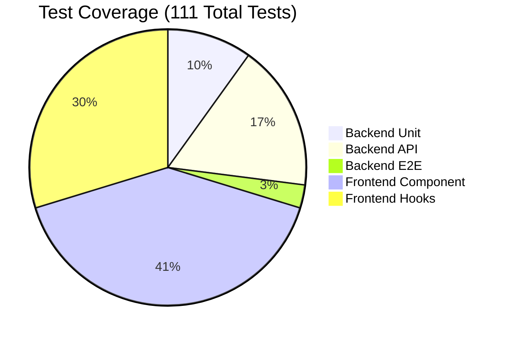

# Testing Strategy

Comprehensive test suite with 111 tests ensuring system reliability and quality across backend EMG processing and frontend user interface.

## Test Distribution



### Test Statistics
- **Total Tests**: 111 (33 backend + 78 frontend)
- **Backend Coverage**: 62% (EMG processing focus)
- **Frontend Pass Rate**: 100% (78/78 tests passing)
- **E2E Tests**: 3 comprehensive workflow tests with real C3D files

## Running Tests

### All Tests
```bash
# Complete test suite - runs all 111 tests with environment validation
./start_dev_simple.sh --test

# Backend only (33 tests total)
cd backend
source venv/bin/activate  # Required for backend testing
python -m pytest tests/ -v

# Frontend only (78 tests total, 100% passing)
cd frontend
npm test -- --run        # Run once with results summary
npm test                 # Run in watch mode for development
```

### Backend Tests
```bash
# Unit tests (11 tests)
pytest tests/test_emg_analysis.py -v

# API tests (19 tests)
pytest tests/test_api_endpoints.py -v

# E2E with real C3D (3 tests)
pytest tests/test_e2e_complete_workflow.py -v -s

# Coverage report (62% EMG processing coverage)
pytest tests/ --cov=backend --cov-report=html

# Run specific test categories
pytest tests/ -k "test_emg" -v     # EMG analysis tests
pytest tests/ -k "test_api" -v     # API endpoint tests
pytest tests/ -k "test_e2e" -v     # End-to-end tests
```

### Frontend Tests
```bash
# Component tests
npm test components

# Hook tests
npm test hooks

# Coverage
npm test -- --coverage
```

## Test Organization

### Backend Structure
```
backend/tests/
├── test_emg_analysis.py     # Algorithm tests
├── test_api_endpoints.py    # API endpoint tests
├── test_integration.py      # Service integration
├── test_e2e_*.py           # End-to-end tests
└── samples/                # Real C3D test files
```

### Frontend Structure
```
frontend/src/
├── components/__tests__/    # Component tests
├── hooks/__tests__/        # Hook tests
└── tests/                  # Integration tests
```

## Key Test Files

### Real C3D Test Data
- File: `Ghostly_Emg_20230321_17-50-17-0881.c3d`
- Size: 2.74MB
- Duration: 175.1 seconds
- Expected: 20 CH1, 9 CH2 contractions

### Critical Test Lessons

#### Supabase Client Mocking
```python
# ✅ CORRECT - Supabase Python client is synchronous
from unittest.mock import MagicMock
mock_service = MagicMock()
mock_service.from_.return_value.select.return_value.execute.return_value.data = [...]

# ❌ WRONG - AsyncMock causes coroutine errors
from unittest.mock import AsyncMock
mock_service = AsyncMock()  # TypeError: 'coroutine' object is not iterable
```

**Key Principle**: The Supabase Python client (`supabase-py`) is **synchronous**, not async. Always use `MagicMock` for testing, never `AsyncMock`.

#### Common Test Patterns
```python
# Mocking Supabase client
@patch('services.clinical.therapy_session_service.get_supabase_client')
def test_service_method(mock_get_client):
    mock_client = MagicMock()
    mock_get_client.return_value = mock_client
    
    # Setup query chain
    mock_client.table.return_value.select.return_value.execute.return_value.data = [
        {"id": "123", "status": "completed"}
    ]
    
    # Test the service
    result = service.process_session("123")
    assert result.status == "completed"
```

## Coverage Targets

- Backend: 62% (current)
- Frontend: Comprehensive
- E2E: All critical paths
- Integration: Service boundaries

## CI/CD Integration

Tests run automatically on:
- Every push
- Pull requests