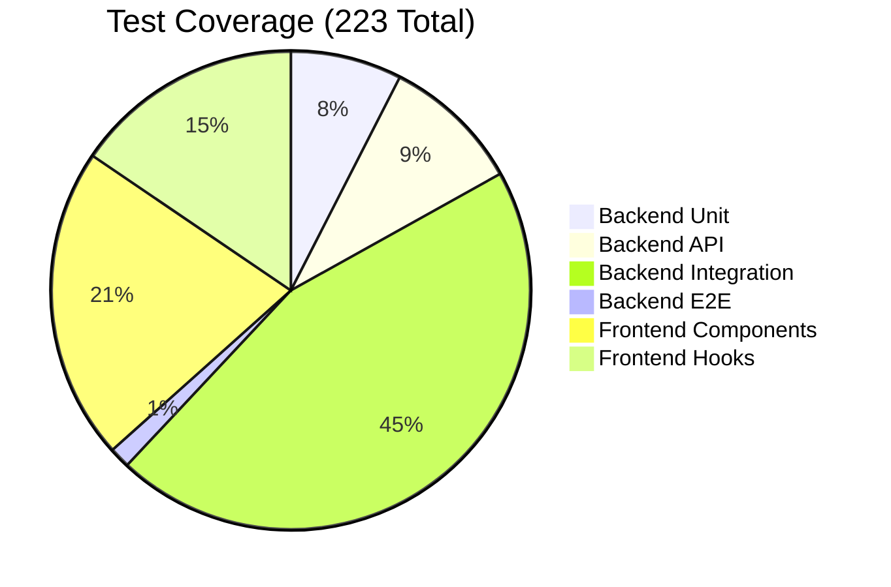

# Testing Strategy

Comprehensive test suite with 223 tests ensuring system reliability.

## Test Distribution



## Running Tests

### All Tests
```bash
# Complete test suite
./start_dev_simple.sh --test

# Backend only (135 tests)
cd backend && python -m pytest tests/ -v

# Frontend only (78 tests)
cd frontend && npm test -- --run
```

### Backend Tests
```bash
# Unit tests
pytest tests/test_emg_analysis.py

# API tests
pytest tests/test_api_endpoints.py

# E2E with real C3D
pytest tests/test_e2e_complete_workflow.py

# Coverage report
pytest tests/ --cov=backend
```

### Frontend Tests
```bash
# Component tests
npm test components

# Hook tests
npm test hooks

# Coverage
npm test -- --coverage
```

## Test Organization

### Backend Structure
```
backend/tests/
├── test_emg_analysis.py     # Algorithm tests
├── test_api_endpoints.py    # API endpoint tests
├── test_integration.py      # Service integration
├── test_e2e_*.py           # End-to-end tests
└── samples/                # Real C3D test files
```

### Frontend Structure
```
frontend/src/
├── components/__tests__/    # Component tests
├── hooks/__tests__/        # Hook tests
└── tests/                  # Integration tests
```

## Key Test Files

### Real C3D Test Data
- File: `Ghostly_Emg_20230321_17-50-17-0881.c3d`
- Size: 2.74MB
- Duration: 175.1 seconds
- Expected: 20 CH1, 9 CH2 contractions

### Critical Test Lessons

```python
# ✅ CORRECT - Supabase is synchronous
mock_service = MagicMock()

# ❌ WRONG - Causes coroutine errors
mock_service = AsyncMock()
```

## Coverage Targets

- Backend: 62% (current)
- Frontend: Comprehensive
- E2E: All critical paths
- Integration: Service boundaries

## CI/CD Integration

Tests run automatically on:
- Every push
- Pull requests