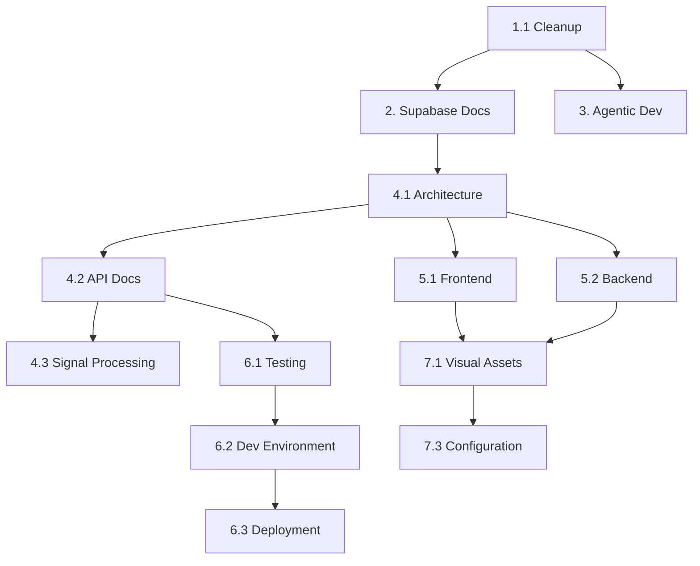

# EMG C3D Analyzer - Documentation Update Tasks

## Project Overview
Complete overhaul of Docusaurus documentation to accurately reflect the sophisticated EMG C3D Analyzer platform, including Supabase integration and modern development workflows.

## Current State Assessment
- **Documentation**: Basic Docusaurus setup with outdated placeholders (2019-2021 blog posts)
- **Architecture**: 4-layer system (API → Orchestration → Processing → Persistence)
- **Tech Stack**: React 19, FastAPI, Python 3.11+, Supabase, Redis
- **Testing**: 135 tests (11 backend unit + 19 API + 3 E2E + 78 frontend)
- **Development**: Agentic workflows with Claude Code and Cursor

## Current Progress (Pragmatic Approach - YAGNI/KISS/DRY)
- ✅ **Clinical Documentation**: metrics-definitions.md completed (comprehensive EMG algorithms)
- ✅ **Backend Overview**: DDD architecture and API design patterns completed
- 🔄 **7 Balanced Sections**: Focused 3-7 files per section approach
- 🎯 **Essential Documentation**: Document what exists, build what's needed (no over-engineering)

## Documentation Approaches

### Pragmatic Approach (RECOMMENDED - YAGNI/KISS/DRY)

**Timeline**: 2 weeks | **Effort**: 25-30 hours | **Team**: 1-2 people

#### 7 Focused Sections (Essential Only)
```
docusaurus/docs/
├── clinical/          # ✅ Domain knowledge (4 files) - COMPLETED
├── backend/           # 🔄 Technical implementation (7 files) - IN PROGRESS
├── frontend/          # Essential React patterns (5 files)
├── supabase/          # Consolidated integration (4 files)
├── testing/           # Current 135-test suite (3 files)
├── infrastructure/    # Essential CI/CD & deployment (4 files)
└── architecture/      # Existing + design patterns (3 files)
```

#### Essential Infrastructure Only (4 files)
- **deployment.md** - Docker + production deployment
- **ci-cd.md** - GitHub Actions workflow
- **monitoring.md** - Health checks, logging, error tracking  
- **environments.md** - Dev/staging/prod configuration

**Remove**: Platform-specific guides, extensive scaling docs, complex infrastructure-as-code

#### Implementation Priority
1. **Week 1**: Complete backend + supabase essentials
2. **Week 2**: Frontend + testing + infrastructure basics

---

### Comprehensive Approach (Original Plan - Over-Engineered)

**Timeline**: 3 weeks | **Effort**: 75 hours | **Team**: 5-7 people

*Note: This approach violates YAGNI/KISS/DRY principles but provides exhaustive coverage*

---

## Task Breakdown (Original Comprehensive Plan)

### Phase 1: Foundation & Cleanup (Priority: Critical)

#### Task 1.1: Content Audit & Cleanup
**Effort**: 3 hours  
**Files to Remove**:
- [ ] `blog/` directory (outdated 2019-2021 posts)
- [ ] `docs/signal-processing/second-doc.md` (empty placeholder)
- [ ] `docs/examples/` (default Docusaurus examples)
- [ ] Default images in `static/img/` (Docusaurus plushie, etc.)

**Acceptance Criteria**:
- No placeholder content remains
- All blog posts removed or blog disabled
- Static assets are project-specific

---

### Phase 2: Supabase Platform Documentation (Priority: Critical)

#### Task 2.1: Supabase Authentication Documentation
**Effort**: 5 hours  
**Create New Section**: `docs/supabase/auth/`

**Files to Create**:
```
docs/supabase/auth/
├── overview.md          # Authentication architecture
├── authentication-flow.md   # Login/signup flows
├── jwt-validation.md    # Backend JWT validation
├── role-management.md   # Roles: therapist, admin, patient
└── session-handling.md  # Session lifecycle
```

**Key Content**:
- Frontend: `useAuth` hook → Supabase Auth client
- Backend: JWT validation only via `get_current_user`
- Database: RLS policies enforce authorization
- Include authentication flow diagram (Mermaid)

#### Task 2.2: Supabase Storage Documentation
**Effort**: 4 hours  
**Create New Section**: `docs/supabase/storage/`

**Files to Create**:
```
docs/supabase/storage/
├── overview.md          # Storage architecture
├── c3d-upload-flow.md   # File upload process
├── webhook-integration.md   # Webhook configuration
├── bucket-policies.md   # Security policies
└── file-management.md   # File lifecycle
```

**Key Content**:
- Bucket: `c3d-examples` for C3D files
- Webhook URL: `/webhooks/storage/c3d-upload`
- HMAC-SHA256 signature verification
- Async processing via BackgroundTasks

#### Task 2.3: Supabase Database & RLS Documentation
**Effort**: 6 hours  
**Create New Section**: `docs/supabase/database/`

**Files to Create**:
```
docs/supabase/database/
├── schema-overview.md   # Database schema
├── tables/
│   ├── therapy-sessions.md
│   ├── emg-statistics.md
│   ├── performance-scores.md
│   └── session-parameters.md
├── rls-policies.md      # 18+ RLS policies
├── migrations.md        # Migration strategy
└── repository-pattern.md    # Repository implementation
```

**Key Content**:
- Core tables and relationships
- RLS pattern: `therapist_id` matching
- Repository pattern with dependency injection
- Migration naming: `YYYYMMDDHHMMSS_description.sql`

---

### Phase 3: Agentic Development Documentation (Priority: Critical)

#### Task 3.1: Claude Code Development Workflow
**Effort**: 5 hours  
**Create New Section**: `docs/agentic-development/claude-code/`

**Files to Create**:
```
docs/agentic-development/claude-code/
├── overview.md          # Claude Code introduction
├── setup.md            # Configuration guide
├── claude-md-files.md  # CLAUDE.md structure
├── mcp-servers.md      # MCP server configuration
└── best-practices.md   # Development patterns
```

**MCP Servers to Document**:
1. Context7 - Documentation lookup
2. Sequential - Complex analysis
3. Supabase - Database operations
4. Playwright - E2E testing
5. Perplexity - AI web search
6. Shadcn-ui - Component library
7. Serena - NLP tasks

**SuperClaude Commands**:
- `/sc:load` - Load project context
- `/sc:analyze` - System analysis
- `/sc:implement` - Feature implementation
- `/sc:test` - Run test suites
- `/sc:document` - Generate docs
- `/sc:git` - Version control
- `/sc:save` - Save session

#### Task 3.2: Cursor IDE Integration
**Effort**: 4 hours  
**Create New Section**: `docs/agentic-development/cursor/`

**Files to Create**:
```
docs/agentic-development/cursor/
├── setup.md            # Cursor configuration
├── ai-features.md      # AI capabilities
├── rules-configuration.md  # .cursorrules setup
├── composer-workflows.md   # Multi-file editing
└── debugging.md        # AI-assisted debugging
```

**Key Features**:
- Cmd+K: Inline editing
- Cmd+L: Chat interface
- Tab: Autocomplete
- Composer: Multi-file operations

#### Task 3.3: Agentic Testing Workflows
**Effort**: 4 hours  
**Create New Section**: `docs/agentic-development/testing/`

**Files to Create**:
```
docs/agentic-development/testing/
├── ai-test-generation.md   # AI-powered test creation
├── coverage-improvement.md # Gap analysis
├── e2e-automation.md      # E2E test automation
└── mocking-strategies.md  # Mock patterns
```

**Critical Lesson**:
- **NEVER use AsyncMock for Supabase** - client is synchronous
- Always use `MagicMock()` to avoid coroutine errors

---

### Phase 4: Core Technical Documentation (Priority: High)

#### Task 4.1: Architecture Documentation
**Effort**: 8 hours  
**Update/Create**: `docs/architecture/`

**Files to Update/Create**:
```
docs/architecture/
├── overview.md (UPDATE)         # System overview
├── layered-architecture.md (NEW)    # 4-layer details
├── domain-driven-design.md (NEW)    # DDD implementation
├── data-flow.md (NEW)           # Processing flows
├── processing-pipeline.md (NEW)  # EMG pipeline
└── decision-log.md (NEW)        # Architecture decisions
```

**Key Components**:
- API Layer: `upload.py` (194 lines), `webhooks.py` (349 lines)
- Orchestration: `therapy_session_processor.py` (1,669 lines)
- Processing: `processor.py` (1,341 lines)
- Persistence: Repositories + Supabase

**Architecture Decision**: Direct Supabase vs FastAPI
- Use Direct Supabase: Simple CRUD, auth, subscriptions
- Use FastAPI: Complex processing, computations, webhooks

#### Task 4.2: API Reference Documentation
**Effort**: 6 hours  
**Create New Section**: `docs/api/`

**Files to Create**:
```
docs/api/
├── overview.md
├── endpoints/
│   ├── upload.md        # Stateless processing
│   ├── webhooks.md      # Stateful processing
│   ├── analysis.md      # EMG analysis
│   ├── mvc.md          # MVC calibration
│   ├── export.md       # Data export
│   ├── scoring.md      # Performance scoring
│   └── health.md       # Health checks
└── patterns/
    ├── error-handling.md
    ├── validation.md
    └── caching.md       # Redis 50x performance
```

#### Task 4.3: Signal Processing Documentation
**Effort**: 5 hours  
**Update/Create**: `docs/signal-processing/`

**Files to Update/Create**:
```
docs/signal-processing/
├── overview.md (UPDATE)
├── dual-signal-detection.md (NEW)  # 5% temporal + 10% amplitude
├── clinical-metrics.md (NEW)       # RMS, MAV, MPF, MDF
├── fatigue-analysis.md (NEW)       # FI_nsm5
└── validation.md (NEW)             # 2x signal-to-noise
```

**Key Algorithms**:
- Dual detection thresholds
- MVC priority cascade: C3D → Database → Self-calibration
- Clinical metrics formulas
- Contraction detection (20% MVC, 500ms duration)

---

### Phase 5: Frontend & Backend Documentation (Priority: High)

#### Task 5.1: Frontend Documentation
**Effort**: 4 hours  
**Update/Create**: `docs/frontend/`

**Files to Update/Create**:
```
docs/frontend/
├── react-architecture.md (UPDATE)  # React 19 patterns
├── state-management.md (NEW)       # Zustand store
├── component-organization.md (NEW)  # tabs/shared/ui
├── typescript-patterns.md (NEW)    # Type safety
└── performance.md (NEW)            # Optimization
```

**Component Structure**:
- Tabs: SignalPlotsTab, PerformanceTab, SettingsTab, BFRMonitoringTab
- Shared: Reusable components
- UI: shadcn/ui components

#### Task 5.2: Backend Documentation
**Effort**: 5 hours  
**Update/Create**: `docs/backend/`

**Files to Update/Create**:
```
docs/backend/
├── api-design.md (UPDATE)          # FastAPI patterns
├── service-architecture.md (NEW)    # DDD services
├── repository-pattern.md (NEW)     # Data access
├── caching-strategy.md (NEW)       # Redis implementation
└── processing-engine.md (NEW)      # C3D processor
```

**Service Organization**:
- Clinical: Performance scoring, session processing
- C3D: File processing, parsing
- Data: Export, metadata services
- Infrastructure: Webhook security

---

### Phase 6: Testing & DevOps (Priority: High)

#### Task 6.1: Testing Documentation
**Effort**: 4 hours  
**Create New Section**: `docs/testing/`

**Files to Create**:
```
docs/testing/
├── overview.md          # 223 tests strategy
├── backend-testing.md   # 135 Python tests
├── frontend-testing.md  # 78 React tests
├── e2e-testing.md      # Real C3D data tests
└── test-automation.md  # AI-powered testing
```

**Test Organization**:
- Backend: Unit (16), API (20), E2E (3), Integration (96)
- Frontend: Components, hooks, integration
- Coverage: Backend 62%, Frontend comprehensive

#### Task 6.2: Development Environment
**Effort**: 4 hours  
**Create New Section**: `docs/development/`

**Files to Create**:
```
docs/development/
├── local-setup.md       # Native development
├── docker-setup.md      # Container development
├── webhook-testing.md   # ngrok integration
├── environment-variables.md  # Configuration
└── troubleshooting.md   # Common issues
```

**Development Commands**:
```bash
./start_dev_simple.sh         # Native development
./start_dev_simple.sh --webhook  # With ngrok
./start_dev.sh               # Docker development
```

#### Task 6.3: DevOps & CI/CD Documentation (STREAMLINED)
**Effort**: 6 hours (was 14+ hours in original)  
**Create New Section**: `docs/infrastructure/` (Essential Only)

**Files to Create** (Pragmatic Approach):
```
docs/infrastructure/
├── deployment.md        # Docker + production deployment
├── ci-cd.md            # GitHub Actions workflow
├── monitoring.md       # Health checks, logging, error tracking
└── environments.md     # Dev/staging/prod configuration
```

**Essential DevOps Components**:
- GitHub Actions for CI/CD
- Docker containerization (development & production)
- Environment management (dev/staging/prod)
- Basic monitoring and error tracking

**REMOVED (YAGNI)**:
- ❌ Platform-specific deployment guides (Coolify)
- ❌ Extensive scaling strategies before basics work
- ❌ Complex infrastructure-as-code before simple deployment proven
- ❌ Advanced monitoring before core functionality exists

---

#### Original Comprehensive DevOps Plan (Over-Engineered)
<details>
<summary>Click to view original 12+ file DevOps plan</summary>

**Files to Create** (Original Over-Engineered Approach):
```
docs/devops/
├── overview.md          # DevOps architecture
├── ci-cd/
│   ├── overview.md      # CI/CD pipeline overview
│   ├── github-actions.md    # GitHub Actions workflows
│   ├── testing-pipeline.md  # Automated testing
│   └── deployment-pipeline.md # Deployment automation
├── docker/
│   ├── overview.md      # Docker architecture
│   ├── development.md   # Docker development setup
│   ├── production.md    # Production containers
│   └── docker-compose.md    # Multi-container orchestration
├── coolify/
│   ├── overview.md      # Coolify platform overview
│   ├── setup.md        # Coolify installation
│   ├── deployment.md   # Application deployment
│   └── monitoring.md   # Coolify monitoring
└── infrastructure/
    ├── monitoring.md    # Application monitoring
    ├── logging.md      # Centralized logging
    ├── security.md     # Security best practices
    └── scaling.md      # Scaling strategies
```

**Key DevOps Components**:
- GitHub Actions for CI/CD
- Docker containerization (development & production)
- Coolify for self-hosted deployment
- Infrastructure as Code principles
- Monitoring and observability

</details>

#### Task 6.4: Deployment Documentation
**Effort**: 4 hours  
**Create New Section**: `docs/deployment/`

**Files to Create**:
```
docs/deployment/
├── overview.md          # Deployment strategies
├── vercel-frontend.md   # Frontend deployment
├── docker-backend.md    # Backend containerization
├── supabase-setup.md   # Database configuration
├── production-checklist.md  # Pre-deployment checklist
└── rollback-procedures.md   # Rollback strategies
```

---

### Phase 7: Visual Assets & Polish (Priority: Medium)

#### Task 7.1: Visual Diagrams
**Effort**: 6 hours  
**Create Diagrams**:

**Mermaid Diagrams to Create**:
1. Supabase Authentication Flow
2. Storage Webhook Processing Flow
3. RLS Policy Hierarchy
4. 4-Layer Architecture
5. Signal Processing Pipeline
6. Component Hierarchy
7. Testing Pyramid
8. Deployment Architecture

#### Task 7.2: Getting Started Updates
**Effort**: 3 hours  
**Update**: `docs/getting-started/`

**Files to Update**:
- `quick-start.md` - Simplified onboarding
- `installation.md` - Detailed prerequisites
- `configuration.md` - Environment setup
- `first-analysis.md` - Step-by-step guide

#### Task 7.3: Final Configuration
**Effort**: 2 hours  
**Update Configuration Files**:

- `docusaurus.config.ts` - Remove blog, update metadata
- `sidebars.ts` - Reorganize navigation
- `src/pages/index.tsx` - Update homepage
- Configure search functionality

---

## Review Checkpoints

### Checkpoint 1: Foundation Complete (End of Day 2)
- [ ] All obsolete content removed
- [ ] Supabase documentation structure created
- [ ] Agentic development sections outlined

### Checkpoint 2: Core Documentation (End of Week 1)
- [ ] Supabase platform fully documented
- [ ] Agentic workflows complete
- [ ] Architecture documentation updated

### Checkpoint 3: Technical Content (End of Week 2)
- [ ] API reference complete
- [ ] Signal processing documented
- [ ] Frontend/Backend guides done

### Checkpoint 4: Production Ready (End of Week 3)
- [ ] Testing documentation complete
- [ ] Deployment guides finished
- [ ] Visual assets integrated
- [ ] Final review passed

---

## Quality Gates

### Gate 1: Technical Accuracy
- [ ] All code examples compile and run
- [ ] API endpoints verified against codebase
- [ ] Metrics and formulas validated
- [ ] Real data examples tested

### Gate 2: Completeness
- [ ] No TODO placeholders
- [ ] All sections have content
- [ ] Examples provided for complex concepts
- [ ] Diagrams for all major flows

### Gate 3: Usability
- [ ] Clear navigation structure
- [ ] Search functionality works
- [ ] Mobile responsive
- [ ] Load time < 3 seconds

### Gate 4: Supabase Integration
- [ ] Auth flow clearly explained
- [ ] RLS policies documented with examples
- [ ] Storage webhook process detailed
- [ ] Database schema complete

---

## Success Metrics

| Metric | Target | Measurement Method |
|--------|--------|-------------------|
| Coverage | 100% | All components documented |
| Accuracy | 100% | Code examples tested |
| Supabase Docs | 100% | All features covered |
| Agentic Workflows | 100% | Claude Code & Cursor documented |
| Onboarding Time | < 30 min | New developer setup |
| Page Load | < 3s | Performance testing |
| Search Coverage | 100% | All content indexed |

---

## Resource Requirements

- **Total Effort**: 75 hours
- **Timeline**: 3 weeks
- **Team Size**: 5-7 people
- **Critical Skills**: 
  - Supabase expertise
  - Technical writing
  - Mermaid diagrams
  - React/FastAPI knowledge

---

## Risk Mitigation

| Risk | Probability | Impact | Mitigation |
|------|------------|--------|------------|
| Supabase complexity | High | High | Expert review, real examples |
| RLS confusion | High | High | Visual diagrams, test cases |
| Scope creep | Medium | Medium | Strict task boundaries |
| Technical gaps | Medium | High | SME involvement |
| Agentic workflow changes | Low | Medium | Version documentation |

---

## Dependencies



---

## Notes

### Critical Technical Decisions to Document
1. **Synchronous Supabase Client**: No AsyncMock in tests
2. **Direct Supabase vs FastAPI**: KISS principle application
3. **RLS as Authorization**: Backend validates, RLS enforces
4. **Stateless Processing**: Complete response bundles
5. **Dual Signal Detection**: 5% temporal + 10% amplitude
6. **MVC Priority Cascade**: C3D → DB → Self-calibration

### Supabase Integration Points
1. **Auth**: Frontend hook → Backend validation → RLS
2. **Storage**: Direct upload → Webhook → Processing
3. **Database**: Repository pattern → RLS policies
4. **Real-time**: Subscriptions for live updates

### Agentic Development Best Practices
1. **Claude Code**: CLAUDE.md as source of truth
2. **Cursor**: .cursorrules for AI behavior
3. **Testing**: AI-generated tests with validation
4. **Documentation**: Auto-update with code changes

---

## Implementation Order

1. **Week 1**: Foundation + Supabase + Agentic (Tasks 1-3)
2. **Week 2**: Technical Documentation (Tasks 4-6)
3. **Week 3**: Polish + Review (Task 7 + Reviews)

---

## Completion Checklist

### Documentation Coverage
- [ ] Supabase Auth fully documented
- [ ] Supabase Storage webhook explained
- [ ] RLS policies with examples
- [ ] Database schema complete
- [ ] Claude Code workflows
- [ ] Cursor integration guide
- [ ] MCP servers documented
- [ ] Testing strategies clear
- [ ] Deployment guides complete

### Technical Accuracy
- [ ] All code examples work
- [ ] API endpoints verified
- [ ] Metrics validated
- [ ] Real data tested

### User Experience
- [ ] Navigation logical
- [ ] Search working
- [ ] Mobile responsive
- [ ] Fast loading

---

*Last Updated: 2025-01-19*
*Status: Ready for Implementation*