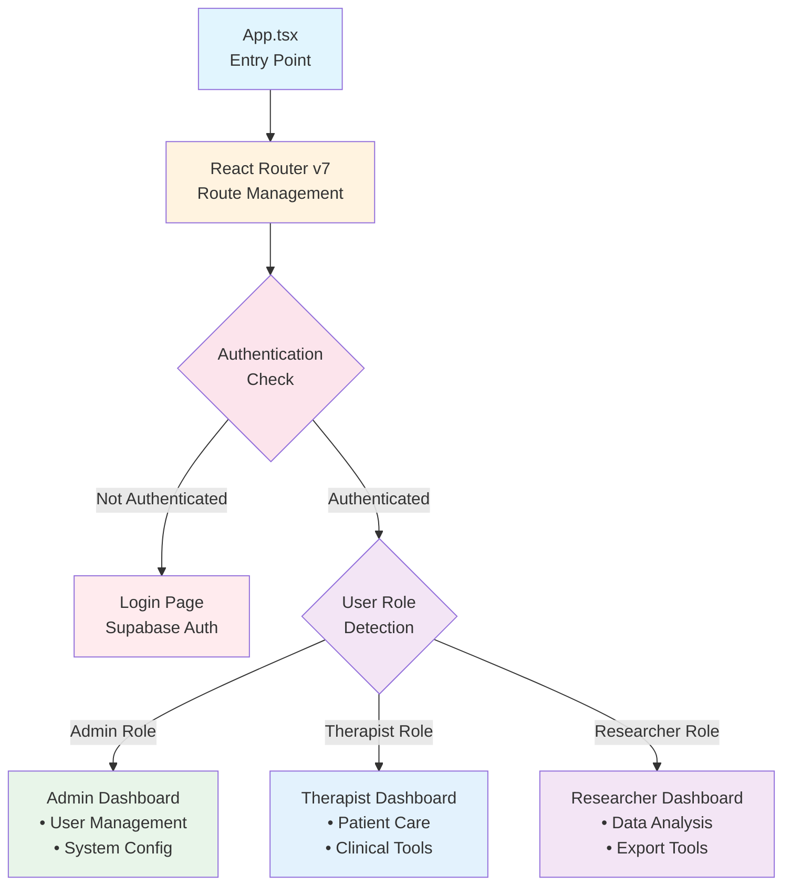
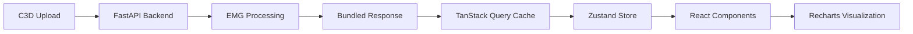

# GHOSTLY+ EMG C3D Analyzer - Frontend

## Overview

This frontend application serves as the user interface for the GHOSTLY+ EMG C3D Analyzer system. It processes electromyography data from C3D files generated during rehabilitation therapy sessions. The application supports three user roles - therapists who manage patient care, researchers who analyze clinical data, and administrators who configure the system. The interface is designed for medical professionals working with elderly patients in hospital rehabilitation settings.

## Architecture



### Technology Stack

The application uses React 18.3 with TypeScript 4.9 to provide type safety during development. React Router v7 handles navigation with its data loader pattern, ensuring data is fetched before components render - eliminating loading states and providing sub-200ms page transitions. Vite 5.4 serves as our build tool, offering fast development server startup and hot module replacement.

For state management, we use TanStack Query to cache server responses and handle data synchronization, while Zustand 4.5 manages client-side UI state like session parameters. The visual layer combines Tailwind CSS for utility-first styling with shadcn/ui components built on Radix UI primitives, ensuring accessibility compliance out of the box. Recharts powers our EMG signal visualization, handling up to 10,000 data points efficiently through intelligent downsampling. The Supabase client provides authentication and real-time features when needed.

### Directory Structure

```
src/
├── components/           # UI components by domain
│   ├── dashboards/      # Role-specific interfaces
│   │   ├── admin/       # User management, system config
│   │   ├── therapist/   # Patient management, clinical tools
│   │   └── researcher/  # Analysis workspace, data export
│   ├── tabs/            # Analysis interface tabs
│   │   ├── SignalPlotsTab/    # EMG signal visualization
│   │   ├── PerformanceTab/    # Clinical metrics
│   │   ├── ExportTab/         # Data export tools
│   │   └── SettingsTab/       # Session configuration
│   ├── auth/            # Authentication components
│   ├── c3d/             # C3D file browser and upload
│   ├── faq/             # Dynamic FAQ system
│   └── ui/              # Base components (Button, Card, etc.)
├── routes/              # React Router configuration
├── hooks/               # Custom React hooks
├── services/            # API integration layer
├── lib/                 # Utilities (authUtils, etc.)
├── store/               # Zustand stores
└── config/              # Application configuration
```

## Data Flow



### Processing Pipeline
- **Single API Response**: Complete analysis bundle (175.1s @ 990Hz)
- **Local Caching**: TanStack Query with 5-minute stale time
- **State Management**: Zustand for session parameters and UI state
- **Visualization**: Recharts with intelligent downsampling (10,000 points max)

## Common Usage Patterns

### Authentication with useAuth Hook
```typescript
import { useAuth } from '@/hooks/useAuth'

function MyComponent() {
  const { user, userRole, loading, logout } = useAuth()
  
  if (loading) return <LoadingSpinner />
  if (!user) return <LoginPage />
  
  // Component content for authenticated users
  return (
    <div>
      <h1>Welcome, {userRole}</h1>
      <button onClick={logout}>Sign Out</button>
    </div>
  )
}
```

### Navigation with React Router
```typescript
import { useNavigate } from 'react-router-dom'

function MyComponent() {
  const navigate = useNavigate()
  
  // Programmatic navigation
  const handleAnalysis = () => {
    navigate('/analysis?file=test.c3d')
  }
  
  return <button onClick={handleAnalysis}>Open Analysis</button>
}
```

### Protected Dashboard Example
```typescript
import { useAuth } from '@/hooks/useAuth'
import { useQuery } from '@tanstack/react-query'

function TherapistDashboard() {
  const { user, userRole } = useAuth()
  
  const { data: sessions } = useQuery({
    queryKey: ['therapy-sessions'],
    queryFn: fetchTherapySessions,
    enabled: userRole === 'THERAPIST'
  })
  
  return (
    <DashboardLayout>
      <PatientList sessions={sessions} />
    </DashboardLayout>
  )
}
```

## Navigation System

The navigation system uses React Router v7's data loading patterns, where route loaders pre-fetch data before components render. This approach eliminates loading states - users never see spinners during navigation. Protected routes validate authentication in their loaders, redirecting to login if needed while preserving the intended destination.

```typescript
// Route loaders ensure data is ready before render
import { getAuthData } from '../lib/authUtils'
import { redirect } from 'react-router-dom'

export async function protectedLoader() {
  const authData = await getAuthData()
  if (!authData.session) {
    const from = window.location.pathname
    throw redirect(`/login?from=${encodeURIComponent(from)}`)
  }
  return authData
}
```

## UI Components

The interface is built with shadcn/ui components, which are React components built on Radix UI primitives and styled with Tailwind CSS. This combination provides accessible, keyboard-navigable components that follow WAI-ARIA patterns by default. Components are composable - a Card contains CardHeader, CardTitle, CardDescription, and CardContent sections that can be mixed and matched as needed.

Common components include form controls (Button, Input, Select), layout elements (Card, Tabs, ScrollArea), overlays (Dialog, Popover, Tooltip), and feedback components (Toast, Alert, Progress). Each component accepts standard HTML attributes and can be customized through Tailwind classes while maintaining accessibility features like focus management and screen reader support.

## Performance Considerations

The application employs several optimization strategies to maintain responsive performance. Routes are code-split using React.lazy(), loading only the JavaScript needed for the current view. Chart rendering is optimized by downsampling EMG data to a maximum of 10,000 points - sufficient for visual analysis while keeping frame rates smooth. Search and filter inputs use 300ms debouncing to avoid excessive API calls during typing. Component re-renders are minimized through React.memo for pure components and useMemo for expensive calculations.

## Testing

The project uses Vitest with React Testing Library for testing, with over 59 test files co-located in `__tests__/` directories near the components they test. Tests focus on user behavior rather than implementation details, ensuring critical workflows like authentication, data processing, and clinical features work as expected from the user's perspective.

## Development

Start the development server with `npm run dev`, which launches Vite on port 5173 with hot module replacement. The build process (`npm run build`) runs TypeScript compilation followed by Vite's production bundler, creating optimized static assets. Tests run through Vitest (`npm test`) in watch mode during development, with 59+ test files providing coverage of critical business logic and user workflows.

## Configuration and Deployment

The application uses environment variables prefixed with `VITE_` for configuration. During development, the Vite proxy handles API calls to the backend running on port 8080. In production, `VITE_API_URL` points to your backend endpoint, while Supabase credentials enable authentication and storage features.

The application deploys to three environments, each serving different purposes. Development uses Vercel for the frontend and Render for the backend, providing quick iteration cycles with automatic deployments. Staging runs on Digital Ocean with Coolify Cloud (Debian 13) for integration testing. Production operates on a VUB-hosted machine with self-hosted Coolify (Debian), ensuring data sovereignty and institutional control.

In all environments, the frontend builds to static assets that can be served by any web server, with client-side routing handled through HTML5 history API. All routes serve the same index.html file, allowing React Router to take over navigation.

## Essential Documentation

### Top 5 Frontend Resources
- **React 18**: [Official Documentation](https://react.dev/)
- **TypeScript**: [Handbook](https://www.typescriptlang.org/docs/handbook/intro.html)
- **React Router v7**: [Documentation](https://reactrouter.com/)
- **TanStack Query**: [React Quick Start](https://tanstack.com/query/v5/docs/framework/react/quick-start)
- **shadcn/ui**: [Components](https://ui.shadcn.com/)

## Contributing

When working on this codebase, refer to the project documentation in `/docusaurus/docs` for architecture patterns and `/src/components/tabs/README.md` for component organization. The project follows standard React patterns with TypeScript for type safety and uses the API_CONFIG pattern (defined in `/src/config/apiConfig.ts`) for all backend communication to ensure environment-aware API calls.

