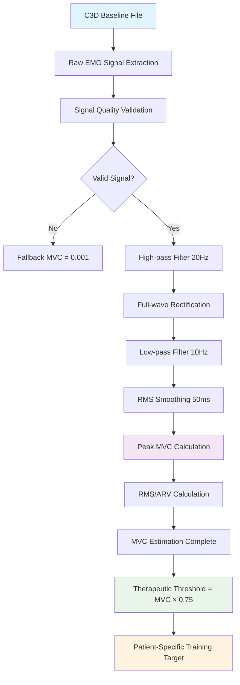

# GHOSTLY+ Performance Metrics: Technical Specification

**Objective**: Concise technical specification of the GHOSTLY+ performance scoring algorithm for clinical trial validation.

---

## 1. Clinical Trial Context

**GHOSTLY+ TBM** - Multicenter RCT with 120 hospitalized adults (≥65 years) with restricted lower-limb mobility.

**Intervention Protocol**:
- **5 Therapy Sessions per week** over 14 days
- Each **Therapy Session** = 3 Game Sessions (with 2-min rest periods)
- Each **Game Session** = 12 isometric contractions per muscle (left + right quadriceps)
- Target: ≥75% MVC intensity under 50% AOP BFR

**Primary Outcome**: Lower-limb muscle strength (MicroFet Dynamometer)

---

## 2. Scoring Terminology

**🟢 Compliance** (*"How well?"*): Intra-session metric quantifying execution quality within a single Game Session. Assesses whether contractions met force (≥75% MVC) and duration (≥2s) targets.

**🔵 Adherence** (*"How often?"*): Inter-session metric quantifying protocol consistency over multiple days. Measures completion of prescribed sessions (5 Therapy Sessions/week).

---

## 3. Real-Time Performance Score

Core performance score calculated after each **Game Session**:

$$P_{overall} = w_c \cdot S_{compliance} + w_s \cdot S_{symmetry} + w_e \cdot S_{effort} + w_g \cdot S_{game}$$

**Default Weights** (research-determined, $\sum w_i = 1$):
- $w_c = 0.40$ (Therapeutic Compliance)
- $w_s = 0.25$ (Muscle Symmetry) 
- $w_e = 0.20$ (Subjective Effort)
- $w_g = 0.15$ (Game Performance) *Default weight = 0.00 when game data unavailable*

### 3.1 Therapeutic Compliance Score

$$S_{compliance} = \left(\frac{S_{comp}^{left} + S_{comp}^{right}}{2}\right) \times C_{BFR}$$

**BFR Safety Gate** (Applied to Overall Score):
$$P_{overall} = \left(w_c \cdot S_{compliance} + w_s \cdot S_{symmetry} + w_e \cdot S_{effort} + w_g \cdot S_{game}\right) \times C_{BFR}$$

$$C_{BFR} = \begin{cases}
1.0 & \text{if pressure} \in [45\%, 55\%] \text{ AOP} \\
\textcolor{red}{0.0} & \text{otherwise (full penalty)}
\end{cases}$$

**Per-Muscle Compliance**:
$$S_{comp}^{muscle} = w_{comp} \cdot R_{comp} + w_{int} \cdot R_{int} + w_{dur} \cdot R_{dur}$$

| Component | Symbol | Weight | Formula | Description |
|-----------|--------|--------|---------|-------------|
| Completion Rate | $R_{comp}$ | $w_{comp}$ | $\frac{\text{contractions completed}}{12}$ | All prescribed contractions completed |
| Intensity Rate | $R_{int}$ | $w_{int}$ | $\frac{\text{reps} \ge 75\% \text{MVC}}{\text{reps completed}}$ | Force threshold achievement |
| Duration Rate | $R_{dur}$ | $w_{dur}$ | $\frac{\text{reps} \ge \text{duration threshold}}{\text{reps completed}}$ | Time requirement compliance |

*Note: Weights ($w_{comp}, w_{int}, w_{dur}$) are configurable, defaulting to 1/3 each. The duration threshold is adaptive.*

### 3.2 Muscle Symmetry Score

$$S_{symmetry} = \left(1 - \frac{|S_{comp}^{left} - S_{comp}^{right}|}{S_{comp}^{left} + S_{comp}^{right}}\right) \times 100$$

**Medical Rationale & Evidence Base**:

This formula represents the **clinically standard Asymmetry Index** widely used in rehabilitation medicine and peer-reviewed research. Based on extensive medical literature review (December 2025), this approach is superior to alternative formulas for several clinical reasons:

**✅ Evidence-Based Medicine**:
- Standard formula in rehabilitation research and clinical practice
- Used extensively in EMG bilateral muscle assessment studies
- Established in peer-reviewed journals for muscle balance evaluation
- Consistent with Limb Symmetry Index (LSI) principles in sports medicine

**✅ Clinical Interpretation**:
- **Normalized to Total Performance**: Denominator `(left + right)` provides meaningful context relative to total bilateral capability
- **Percentage-Based**: Results directly correlate to established clinical thresholds:
  - **>90%** = Excellent symmetry (return-to-sport criteria)
  - **80-90%** = Good symmetry (acceptable for daily activities)  
  - **<80%** = Poor symmetry (requires therapeutic intervention)

**✅ Superior to Min/Max Approach**:
The alternative formula `min(left, right) / max(left, right) × 100` has clinical limitations:
- Penalizes high unilateral performance (artificially lowers symmetry when one side excels)
- Less sensitive to clinically significant differences in bilateral low performance
- Not established in medical literature for rehabilitation assessment

**Clinical Example**:
- Patient: Left = 60%, Right = 80%
- **Medical formula**: `(1 - |60-80|/(60+80)) × 100 = 85.7%` → *Good symmetry, minor intervention*
- **Min/Max formula**: `60/80 × 100 = 75%` → *Poor symmetry, major intervention* (overly pessimistic)

**Implementation**: Both backend (`performance_scoring_service.py`) and frontend (`useEnhancedPerformanceMetrics.ts`) use this medically validated formula for consistent clinical assessment.

### 3.3 Subjective Effort Score

Based on post-session Rating of Perceived Exertion (RPE) on 0-10 scale:

$$S_{effort} = \begin{cases}
100\% & \text{if } \text{RPE}_{post} \in [4, 6] \text{ (optimal therapeutic range)} \\
80\% & \text{if } \text{RPE}_{post} \in \{3, 7\} \text{ (acceptable range)} \\
60\% & \text{if } \text{RPE}_{post} \in \{2, 8\} \text{ (suboptimal range)} \\
20\% & \text{if } \text{RPE}_{post} \in \{0, 1, 9, 10\} \text{ (poor/dangerous)}
\end{cases}$$

### 3.4 Game Performance Score

$$S_{game} = \frac{\text{game points achieved}}{\text{max achievable points (current difficulty)}} \times 100$$

*Note: Game performance score is optional and highly game-dependent. Default weight is 0.00 when game scoring data is unavailable or unreliable. Maximum achievable points adapt via Dynamic Difficulty Adjustment (DDA) system.*

---

## 4. Longitudinal Adherence Score

$$\text{Adherence}(t) = \frac{\text{Game Sessions completed by day } t}{\text{Game Sessions expected by day } t} \times 100$$

Where:
- $t$ = current protocol day ($t \geq 3$ for measurement stability)
- Expected rate: 15 Game Sessions per 7 days ≈ $2.14 \times t$
- **Starting Day**: Adherence calculation begins from day 3 onwards to ensure stable baseline

**Clinical Thresholds**:
- **Excellent**: ≥85% (meeting/exceeding frequency)
- **Good**: 70-84% (adequate with minor gaps)
- **Moderate**: 50-69% (suboptimal, intervention consideration)
- **Poor**: <50% (significant concern, support needed)

---

## 5. Clinical Example

**Scenario**: 72-year-old, Day 5, BFR active at 52% AOP

**Metrics**:
- Left muscle: 11/12 completed (92%), 9/11 ≥75% MVC (82%), 10/11 ≥2s (91%)
- Right muscle: 12/12 completed (100%), 8/12 ≥75% MVC (67%), 11/12 ≥2s (92%)
- Post-session RPE: 6
- Game score: 850/1000 points

**Calculations**:
- $S_{comp}^{left} = \frac{1}{3}(0.92 + 0.82 + 0.91) = 88.3\%$
- $S_{comp}^{right} = \frac{1}{3}(1.00 + 0.67 + 0.92) = 86.2\%$
- $S_{compliance} = \frac{88.3 + 86.2}{2} \times 1.0 = 87.3\%$
- $S_{symmetry} = \left(1 - \frac{|88.3 - 86.2|}{88.3 + 86.2}\right) \times 100 = 98.8\%$
- $S_{effort} = 100\%$ (RPE = 6)
- $S_{game} = 85\%$

**Overall Performance** (with BFR safety gate):
$$P_{overall} = \left(0.40 \times 87.3 + 0.25 \times 98.8 + 0.20 \times 100 + 0.15 \times 85\right) \times 1.0 = 91.6\%$$

**Clinical Interpretation**: Excellent rehabilitation performance - optimal therapeutic benefit achieved.

---

## 6. Primary Validation Objectives

This framework requires experimental validation to determine:

1. **Optimal Weightings ($w_i$)**: Via regression modeling against MicroFet strength data and 30s-STS outcomes
2. **Clinical Validity of RPE Mapping**: Correlate with physiological data (EMG fatigue index) and patient-reported outcomes
3. **Parameter Thresholds**: Systematically tune MVC%, duration, and BFR window thresholds
4. **DDA Algorithm Efficacy**: Evaluate therapeutic challenge maintenance across treatment course

---

## 7. MVC Threshold Calculation Priority System

**Technical Specification**: The system implements a priority-based hierarchy for MVC threshold determination, ensuring clinical accuracy and data-driven validation.

### 7.1 MVC Calculation Hierarchy

**Priority 1 - Backend-Calculated MVC (Recommended)**:
- **Source**: `analytics.mvc_threshold_actual_value`
- **Method**: Clinical estimation using 95th percentile analysis
- **Signal Processing Pipeline**:
  ```
  Raw EMG → High-pass Filter (20Hz) → Rectification → Low-pass Filter (10Hz) → RMS Envelope → 95th Percentile
  ```
- **Clinical Validation**: RMS envelope method is physiologically superior to linear envelope for MVC quantification
- **Confidence Scoring**: Includes statistical confidence assessment based on signal characteristics
- **Patient-Specific**: Calculated from actual patient data during session

**Priority 2 - User-Defined MVC (Fallback)**:
- **Source**: `sessionParams.session_mvc_values` + threshold percentages
- **Method**: Manual values × threshold percentage (typically 75%)
- **Use Cases**: Backup when signal analysis unavailable, clinical override scenarios
- **Limitations**: Not patient-specific, potential inaccuracy

### 7.2 Scientific Rationale

**RMS vs Linear Envelope** (validated via literature review):
- **RMS Envelope**: Captures signal power, robust to noise, physiologically meaningful
- **Linear Envelope**: Simple rectification + filtering, more noise-sensitive
- **Clinical Consensus**: RMS envelope preferred for EMG MVC calculations

**Peak and RMS Methods (Standard Clinical Practice)**:
- **Peak Value**: Highest amplitude of rectified EMG during MVC - captures maximum instantaneous activation
- **RMS/ARV**: Root Mean Square or Average Rectified Value - more stable and reliable measure of sustained activation
- **Clinical Consensus**: Both peak and RMS should be reported together for comprehensive MVC assessment
- **Normalization Standard**: Task-related EMG expressed as %MVC for cross-subject comparison

### 7.3 MVC Detection from C3D Baseline Sessions

MVC detection from C3D files follows a standardized scientific process to ensure therapeutic personalization. The system first extracts raw EMG signals from GHOSTLY+ "baseline" game sessions, then applies a clinically validated processing pipeline. This pipeline includes high-pass filtering at 20Hz to eliminate baseline drift, rectification to convert bipolar signals to unipolar amplitude, low-pass filtering at 10Hz to create a smooth envelope, and 50ms RMS smoothing for final envelope extraction.

MVC estimation follows standard clinical practice by calculating both peak values and RMS measurements from the processed signal. The system primarily uses the peak value method (maximum amplitude of rectified EMG) as the gold standard for MVC determination, which represents the highest instantaneous muscle activation capacity. Additionally, RMS values are calculated to provide a stable measure of sustained activation. This dual approach ensures comprehensive MVC assessment following established clinical guidelines while maintaining compatibility with therapeutic gaming environments.

The final therapeutic threshold is calculated as 75% of the estimated MVC value, creating personalized targets adapted to each patient's real physiological condition. This approach ensures therapeutic exercises are calibrated to individual capabilities measured during baseline sessions, unlike generic manual values that do not reflect inter-individual variations.



### 7.4 Current Implementation Status

- ✅ **Priority System Active**: Backend-calculated MVC takes precedence over manual values
- ✅ **RMS Pipeline Implemented**: Uses scientifically validated signal processing chain
- ✅ **Clinical Parameters**: 20Hz high-pass, 10Hz low-pass, 50ms smoothing window
- ✅ **C3D Baseline Detection**: Automated MVC estimation from game session data
- ✅ **Fallback Protection**: System gracefully handles missing backend calculations

---

## 8. Implementation Notes

- **Real-time Calculation**: All metrics calculated during session for immediate feedback
- **Configurable Weights**: All weights adjustable through settings interface
- **Safety Priority**: BFR violations override all other performance metrics
- **Clinical Population**: Optimized for hospitalized older adults with mobility restrictions
- **MVC Data Quality**: Backend calculations preferred for clinical accuracy
- **Open Source**: Available at https://github.com/openfeasyo/OpenFeasyo